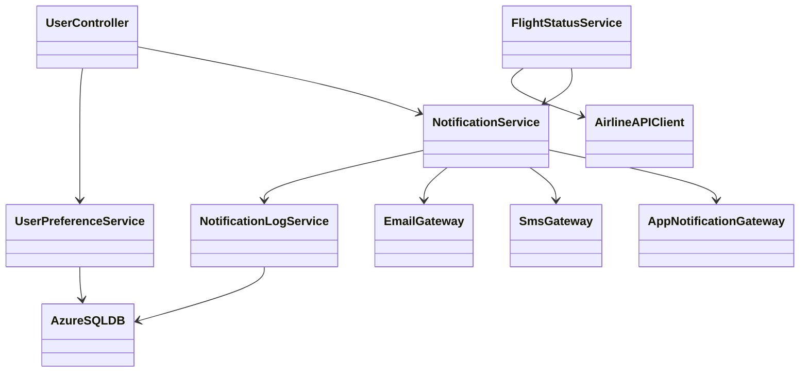
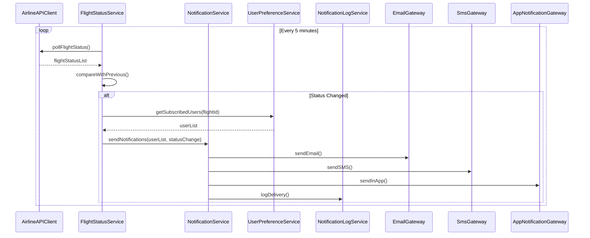
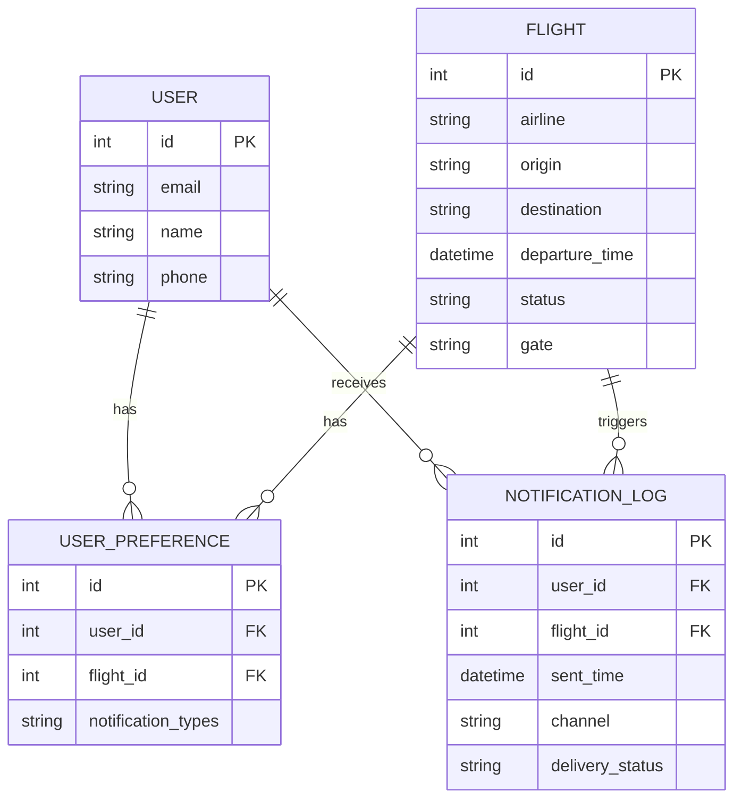

# For User Story Number [3]
1. Objective
Provide travelers with real-time flight status updates and notifications for delays, cancellations, or gate changes. The system ensures timely delivery of alerts via email, SMS, or in-app notifications based on user preferences. All notification events are logged and monitored for reliability.

2. API Model
  2.1 Common Components/Services
  - FlightStatusService (polls airline APIs and detects status changes)
  - NotificationService (sends notifications via email/SMS/app)
  - UserPreferenceService (manages user notification preferences)
  - NotificationLogService (logs notification delivery)

  2.2 API Details
| Operation   | REST Method | Type    | URL                              | Request (JSON)                                                                 | Response (JSON)                                                                 |
|-------------|-------------|---------|----------------------------------|--------------------------------------------------------------------------------|---------------------------------------------------------------------------------|
| Subscribe   | POST        | Success | /api/notifications/subscribe     | {"userId":123,"flightId":1,"preferences":["email","sms"]}                | {"status":"SUBSCRIBED"}                                                      |
| Unsubscribe | POST        | Success | /api/notifications/unsubscribe   | {"userId":123,"flightId":1}                                                  | {"status":"UNSUBSCRIBED"}                                                    |
| Status      | GET         | Success | /api/flights/status/1            | N/A                                                                            | {"flightId":1,"status":"DELAYED","gate":"A12","departureTime":"12:30"} |
| Notify      | POST        | Success | /api/notifications/send          | {"userId":123,"flightId":1,"message":"Flight delayed"}                     | {"deliveryStatus":"SENT","logId":789}                                      |

  2.3 Exceptions
| API                   | Exception Type         | Description                              |
|-----------------------|-----------------------|------------------------------------------|
| /api/notifications/*  | UnauthorizedException | User not authenticated                   |
| /api/flights/status/* | NotFoundException     | Flight ID not found                      |
| /api/notifications/send| DeliveryFailedException| Notification delivery failed            |

3 Functional Design
  3.1 Class Diagram

  3.2 UML Sequence Diagram

  3.3 Components
| Component Name         | Description                                             | Existing/New |
|-----------------------|---------------------------------------------------------|--------------|
| UserController        | Handles user subscription/unsubscription                | New          |
| FlightStatusService   | Polls airline APIs and detects flight status changes    | New          |
| NotificationService   | Sends notifications via email/SMS/app                   | New          |
| UserPreferenceService | Manages user notification preferences                   | New          |
| NotificationLogService| Logs notification delivery and status                   | New          |
| AirlineAPIClient      | Integrates with airline status APIs                     | New          |
| EmailGateway          | Sends email notifications                               | New          |
| SmsGateway            | Sends SMS notifications                                 | New          |
| AppNotificationGateway| Sends in-app notifications                              | New          |
| AzureSQLDB            | Database for storing user, flight, and log info         | Existing     |

  3.4 Service Layer Logic and Validations
| FieldName         | Validation                              | Error Message                     | ClassUsed               |
|-------------------|-----------------------------------------|-----------------------------------|-------------------------|
| userId            | Must be subscribed                      | User not subscribed               | UserPreferenceService   |
| flightId          | Must exist in system                    | Invalid flight ID                 | FlightStatusService     |
| notification      | Delivery must be logged and confirmed   | Notification delivery failed      | NotificationLogService  |
| statusRefresh     | Must occur every 5 minutes              | Status refresh interval error     | FlightStatusService     |

4 Integrations
| SystemToBeIntegrated | IntegratedFor            | IntegrationType |
|----------------------|--------------------------|-----------------|
| Airline Status APIs  | Real-time flight status  | API             |
| Email/SMS Gateway    | Notification delivery    | API             |
| App Notification     | In-app alerts            | API             |

5 DB Details
  5.1 ER Model

  5.2 DB Validations
- Only users with valid subscriptions in USER_PREFERENCE receive notifications.
- Each NOTIFICATION_LOG must reference valid user and flight IDs.
- Delivery status must be one of [SENT, FAILED].

6 Non-Functional Requirements
  6.1 Performance
  - Notification delivery within 1 minute of status change.
  - Scalable to support global flight data feeds.

  6.2 Security
    6.2.1 Authentication
    - OAuth2/JWT authentication for all endpoints.
    - Secure HTTPS enforced.
    6.2.2 Authorization
    - Only subscribed users receive notifications.
    - Data privacy for user contact information.

  6.3 Logging
    6.3.1 Application Logging
    - DEBUG: API polling and notification triggers
    - INFO: Notification deliveries
    - WARN: Delivery delays
    - ERROR: Delivery failures, API errors
    6.3.2 Audit Log
    - Log all notification events and delivery status

7 Dependencies
- Airline status APIs must be available for polling.
- Email/SMS/app gateways must be configured and reliable.

8 Assumptions
- Airline APIs provide real-time, reliable status data.
- Notification gateways support high throughput.
- Users maintain up-to-date contact preferences.
