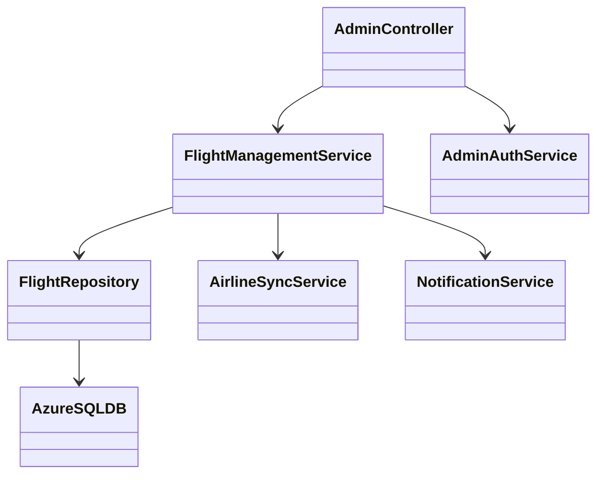
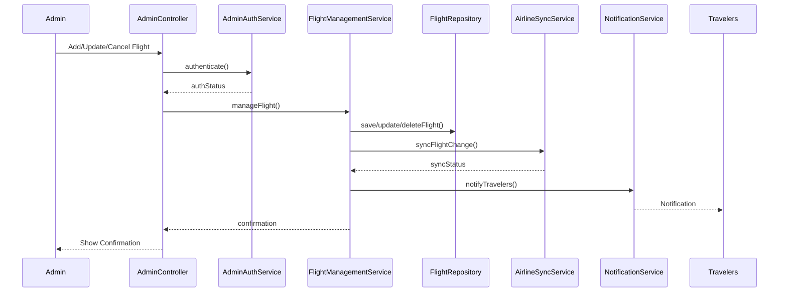
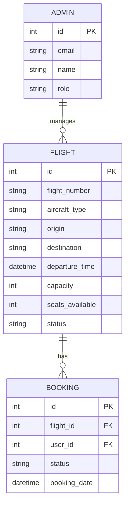

# For User Story Number [4]
1. Objective
Enable airline administrators to manage flight inventory and schedules, ensuring accurate and up-to-date information is available to travelers. The system supports adding, updating, or removing flights, managing seat inventory, and synchronizing changes with external airline systems. Notifications are sent to travelers for any schedule changes or cancellations.

2. API Model
  2.1 Common Components/Services
  - FlightManagementService (handles flight CRUD and inventory)
  - AirlineSyncService (synchronizes with external airline systems)
  - NotificationService (notifies travelers of changes)
  - AdminAuthService (admin authentication and authorization)

  2.2 API Details
| Operation   | REST Method | Type    | URL                              | Request (JSON)                                                                 | Response (JSON)                                                                 |
|-------------|-------------|---------|----------------------------------|--------------------------------------------------------------------------------|---------------------------------------------------------------------------------|
| Add Flight  | POST        | Success | /api/admin/flights               | {"flightNumber":"DL123","aircraftType":"A320","origin":"JFK","destination":"LAX","departureTime":"2025-10-01T10:00","capacity":180} | {"flightId":1,"status":"ADDED"}                                             |
| Update      | PUT         | Success | /api/admin/flights/1             | {"departureTime":"2025-10-01T12:00","capacity":200}                        | {"flightId":1,"status":"UPDATED"}                                          |
| Cancel      | DELETE      | Success | /api/admin/flights/1             | N/A                                                                            | {"flightId":1,"status":"CANCELLED"}                                        |
| Inventory   | PUT         | Success | /api/admin/flights/1/inventory   | {"seatsAvailable":150}                                                        | {"flightId":1,"status":"INVENTORY_UPDATED"}                                |

  2.3 Exceptions
| API                   | Exception Type         | Description                              |
|-----------------------|-----------------------|------------------------------------------|
| /api/admin/flights/*  | UnauthorizedException | Admin not authenticated/authorized       |
| /api/admin/flights/*  | ValidationException   | Flight number not unique/invalid         |
| /api/admin/flights/*  | ConflictException     | Schedule conflicts with existing bookings |
| /api/admin/flights/*  | CapacityExceededException | Inventory exceeds aircraft capacity   |

3 Functional Design
  3.1 Class Diagram

  3.2 UML Sequence Diagram

  3.3 Components
| Component Name         | Description                                             | Existing/New |
|-----------------------|---------------------------------------------------------|--------------|
| AdminController       | Handles admin requests for flight management            | New          |
| FlightManagementService| Business logic for flight CRUD and inventory           | New          |
| FlightRepository      | Persists flight and inventory data                      | New          |
| AirlineSyncService    | Synchronizes changes with external airline systems      | New          |
| NotificationService   | Notifies travelers of schedule changes/cancellations    | New          |
| AdminAuthService      | Handles admin authentication and authorization          | New          |
| AzureSQLDB            | Database for storing flight and inventory info          | Existing     |

  3.4 Service Layer Logic and Validations
| FieldName         | Validation                              | Error Message                     | ClassUsed               |
|-------------------|-----------------------------------------|-----------------------------------|-------------------------|
| flightNumber      | Must be unique and valid                | Flight number invalid/duplicate   | FlightManagementService |
| scheduleChange    | Must not conflict with bookings         | Schedule conflict with bookings   | FlightManagementService |
| seatsAvailable    | Must not exceed aircraft capacity       | Inventory exceeds capacity        | FlightManagementService |

4 Integrations
| SystemToBeIntegrated | IntegratedFor            | IntegrationType |
|----------------------|--------------------------|-----------------|
| Airline Management APIs | Sync flight/inventory changes | API         |
| Notification Service | Notify travelers of changes      | API         |

5 DB Details
  5.1 ER Model

  5.2 DB Validations
- Flight number must be unique in FLIGHT table.
- seats_available <= capacity for each flight.
- No schedule changes allowed if bookings exist within 24 hours of departure.

6 Non-Functional Requirements
  6.1 Performance
  - Admin portal available 24/7.
  - Real-time sync with traveler-facing systems.

  6.2 Security
    6.2.1 Authentication
    - OAuth2/JWT authentication for admin users.
    - Secure HTTPS enforced.
    6.2.2 Authorization
    - Role-based access control for admin operations.

  6.3 Logging
    6.3.1 Application Logging
    - DEBUG: API request/response payloads (excluding sensitive data)
    - INFO: Flight additions, updates, cancellations
    - WARN: Validation or sync issues
    - ERROR: Sync failures, unauthorized access
    6.3.2 Audit Log
    - Log all admin changes to flights and inventory

7 Dependencies
- Airline management APIs must be available for synchronization.
- Notification service must be configured for traveler alerts.

8 Assumptions
- External airline systems accept real-time sync updates.
- Admin users are provisioned with appropriate roles.
- Notification delivery to travelers is reliable and timely.
