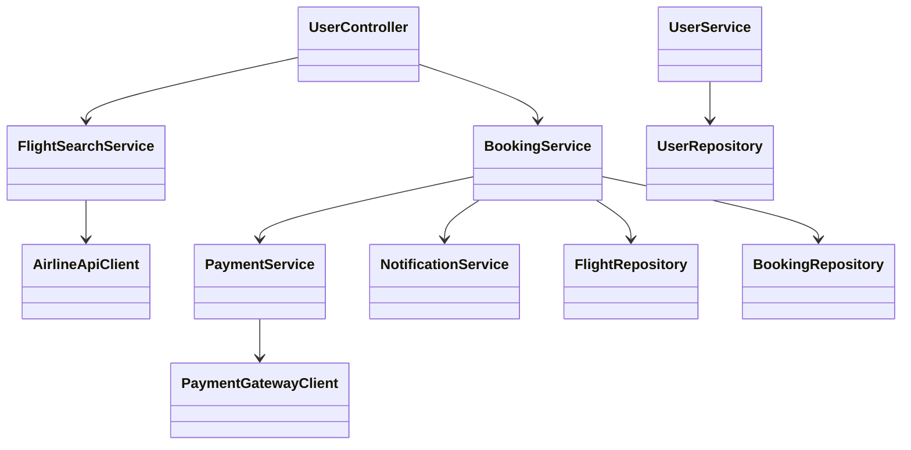
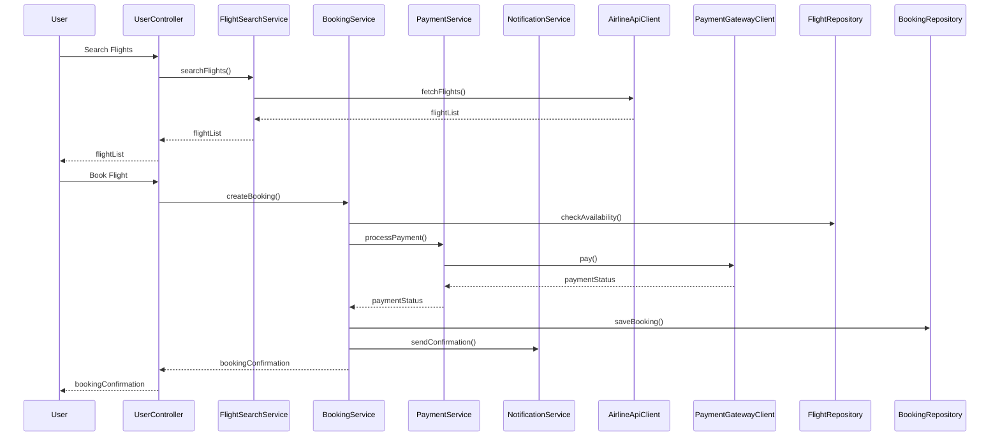

# For User Story Number [1]

1. Objective
This requirement enables travelers to search for available flights, select preferred options, and book air transport tickets online. The system must provide a user-friendly interface, real-time flight availability, and secure payment processing. The goal is to facilitate convenient and secure travel planning and ticket purchasing.

2. API Model
2.1 Common Components/Services
- FlightSearchService (existing/new)
- BookingService (new)
- PaymentService (existing/new)
- NotificationService (existing)
- UserService (existing)

2.2 API Details
| Operation      | REST Method | Type    | URL                        | Request (Sample JSON)                                                                 | Response (Sample JSON) |
|---------------|-------------|---------|----------------------------|--------------------------------------------------------------------------------------|-----------------------|
| Search Flights| GET         | Success | /api/flights/search        | { "origin": "JFK", "destination": "LAX", "date": "2024-07-01" }               | { "flights": [{"flightId":123, "price":200, "departureTime":"10:00"}]} |
| Book Flight   | POST        | Success | /api/bookings              | { "flightId":123, "passengerDetails": {...}, "paymentInfo": {...} }               | { "bookingId":456, "status":"CONFIRMED", "ticket": {...} } |
| Payment       | POST        | Success | /api/payments              | { "bookingId":456, "paymentInfo": {...} }                                           | { "paymentStatus": "SUCCESS", "transactionId": "abc123" } |
| Get Booking   | GET         | Success | /api/bookings/{bookingId}  | -                                                                                    | { "bookingId":456, "status":"CONFIRMED", "ticket": {...} } |

2.3 Exceptions
| API           | Exception Type           | Error Message                                 |
|---------------|-------------------------|-----------------------------------------------|
| Search Flights| FlightNotFoundException | No flights found for the given criteria.      |
| Book Flight   | ValidationException     | Required fields missing or invalid.           |
| Book Flight   | FlightUnavailableException | Selected flight is no longer available.    |
| Payment       | PaymentFailedException  | Payment could not be processed.               |
| Get Booking   | BookingNotFoundException| Booking not found.                            |

3 Functional Design
3.1 Class Diagram


3.2 UML Sequence Diagram


3.3 Components
| Component Name         | Description                                                | Existing/New |
|-----------------------|------------------------------------------------------------|--------------|
| UserController        | Handles user requests for flight search and booking         | New          |
| FlightSearchService   | Business logic for searching flights                       | New          |
| BookingService        | Manages booking lifecycle                                  | New          |
| PaymentService        | Handles payment processing                                 | Existing/New |
| NotificationService   | Sends booking confirmations                                | Existing     |
| AirlineApiClient      | Integrates with airline APIs for real-time data            | New          |
| PaymentGatewayClient  | Integrates with payment gateway                            | Existing/New |
| FlightRepository      | Data access for flights                                    | New          |
| BookingRepository     | Data access for bookings                                   | New          |
| UserService           | User management and validation                             | Existing     |
| UserRepository        | Data access for user information                           | Existing     |

3.4 Service Layer Logic and Validations
| FieldName        | Validation                                  | Error Message                              | ClassUsed            |
|------------------|---------------------------------------------|--------------------------------------------|----------------------|
| origin           | Not null, valid airport code                 | Origin is required and must be valid.      | FlightSearchService  |
| destination      | Not null, valid airport code                 | Destination is required and must be valid. | FlightSearchService  |
| date             | Not null, valid date, not in the past        | Date is required and must be valid.        | FlightSearchService  |
| passengerDetails | All required fields present                  | Passenger details are incomplete.          | BookingService       |
| paymentInfo      | Valid card details, PCI DSS compliant        | Invalid payment information.               | PaymentService       |
| flightId         | Flight must be available                     | Selected flight is no longer available.    | BookingService       |

4 Integrations
| SystemToBeIntegrated | IntegratedFor         | IntegrationType |
|----------------------|----------------------|-----------------|
| Airline APIs         | Real-time flight data | API             |
| Payment Gateway      | Payment processing    | API             |
| Notification Service | Booking confirmation  | API             |

5 DB Details
5.1 ER Model
```mermaid
erDiagram
    USER ||--o{ BOOKING : has
    BOOKING }o--|| FLIGHT : books
    BOOKING }o--|| PAYMENT : paid_by
    FLIGHT ||--o{ AIRLINE : operated_by
    USER {
        user_id PK
        email
        password_hash
        name
    }
    BOOKING {
        booking_id PK
        user_id FK
        flight_id FK
        status
        booking_date
        ticket_number
    }
    FLIGHT {
        flight_id PK
        airline_id FK
        origin
        destination
        departure_time
        arrival_time
        price
        seats_available
    }
    PAYMENT {
        payment_id PK
        booking_id FK
        amount
        payment_method
        status
        transaction_id
    }
    AIRLINE {
        airline_id PK
        name
        code
    }
```

5.2 DB Validations
- Unique constraint on ticket_number
- Foreign key constraints on user_id, flight_id, airline_id, booking_id
- Not null constraints on all required fields

6 Non-Functional Requirements
6.1 Performance
- API response time < 2 seconds for search and booking
- Booking confirmation sent within 5 seconds of payment
- Caching of frequent flight search queries at API layer

6.2 Security
6.2.1 Authentication
- OAuth2/JWT authentication for all endpoints
- Integration with IAM provider if available
6.2.2 Authorization
- Only authenticated users can book tickets
- Role-based access for admin operations

6.3 Logging
6.3.1 Application Logging
- DEBUG: API request/response payloads (excluding sensitive data)
- INFO: Successful bookings, payments, and confirmations
- ERROR: Failed payments, booking errors
- WARN: Suspicious activity or repeated failures
6.3.2 Audit Log
- All booking and payment events logged with user, timestamp, and status

7 Dependencies
- Airline APIs for flight data
- Payment gateway for processing payments
- Notification service for confirmations

8 Assumptions
- All airline APIs provide real-time availability and pricing
- Payment gateway is PCI DSS compliant and available
- Notification service supports email/SMS
- User authentication is already implemented
