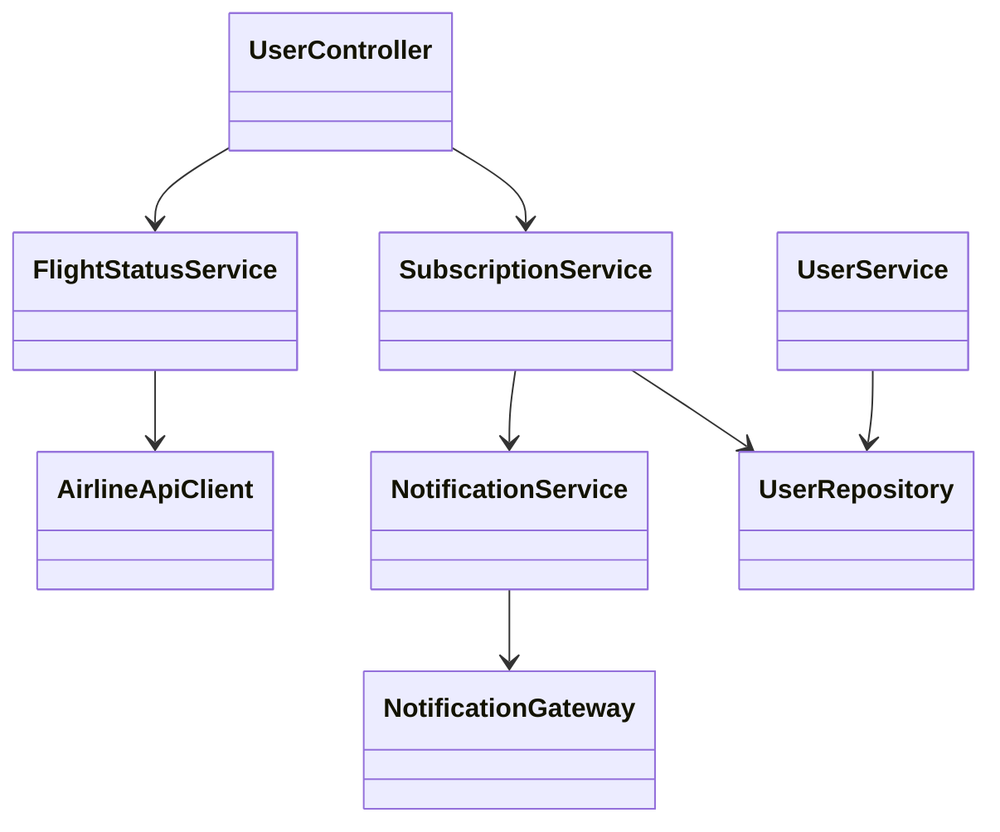
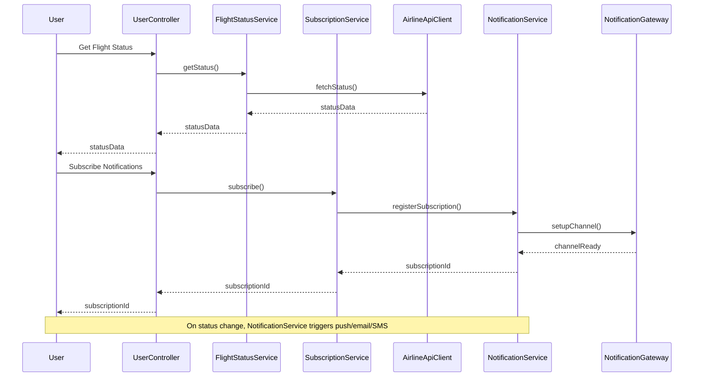

# For User Story Number [2]

1. Objective
This requirement enables travelers to track the status of their flights in real-time, including updates on delays, gate changes, and cancellations. The system must provide accurate, timely notifications and easy access to flight status information. The goal is to keep travelers informed and reduce uncertainty during their journey.

2. API Model
2.1 Common Components/Services
- FlightStatusService (new)
- NotificationService (existing)
- UserService (existing)
- SubscriptionService (new)

2.2 API Details
| Operation              | REST Method | Type    | URL                              | Request (Sample JSON)                                         | Response (Sample JSON) |
|-----------------------|-------------|---------|----------------------------------|--------------------------------------------------------------|-----------------------|
| Get Flight Status     | GET         | Success | /api/flights/status              | { "flightNumber": "AA123", "date": "2024-07-01" }           | { "status": "ON_TIME", "gate": "A12", "departureTime": "10:00" } |
| Subscribe Notifications| POST        | Success | /api/notifications/subscribe     | { "flightNumber": "AA123", "userId": 789, "type": "EMAIL" } | { "subscriptionId": 321, "status": "SUBSCRIBED" } |
| Unsubscribe Notifications| DELETE    | Success | /api/notifications/unsubscribe/{subscriptionId} | -                                            | { "status": "UNSUBSCRIBED" } |

2.3 Exceptions
| API                    | Exception Type           | Error Message                                 |
|------------------------|-------------------------|-----------------------------------------------|
| Get Flight Status      | FlightNotFoundException | Flight not found or invalid reference.        |
| Subscribe Notifications| ValidationException     | Invalid user or flight number.                |
| Unsubscribe Notifications| NotFoundException     | Subscription not found.                       |

3 Functional Design
3.1 Class Diagram


3.2 UML Sequence Diagram


3.3 Components
| Component Name         | Description                                                | Existing/New |
|-----------------------|------------------------------------------------------------|--------------|
| UserController        | Handles user requests for status and notifications         | New          |
| FlightStatusService   | Fetches and processes flight status                        | New          |
| SubscriptionService   | Manages notification subscriptions                         | New          |
| NotificationService   | Sends push/email/SMS notifications                         | Existing     |
| AirlineApiClient      | Integrates with airline/airport APIs for status            | New          |
| NotificationGateway   | Manages communication channels (email/SMS/push)            | Existing     |
| UserService           | User management and validation                             | Existing     |
| UserRepository        | Data access for user information                           | Existing     |

3.4 Service Layer Logic and Validations
| FieldName        | Validation                                  | Error Message                              | ClassUsed            |
|------------------|---------------------------------------------|--------------------------------------------|----------------------|
| flightNumber     | Not null, valid format                      | Flight number is required and must be valid.| FlightStatusService  |
| bookingReference | Valid reference, matches user booking       | Invalid booking reference.                 | FlightStatusService  |
| userId           | Must exist and be authenticated             | User not found or not authenticated.       | SubscriptionService  |
| type             | Must be EMAIL/SMS/PUSH                      | Invalid notification type.                 | SubscriptionService  |

4 Integrations
| SystemToBeIntegrated | IntegratedFor         | IntegrationType |
|----------------------|----------------------|-----------------|
| Airline/Airport APIs | Real-time status     | API             |
| Notification Gateway | Notifications        | API             |

5 DB Details
5.1 ER Model
```mermaid
erDiagram
    USER ||--o{ SUBSCRIPTION : has
    SUBSCRIPTION }o--|| FLIGHT : for
    FLIGHT {
        flight_id PK
        flight_number
        origin
        destination
        departure_time
        arrival_time
    }
    USER {
        user_id PK
        email
        name
    }
    SUBSCRIPTION {
        subscription_id PK
        user_id FK
        flight_id FK
        type
        status
    }
```

5.2 DB Validations
- Unique constraint on (user_id, flight_id, type)
- Foreign key constraints on user_id, flight_id
- Not null constraints on all required fields

6 Non-Functional Requirements
6.1 Performance
- Status update API response < 1 second
- Status refresh every 2 minutes from airline APIs
- Notification delivery within 1 minute of change

6.2 Security
6.2.1 Authentication
- OAuth2/JWT authentication for all endpoints
6.2.2 Authorization
- Only users with valid bookings can subscribe to notifications

6.3 Logging
6.3.1 Application Logging
- DEBUG: API requests/responses (excluding sensitive data)
- INFO: Subscription events, status changes
- ERROR: Failed API calls, notification failures
- WARN: Invalid subscription attempts
6.3.2 Audit Log
- All notification events logged with user, timestamp, and status

7 Dependencies
- Airline/airport APIs for status data
- Notification gateway for sending notifications

8 Assumptions
- Airline APIs provide near real-time status
- Notification gateway supports all required channels
- User authentication is already implemented
