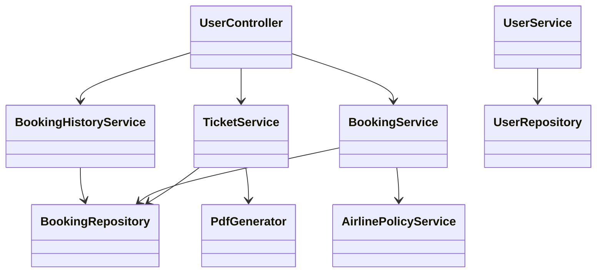
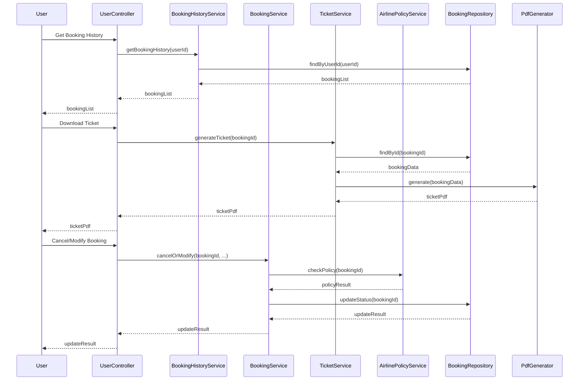

# For User Story Number [3]

1. Objective
This requirement enables registered users to securely view and manage their air transport booking history, including past and upcoming trips. Users can download tickets, and, if allowed by airline policy, cancel or modify reservations. The goal is to provide easy access and management of bookings for a seamless travel experience.

2. API Model
2.1 Common Components/Services
- BookingHistoryService (new)
- BookingService (existing)
- TicketService (new)
- UserService (existing)
- AirlinePolicyService (new)

2.2 API Details
| Operation              | REST Method | Type    | URL                                   | Request (Sample JSON)                       | Response (Sample JSON) |
|-----------------------|-------------|---------|---------------------------------------|---------------------------------------------|-----------------------|
| Get Booking History   | GET         | Success | /api/users/{userId}/bookings          | -                                           | { "bookings": [{"bookingId":456, "flightId":123, "status":"CONFIRMED"}]} |
| Download Ticket       | GET         | Success | /api/bookings/{bookingId}/ticket      | -                                           | PDF binary or { "downloadUrl": "..." } |
| Cancel Booking        | POST        | Success | /api/bookings/{bookingId}/cancel      | { "reason": "Personal" }                  | { "status": "CANCELLED" } |
| Modify Booking        | POST        | Success | /api/bookings/{bookingId}/modify      | { "newFlightId": 321, "passengerDetails": {...} } | { "status": "MODIFIED", "bookingId":789 } |

2.3 Exceptions
| API               | Exception Type           | Error Message                                 |
|-------------------|-------------------------|-----------------------------------------------|
| Get Booking History | AuthenticationException | User not authenticated.                       |
| Download Ticket   | NotFoundException        | Ticket not found or not available.            |
| Cancel Booking    | PolicyViolationException | Cancellation not allowed by airline policy.   |
| Modify Booking    | PolicyViolationException | Modification not allowed by airline policy.   |
| Modify Booking    | ValidationException      | Invalid modification request.                 |

3 Functional Design
3.1 Class Diagram


3.2 UML Sequence Diagram


3.3 Components
| Component Name         | Description                                                | Existing/New |
|-----------------------|------------------------------------------------------------|--------------|
| UserController        | Handles user requests for booking history and management   | New          |
| BookingHistoryService | Retrieves user booking history                             | New          |
| BookingService        | Manages booking lifecycle and modifications                | Existing     |
| TicketService         | Generates downloadable tickets                             | New          |
| AirlinePolicyService  | Validates airline rules for modifications/cancellations    | New          |
| BookingRepository     | Data access for bookings                                   | Existing     |
| PdfGenerator          | Generates PDF/mobile pass for tickets                      | New          |
| UserService           | User management and validation                             | Existing     |
| UserRepository        | Data access for user information                           | Existing     |

3.4 Service Layer Logic and Validations
| FieldName        | Validation                                  | Error Message                              | ClassUsed            |
|------------------|---------------------------------------------|--------------------------------------------|----------------------|
| userId           | Must be authenticated and exist              | User not authenticated.                    | BookingHistoryService |
| bookingId        | Must belong to user, exist, and be modifiable| Invalid booking or not allowed.            | BookingService       |
| reason           | Required for cancellation                    | Cancellation reason required.              | BookingService       |
| newFlightId      | Must be valid and available                  | New flight not available.                  | BookingService       |
| passengerDetails | Must match booking requirements              | Invalid passenger details.                 | BookingService       |

4 Integrations
| SystemToBeIntegrated | IntegratedFor         | IntegrationType |
|----------------------|----------------------|-----------------|
| Airline Systems      | Booking management   | API             |
| PDF Generator        | Ticket downloads     | API/Library     |

5 DB Details
5.1 ER Model
```mermaid
erDiagram
    USER ||--o{ BOOKING : has
    BOOKING }o--|| FLIGHT : books
    BOOKING }o--|| TICKET : generates
    BOOKING {
        booking_id PK
        user_id FK
        flight_id FK
        status
        booking_date
        ticket_number
        modification_allowed
        cancellation_allowed
    }
    FLIGHT {
        flight_id PK
        airline_id FK
        origin
        destination
        departure_time
        arrival_time
        price
    }
    TICKET {
        ticket_id PK
        booking_id FK
        pdf_url
        issued_date
    }
    USER {
        user_id PK
        email
        password_hash
        name
    }
```

5.2 DB Validations
- Foreign key constraints on user_id, flight_id, booking_id
- Not null constraints on all required fields
- Unique constraint on ticket_number

6 Non-Functional Requirements
6.1 Performance
- Booking history page loads within 2 seconds for up to 100 bookings
- Ticket generation/download within 3 seconds

6.2 Security
6.2.1 Authentication
- OAuth2/JWT authentication for all endpoints
6.2.2 Authorization
- Only authenticated users can access/modify their bookings
- Role-based access for admin operations

6.3 Logging
6.3.1 Application Logging
- DEBUG: API request/response payloads (excluding sensitive data)
- INFO: Booking modifications, cancellations, downloads
- ERROR: Failed modifications, unauthorized access
- WARN: Suspicious or repeated failed attempts
6.3.2 Audit Log
- All booking modifications and cancellations logged with user, timestamp, and status

7 Dependencies
- Airline systems for booking management
- PDF generator for ticket downloads

8 Assumptions
- Airline systems support real-time booking management
- PDF generator is available and reliable
- User authentication and authorization are already implemented
