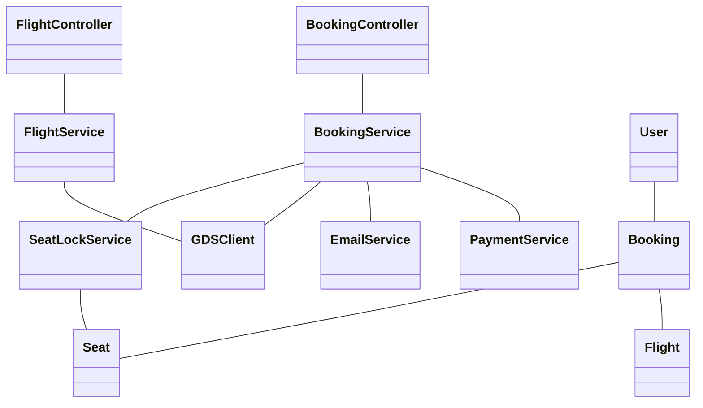
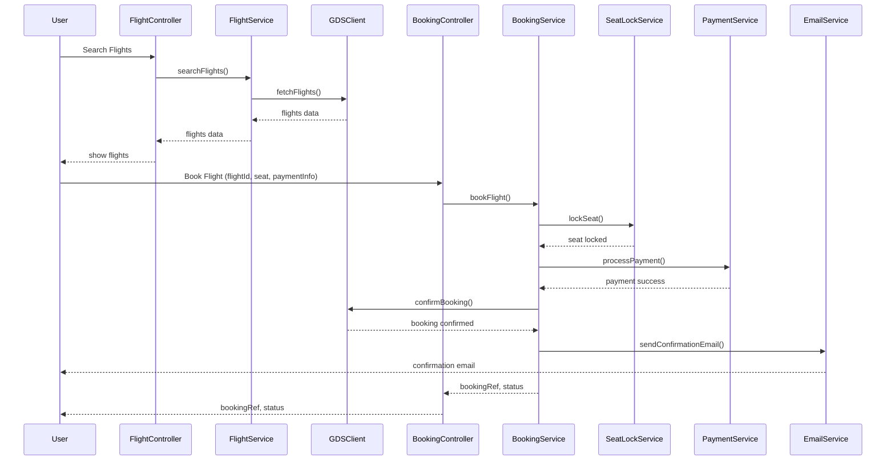
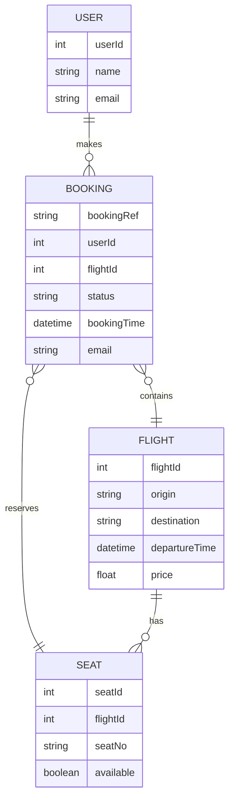

# For User Story Number [1]

1. Objective
The objective is to provide travelers with an online platform to search for available flights, view schedules and prices, select seats, and complete bookings with real-time availability and payment processing. The system must prevent double-booking and deliver booking confirmations via email. The solution should be secure, scalable, and provide a seamless user experience.

2. API Model
2.1 Common Components/Services
- Authentication Service (JWT based)
- Payment Gateway Integration Service
- Email Notification Service
- GDS Integration Service (for flight and seat data)
- Seat Locking Service

2.2 API Details
| Operation         | REST Method | Type           | URL                              | Request (Sample JSON)                                                                                  | Response (Sample JSON)                                                                                 |
|------------------|-------------|----------------|-----------------------------------|--------------------------------------------------------------------------------------------------------|--------------------------------------------------------------------------------------------------------|
| Search Flights   | GET         | Success/Fail   | /api/flights/search               | {"origin":"JFK","destination":"LAX","date":"2025-10-01"}                                         | {"flights":[{"flightId":123,"origin":"JFK","destination":"LAX","departureTime":"2025-10-01T09:00:00Z","price":350.00}]} |
| View Seats       | GET         | Success/Fail   | /api/flights/{flightId}/seats     | N/A                                                                                                    | {"seats":[{"seatNo":"12A","available":true}]}                                                   |
| Book Flight      | POST        | Success/Fail   | /api/bookings                     | {"flightId":123,"userId":456,"seats":["12A"],"paymentInfo":{...},"email":"user@email.com"}   | {"bookingRef":"ABC123","status":"CONFIRMED"}                                                     |
| Payment Callback | POST        | Success/Fail   | /api/payments/callback            | {"transactionId":"TXN789","status":"SUCCESS","bookingRef":"ABC123"}                           | {"status":"CONFIRMED"}                                                                              |

2.3 Exceptions
| API                | Exception Condition                  | Exception Type        | Message                                      |
|--------------------|--------------------------------------|----------------------|----------------------------------------------|
| Search Flights     | Invalid airport code                 | ValidationException  | Invalid origin or destination airport code    |
| Book Flight        | Seat unavailable                     | BusinessException    | Selected seat is no longer available         |
| Book Flight        | Payment failure                      | PaymentException     | Payment could not be processed               |
| Book Flight        | Invalid email                        | ValidationException  | Invalid email address                        |
| Book Flight        | Double booking detected              | BusinessException    | Seat already booked                          |

3 Functional Design
3.1 Class Diagram

3.2 UML Sequence Diagram

3.3 Components
| Component Name      | Description                                               | Existing/New |
|---------------------|-----------------------------------------------------------|--------------|
| FlightController    | Handles flight search and seat availability requests      | New          |
| BookingController   | Handles booking and payment endpoints                    | New          |
| FlightService       | Business logic for flight search                         | New          |
| BookingService      | Business logic for booking, seat lock, payment, email    | New          |
| PaymentService      | Integrates with payment gateway                          | Existing     |
| EmailService        | Sends booking confirmation emails                        | Existing     |
| GDSClient           | Integrates with airline GDS for real-time data           | New          |
| SeatLockService     | Locks seat during booking/payment                        | New          |
| User                | User entity/model                                        | Existing     |
| Booking             | Booking entity/model                                     | New          |
| Flight              | Flight entity/model                                      | Existing     |
| Seat                | Seat entity/model                                        | Existing     |

3.4 Service Layer Logic and Validations
| FieldName      | Validation                                 | Error Message                         | ClassUsed         |
|---------------|---------------------------------------------|---------------------------------------|-------------------|
| origin        | Must be valid airport code                   | Invalid origin airport code           | FlightService     |
| destination   | Must be valid airport code                   | Invalid destination airport code      | FlightService     |
| date          | Must not be in the past                      | Travel date cannot be in the past     | FlightService     |
| paymentInfo   | Must be valid and authorized                 | Payment authorization failed          | PaymentService    |
| email         | Must be valid email address                  | Invalid email address                 | BookingService    |
| seat          | Must be available (not double-booked)        | Seat already booked                   | SeatLockService   |

4 Integrations
| SystemToBeIntegrated | IntegratedFor         | IntegrationType |
|---------------------|-----------------------|-----------------|
| Airline GDS         | Flight/seat data      | API             |
| Payment Gateway     | Payment processing    | API             |
| Email Service       | Booking confirmation  | API             |

5 DB Details
5.1 ER Model

5.2 DB Validations
- Unique constraint on (flightId, seatNo) in SEAT table to prevent double-booking.
- Foreign key constraints between BOOKING, USER, FLIGHT, SEAT.

6 Non-Functional Requirements
6.1 Performance
- API response time < 2 seconds for search and booking.
- Caching of flight search results for 1 minute to reduce GDS load.
- Asynchronous email sending.

6.2 Security
6.2.1 Authentication
- JWT-based authentication for all endpoints.
- HTTPS enforced for all APIs.
- PCI DSS compliance for payment data.
6.2.2 Authorization
- Only authenticated users can book flights.
- Role-based access for admin/reporting endpoints.

6.3 Logging
6.3.1 Application Logging
- DEBUG: API requests/responses (excluding sensitive data)
- INFO: Successful bookings, payments, email sent
- ERROR: Failed payments, booking failures, GDS errors
- WARN: Repeated failed attempts, suspicious activity
6.3.2 Audit Log
- Audit log of all booking and payment transactions (bookingRef, userId, timestamp, status)

7 Dependencies
- Airline GDS system availability
- Payment gateway uptime
- Email service deliverability

8 Assumptions
- All users are registered and authenticated before booking.
- GDS provides real-time seat and flight data.
- Payment gateway supports instant payment confirmation.
