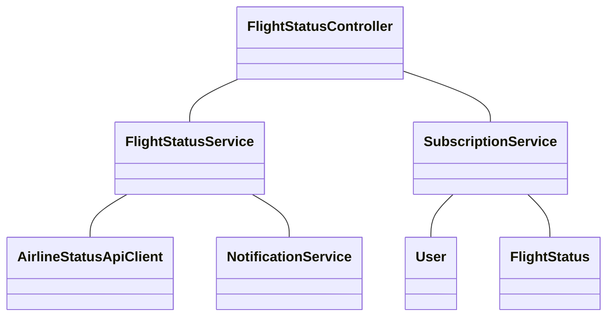
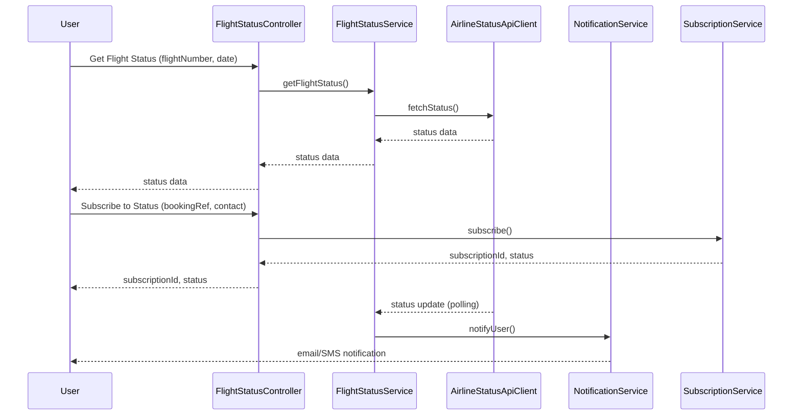
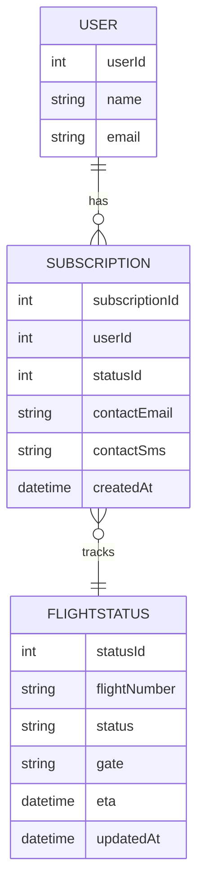

# For User Story Number [2]

1. Objective
The objective is to enable travelers to track their flight status in real-time, including updates on delays, cancellations, and gate changes. The system will provide notifications via email and SMS and allow users to check status through web or mobile interfaces. The solution must ensure timely, reliable, and secure delivery of flight status information.

2. API Model
2.1 Common Components/Services
- Authentication Service (OAuth2 based)
- Notification Service (Email/SMS)
- Airline Status API Integration Service
- Flight Status Polling Service

2.2 API Details
| Operation         | REST Method | Type           | URL                                  | Request (Sample JSON)                                                      | Response (Sample JSON)                                                     |
|------------------|-------------|----------------|---------------------------------------|----------------------------------------------------------------------------|----------------------------------------------------------------------------|
| Get Flight Status| GET         | Success/Fail   | /api/flights/status                   | {"flightNumber":"AA123","date":"2025-10-01"}                         | {"flightNumber":"AA123","status":"DELAYED","gate":"B12","eta":"2025-10-01T10:30:00Z"} |
| Subscribe Status | POST        | Success/Fail   | /api/flights/subscribe-status         | {"bookingRef":"ABC123","contact":{"email":"user@email.com","sms":"+123456789"}} | {"subscriptionId":"SUB123","status":"SUBSCRIBED"}                    |

2.3 Exceptions
| API                | Exception Condition                  | Exception Type        | Message                                      |
|--------------------|--------------------------------------|----------------------|----------------------------------------------|
| Get Flight Status  | Invalid flight number or booking ref | ValidationException  | Invalid flight number or booking reference    |
| Subscribe Status   | Invalid contact info                 | ValidationException  | Invalid email or phone number                |
| Get Flight Status  | Data feed unavailable                | DataFeedException    | Flight status data currently unavailable      |

3 Functional Design
3.1 Class Diagram

3.2 UML Sequence Diagram

3.3 Components
| Component Name          | Description                                               | Existing/New |
|------------------------|-----------------------------------------------------------|--------------|
| FlightStatusController | Handles flight status queries and subscriptions           | New          |
| FlightStatusService    | Business logic for fetching and processing flight status  | New          |
| NotificationService    | Sends email/SMS notifications                            | Existing     |
| AirlineStatusApiClient | Integrates with airline status APIs                      | New          |
| SubscriptionService    | Manages user subscriptions for status updates             | New          |
| User                   | User entity/model                                        | Existing     |
| FlightStatus           | Flight status entity/model                               | New          |

3.4 Service Layer Logic and Validations
| FieldName          | Validation                                 | Error Message                         | ClassUsed             |
|--------------------|---------------------------------------------|---------------------------------------|-----------------------|
| flightNumber       | Must be valid flight number                 | Invalid flight number                 | FlightStatusService   |
| bookingRef         | Must be valid booking reference             | Invalid booking reference             | SubscriptionService   |
| contact.email      | Must be valid email address                 | Invalid email address                 | SubscriptionService   |
| contact.sms        | Must be valid phone number                  | Invalid phone number                  | SubscriptionService   |
| dataFeed           | Must be up-to-date and reliable             | Flight status data unavailable        | AirlineStatusApiClient|

4 Integrations
| SystemToBeIntegrated | IntegratedFor         | IntegrationType |
|---------------------|-----------------------|-----------------|
| Airline Status API  | Real-time flight data | API             |
| Email Service       | Status notifications  | API             |
| SMS Gateway         | Status notifications  | API             |

5 DB Details
5.1 ER Model

5.2 DB Validations
- Unique constraint on (flightNumber, updatedAt) in FLIGHTSTATUS.
- Foreign key constraints between SUBSCRIPTION, USER, FLIGHTSTATUS.

6 Non-Functional Requirements
6.1 Performance
- Status updates delivered within 2 minutes of airline data change.
- Support for 10,000+ concurrent users.
- Monitoring and alerting for data feed/API failures.

6.2 Security
6.2.1 Authentication
- OAuth2 authentication for all endpoints.
- HTTPS enforced for all APIs.
6.2.2 Authorization
- Only users with valid bookings can subscribe to status updates.

6.3 Logging
6.3.1 Application Logging
- DEBUG: API requests/responses (excluding sensitive data)
- INFO: Status update deliveries, subscription creations
- ERROR: Data feed/API failures, notification delivery errors
- WARN: Repeated failed notification attempts
6.3.2 Audit Log
- Audit log of all status notifications sent (subscriptionId, userId, timestamp, status)

7 Dependencies
- Airline status API/data feed availability
- Email/SMS gateway uptime

8 Assumptions
- Airline status APIs provide real-time, reliable updates.
- Users have verified contact information for notifications.
