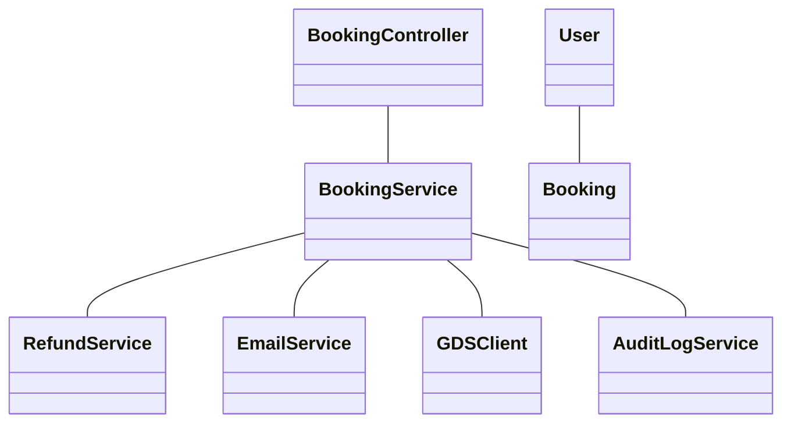
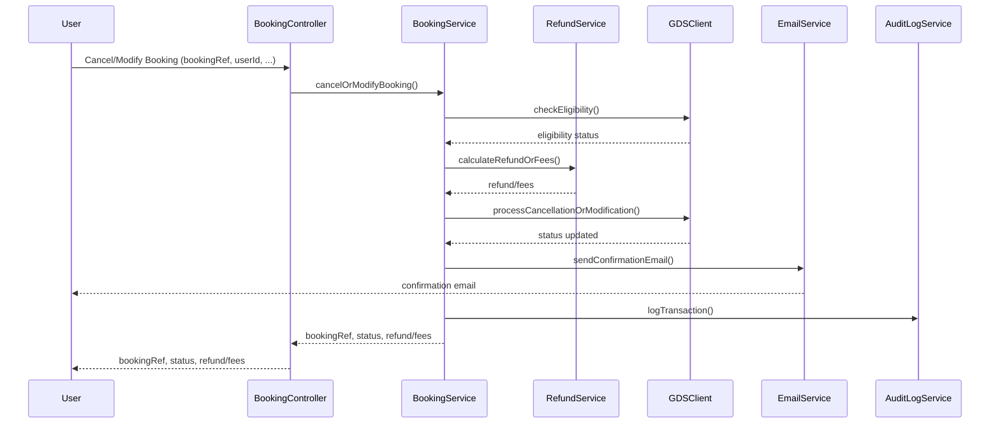
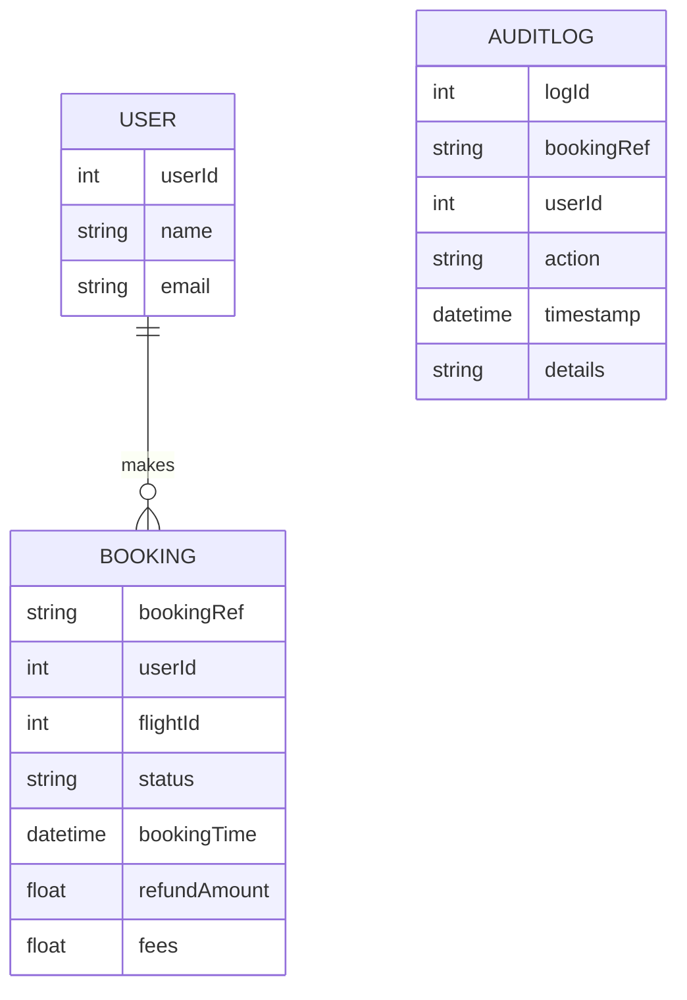

# For User Story Number [3]

1. Objective
The objective is to allow travelers to cancel or modify their air transport bookings online, providing clear information on refund eligibility and applicable fees. The system will automate refund processing and ensure updated confirmations are sent to users. The solution must be secure, compliant, and handle concurrent modification requests efficiently.

2. API Model
2.1 Common Components/Services
- Authentication Service (JWT based)
- Booking Management Service
- Refund Calculation Service
- Email Notification Service
- GDS Integration Service (for booking management)
- Audit Logging Service

2.2 API Details
| Operation             | REST Method | Type           | URL                                  | Request (Sample JSON)                                                                                  | Response (Sample JSON)                                                                                 |
|----------------------|-------------|----------------|---------------------------------------|--------------------------------------------------------------------------------------------------------|--------------------------------------------------------------------------------------------------------|
| List Bookings        | GET         | Success/Fail   | /api/bookings/user/{userId}           | N/A                                                                                                    | {"bookings":[{"bookingRef":"ABC123","status":"CONFIRMED","eligibleForChange":true}]}         |
| Cancel Booking       | POST        | Success/Fail   | /api/bookings/{bookingRef}/cancel     | {"userId":456}                                                                                        | {"bookingRef":"ABC123","status":"CANCELLED","refundAmount":120.00}                             |
| Modify Booking       | POST        | Success/Fail   | /api/bookings/{bookingRef}/modify     | {"userId":456,"newFlightId":789,"newSeats":["14B"]}                                              | {"bookingRef":"ABC123","status":"MODIFIED","fees":30.00}                                       |

2.3 Exceptions
| API                | Exception Condition                  | Exception Type        | Message                                      |
|--------------------|--------------------------------------|----------------------|----------------------------------------------|
| Cancel/Modify      | Booking not eligible                 | BusinessException    | Booking not eligible for cancellation/modification |
| Cancel/Modify      | Refund calculation mismatch          | BusinessException    | Refund calculation error                     |
| Cancel/Modify      | User identity not verified           | AuthException        | User verification failed                     |
| Cancel/Modify      | GDS API failure                     | IntegrationException | Unable to process booking change             |

3 Functional Design
3.1 Class Diagram

3.2 UML Sequence Diagram

3.3 Components
| Component Name      | Description                                               | Existing/New |
|---------------------|-----------------------------------------------------------|--------------|
| BookingController   | Handles booking cancellation/modification endpoints       | New          |
| BookingService      | Business logic for cancellation/modification              | New          |
| RefundService       | Calculates refund amounts and fees                        | New          |
| EmailService        | Sends confirmation emails                                 | Existing     |
| GDSClient           | Integrates with airline GDS for booking management        | New          |
| AuditLogService     | Logs all booking changes for compliance                   | New          |
| User                | User entity/model                                        | Existing     |
| Booking             | Booking entity/model                                     | Existing     |

3.4 Service Layer Logic and Validations
| FieldName      | Validation                                 | Error Message                         | ClassUsed         |
|---------------|---------------------------------------------|---------------------------------------|-------------------|
| bookingRef    | Must be valid and eligible                  | Booking not eligible for change       | BookingService    |
| userId        | Must match booking owner                    | User verification failed              | BookingService    |
| refundAmount  | Must match airline policy                   | Refund calculation error              | RefundService     |
| newFlightId   | Must be valid and available                 | Invalid new flight selection          | BookingService    |

4 Integrations
| SystemToBeIntegrated | IntegratedFor         | IntegrationType |
|---------------------|-----------------------|-----------------|
| Airline GDS         | Booking management    | API             |
| Email Service       | Confirmation emails   | API             |

5 DB Details
5.1 ER Model

5.2 DB Validations
- Only bookings within allowed window have status changeable.
- Foreign key constraints between BOOKING, USER.
- All modifications/cancellations must be logged in AUDITLOG.

6 Non-Functional Requirements
6.1 Performance
- Booking changes processed within 2 minutes.
- Support for 500+ concurrent modification requests.

6.2 Security
6.2.1 Authentication
- JWT-based authentication for all endpoints.
- HTTPS enforced for all APIs.
6.2.2 Authorization
- Only booking owners can modify/cancel their bookings.

6.3 Logging
6.3.1 Application Logging
- DEBUG: API requests/responses (excluding sensitive data)
- INFO: Successful cancellations/modifications, refunds processed
- ERROR: GDS/API failures, refund calculation errors
- WARN: Suspicious modification attempts
6.3.2 Audit Log
- Audit log of all booking changes (bookingRef, userId, action, timestamp)

7 Dependencies
- Airline GDS system availability
- Email service deliverability

8 Assumptions
- Airline GDS provides up-to-date booking eligibility and rules.
- Refunds can be processed automatically to original payment method.
