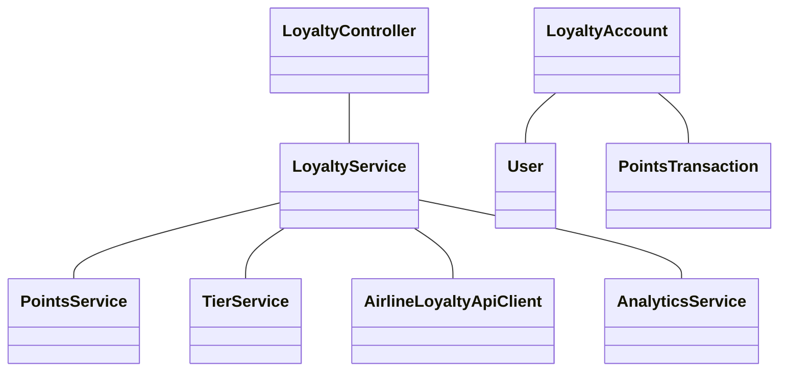
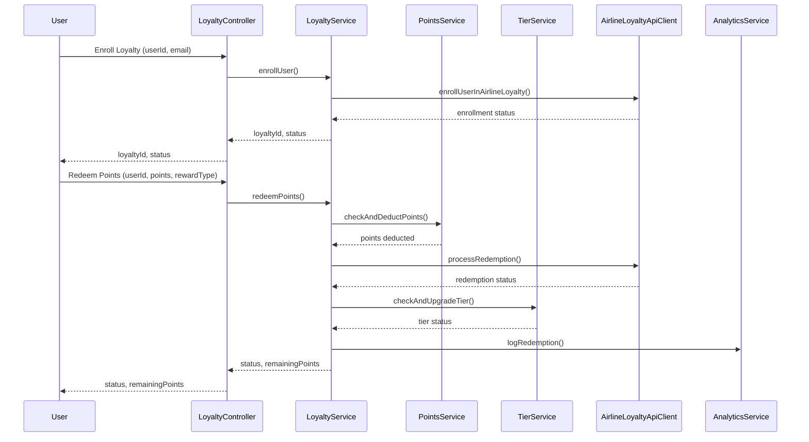
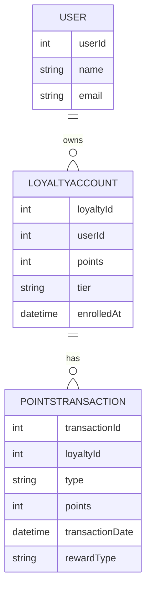

# For User Story Number [4]

1. Objective
The objective is to enable frequent flyers to enroll in and manage a loyalty program, allowing them to earn and redeem points for air travel and related benefits. The system must track points accrual and redemption, support tier upgrades, and provide real-time statements and analytics. The solution should be secure, scalable, and seamlessly integrated with airline loyalty systems.

2. API Model
2.1 Common Components/Services
- Authentication Service (JWT based)
- Loyalty Program Service
- Points Accrual/Redemption Service
- Tier Management Service
- Airline Loyalty System Integration Service
- Analytics Service

2.2 API Details
| Operation              | REST Method | Type           | URL                                   | Request (Sample JSON)                                                                                  | Response (Sample JSON)                                                                                 |
|-----------------------|-------------|----------------|----------------------------------------|--------------------------------------------------------------------------------------------------------|--------------------------------------------------------------------------------------------------------|
| Enroll Loyalty        | POST        | Success/Fail   | /api/loyalty/enroll                    | {"userId":456,"email":"user@email.com"}                                                            | {"loyaltyId":"LOY123","status":"ENROLLED"}                                                      |
| Get Points Balance    | GET         | Success/Fail   | /api/loyalty/{userId}/balance          | N/A                                                                                                    | {"points":12000,"tier":"Gold"}                                                                    |
| Get Transaction Hist. | GET         | Success/Fail   | /api/loyalty/{userId}/transactions     | N/A                                                                                                    | {"transactions":[{"date":"2025-10-01","type":"ACCRUAL","points":500}]}                      |
| Redeem Points         | POST        | Success/Fail   | /api/loyalty/{userId}/redeem           | {"points":5000,"rewardType":"Flight Upgrade"}                                                      | {"status":"REDEEMED","remainingPoints":7000}                                                     |

2.3 Exceptions
| API                | Exception Condition                  | Exception Type        | Message                                      |
|--------------------|--------------------------------------|----------------------|----------------------------------------------|
| Enroll Loyalty     | User already enrolled                | BusinessException    | User already enrolled in loyalty program     |
| Redeem Points      | Insufficient points                  | BusinessException    | Not enough points to redeem                  |
| Redeem Points      | Invalid reward type                  | ValidationException  | Invalid reward type selected                 |
| Any                | User identity not verified           | AuthException        | User verification failed                     |

3 Functional Design
3.1 Class Diagram

3.2 UML Sequence Diagram

3.3 Components
| Component Name          | Description                                               | Existing/New |
|------------------------|-----------------------------------------------------------|--------------|
| LoyaltyController      | Handles loyalty program endpoints                         | New          |
| LoyaltyService         | Business logic for loyalty program                        | New          |
| PointsService          | Points accrual and redemption logic                       | New          |
| TierService            | Manages user tier upgrades                                | New          |
| AirlineLoyaltyApiClient| Integrates with airline loyalty systems                   | New          |
| AnalyticsService       | Tracks and reports program analytics                      | New          |
| User                   | User entity/model                                        | Existing     |
| LoyaltyAccount         | Loyalty account entity/model                              | New          |
| PointsTransaction      | Points transaction entity/model                           | New          |

3.4 Service Layer Logic and Validations
| FieldName      | Validation                                 | Error Message                         | ClassUsed         |
|---------------|---------------------------------------------|---------------------------------------|-------------------|
| userId        | Must be valid and unique                    | User verification failed              | LoyaltyService    |
| points        | Must not exceed available balance           | Not enough points to redeem           | PointsService     |
| rewardType    | Must be valid reward type                   | Invalid reward type selected          | LoyaltyService    |
| eligibleBooking| Only eligible bookings accrue points        | Booking not eligible for points       | PointsService     |

4 Integrations
| SystemToBeIntegrated | IntegratedFor         | IntegrationType |
|---------------------|-----------------------|-----------------|
| Airline Loyalty API | Enrollment, accrual, redemption | API             |
| Analytics Service   | Program analytics      | API             |

5 DB Details
5.1 ER Model

5.2 DB Validations
- Unique constraint on (userId) in LOYALTYACCOUNT.
- Foreign key constraints between LOYALTYACCOUNT, USER, POINTSTRANSACTION.
- Points balance must not go negative.

6 Non-Functional Requirements
6.1 Performance
- Points accrual/redemption reflected within 1 minute.
- Support for 100,000+ loyalty members.
- Analytics dashboard with near real-time updates.

6.2 Security
6.2.1 Authentication
- JWT-based authentication for all endpoints.
- HTTPS enforced for all APIs.
6.2.2 Authorization
- Only account owners can redeem points or view statements.

6.3 Logging
6.3.1 Application Logging
- DEBUG: API requests/responses (excluding sensitive data)
- INFO: Points accrual/redemption, tier upgrades
- ERROR: API/integration failures, invalid transactions
- WARN: Suspicious redemption attempts
6.3.2 Audit Log
- Audit log of all points transactions (transactionId, loyaltyId, type, timestamp)

7 Dependencies
- Airline loyalty system availability
- Analytics service uptime

8 Assumptions
- Airline loyalty API supports real-time accrual/redemption.
- Users can only have one loyalty account per userId.
