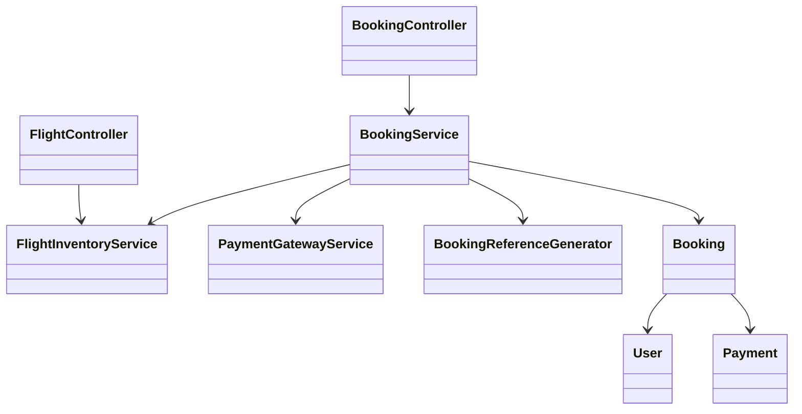
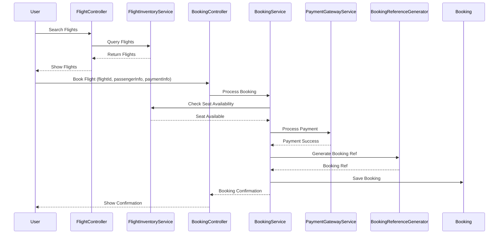
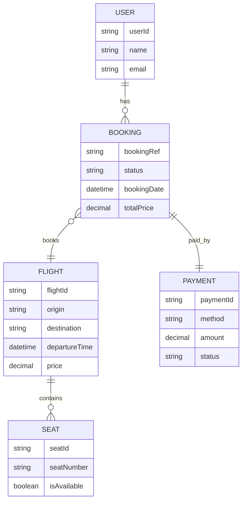

# For User Story Number [1]
1. Objective
This requirement enables travelers to search, select, and book air transport tickets online. It ensures real-time flight availability, secure payment processing, and immediate booking confirmation. The goal is to provide a seamless and secure booking experience for users.

2. API Model
  2.1 Common Components/Services
  - AuthenticationService (OAuth2 based authentication)
  - PaymentGatewayService (Stripe/PayPal integration)
  - FlightInventoryService (for real-time flight data)
  - BookingReferenceGenerator

  2.2 API Details
| Operation  | REST Method | Type    | URL                                | Request (Sample JSON)                                                                                  | Response (Sample JSON)                                                                                 |
|------------|-------------|---------|-------------------------------------|--------------------------------------------------------------------------------------------------------|--------------------------------------------------------------------------------------------------------|
| Search     | GET         | Success | /api/flights/search                 | { "origin": "JFK", "destination": "LAX", "date": "2025-10-01" }                                  | { "flights": [{ "flightId": "F123", "price": 350, "seatsAvailable": 5 }] }                     |
| Book       | POST        | Success | /api/bookings                       | { "flightId": "F123", "passengerInfo": {...}, "paymentInfo": {...} }                               | { "bookingRef": "BR123456", "status": "CONFIRMED", "ticket": {...} }                            |
| Book       | POST        | Failure | /api/bookings                       | { "flightId": "F123", "passengerInfo": {...}, "paymentInfo": {...} }                               | { "error": "Payment failed or seat unavailable" }                                                    |

  2.3 Exceptions
  - InvalidAirportCodeException: Thrown when origin/destination codes are invalid.
  - PastDateException: Thrown when travel date is in the past.
  - PaymentFailedException: Thrown when payment gateway fails.
  - SeatUnavailableException: Thrown when selected seat is no longer available.

3 Functional Design
  3.1 Class Diagram

  3.2 UML Sequence Diagram

  3.3 Components
| Component Name            | Description                                                 | Existing/New |
|--------------------------|-------------------------------------------------------------|--------------|
| FlightController         | Handles flight search requests                               | New          |
| BookingController        | Handles booking requests                                    | New          |
| FlightInventoryService   | Queries flight data and seat availability                   | Existing     |
| PaymentGatewayService    | Integrates with payment providers                           | Existing     |
| BookingService           | Orchestrates booking logic                                  | New          |
| BookingReferenceGenerator| Generates unique booking references                         | New          |
| Booking                  | Entity representing a booking                               | New          |
| User                     | Entity representing a user                                  | Existing     |
| Payment                  | Entity representing a payment                               | New          |

  3.4 Service Layer Logic & Validations
| FieldName       | Validation                                       | Error Message                        | ClassUsed                 |
|-----------------|--------------------------------------------------|--------------------------------------|---------------------------|
| origin          | Not empty, valid airport code                    | Invalid origin airport code           | FlightController          |
| destination     | Not empty, valid airport code                    | Invalid destination airport code      | FlightController          |
| date            | Not in the past                                  | Travel date cannot be in the past     | FlightController          |
| seatAvailability| Must be available                                | Seat unavailable                     | BookingService            |
| payment         | Must be successful                               | Payment failed                       | PaymentGatewayService     |

4 Integrations
| SystemToBeIntegrated | IntegratedFor         | IntegrationType |
|----------------------|----------------------|-----------------|
| Third-party Flight API| Real-time flight data | API             |
| Payment Gateway      | Payment processing    | API             |
| Azure SQL Database   | Booking storage       | DB              |

5 DB Details
  5.1 ER Model

  5.2 DB Validations
  - Unique constraint on bookingRef in BOOKING
  - Foreign key constraints between BOOKING, USER, FLIGHT, PAYMENT
  - Seat availability check before booking

6 Non-Functional Requirements
  6.1 Performance
  - API endpoints must respond within 2 seconds under 1000 concurrent users.
  - Caching for frequent flight search queries at API layer.

  6.2 Security
    6.2.1 Authentication
    - OAuth2 authentication for all endpoints.
    - Integration with IAM for user management.
    6.2.2 Authorization
    - Only authenticated users can book tickets.
    - Role-based access for admin operations.

  6.3 Logging
    6.3.1 Application Logging
    - DEBUG: API request/response payloads (excluding sensitive data)
    - INFO: Successful bookings, payments
    - ERROR: Failed payments, booking errors
    - WARN: Suspicious activity, repeated failures
    6.3.2 Audit Log
    - Log all booking and payment events with user and timestamp

7 Dependencies
  - Third-party flight APIs must be available and performant.
  - Payment gateway integration must be operational.
  - Azure SQL Database connectivity.

8 Assumptions
  - All airport codes follow IATA standard.
  - Payment gateway handles PCI compliance.
  - Real-time flight data is reliable and up-to-date.
