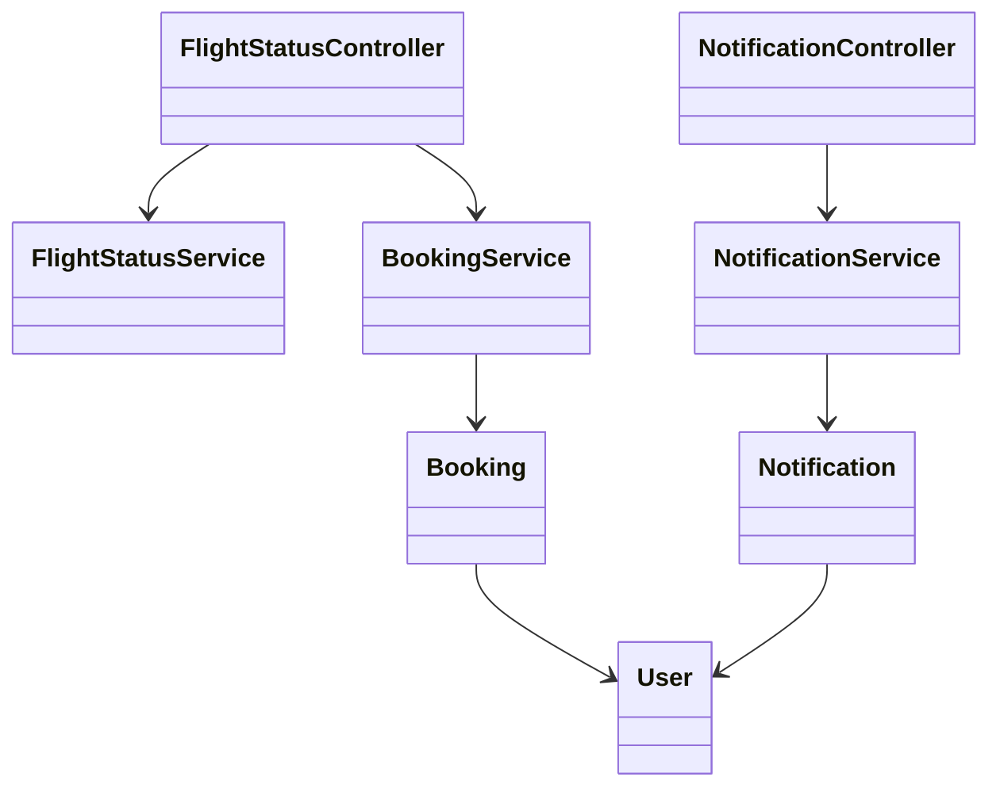
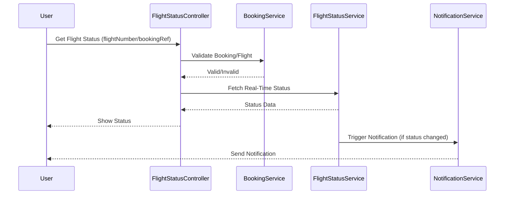
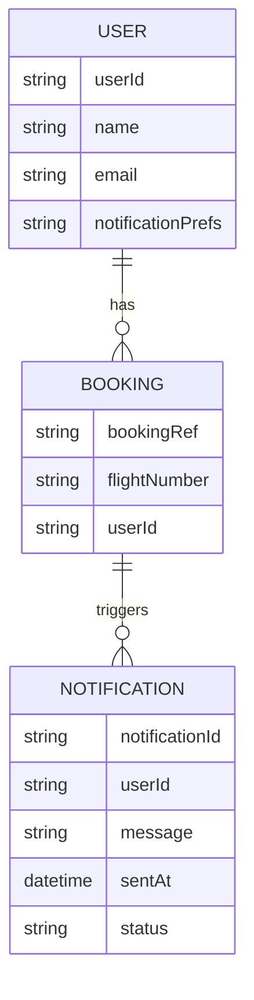

# For User Story Number [2]
1. Objective
This requirement enables travelers to track the real-time status of their flights, including delays, cancellations, and gate changes. It ensures users can retrieve flight status using booking reference or flight number and receive timely notifications for any disruptions. The goal is to keep travelers informed and reduce uncertainty during their journey.

2. API Model
  2.1 Common Components/Services
  - AuthenticationService (OAuth2 based authentication)
  - FlightStatusService (for real-time flight status)
  - NotificationService (Twilio/SendGrid integration)
  - BookingService (to match bookings with flight status)

  2.2 API Details
| Operation   | REST Method | Type    | URL                                    | Request (Sample JSON)                                         | Response (Sample JSON)                                                                                 |
|-------------|-------------|---------|-----------------------------------------|---------------------------------------------------------------|--------------------------------------------------------------------------------------------------------|
| Get Status  | GET         | Success | /api/flights/status                    | { "flightNumber": "F123" }                                   | { "status": "DELAYED", "departureTime": "10:30", "gate": "A12" }                                |
| Get Status  | GET         | Success | /api/flights/status                    | { "bookingRef": "BR123456" }                                 | { "status": "ON TIME", "departureTime": "09:00", "gate": "B1" }                                 |
| Notify      | POST        | Success | /api/notifications/flight-status        | { "userId": "U123", "message": "Flight delayed" }           | { "notificationId": "N123", "status": "SENT" }                                                 |
| Get Status  | GET         | Failure | /api/flights/status                    | { "flightNumber": "INVALID" }                                | { "error": "Flight not found" }                                                                   |

  2.3 Exceptions
  - InvalidBookingReferenceException: Thrown when booking reference is invalid.
  - InvalidFlightNumberException: Thrown when flight number is invalid.
  - NotificationFailedException: Thrown when notification delivery fails.
  - FlightStatusUnavailableException: Thrown when real-time status cannot be fetched.

3 Functional Design
  3.1 Class Diagram

  3.2 UML Sequence Diagram

  3.3 Components
| Component Name         | Description                                                 | Existing/New |
|-----------------------|-------------------------------------------------------------|--------------|
| FlightStatusController| Handles flight status requests                              | New          |
| NotificationController| Handles notification requests                               | New          |
| FlightStatusService   | Integrates with airline/airport APIs for status             | New          |
| NotificationService   | Sends notifications via SMS/Email/In-app                    | Existing     |
| BookingService        | Retrieves and validates bookings                            | Existing     |
| Notification          | Entity representing a notification                          | New          |
| User                  | Entity representing a user                                  | Existing     |
| Booking               | Entity representing a booking                               | Existing     |

  3.4 Service Layer Logic & Validations
| FieldName            | Validation                                   | Error Message                        | ClassUsed                 |
|----------------------|----------------------------------------------|--------------------------------------|---------------------------|
| flightNumber         | Must exist in system                         | Invalid flight number                 | FlightStatusController    |
| bookingRef           | Must exist in system                         | Invalid booking reference             | FlightStatusController    |
| notificationPrefs    | Must be set by user                          | Notification preferences not set      | NotificationService       |
| statusSource         | Must be reliable real-time API               | Flight status unavailable             | FlightStatusService       |

4 Integrations
| SystemToBeIntegrated | IntegratedFor         | IntegrationType |
|----------------------|----------------------|-----------------|
| Airline/Airport API  | Real-time flight status| API             |
| Notification Service | Email/SMS/In-app notif| API             |
| Azure SQL Database   | Booking storage       | DB              |

5 DB Details
  5.1 ER Model

  5.2 DB Validations
  - Foreign key constraints between NOTIFICATION, BOOKING, USER
  - Unique constraint on notificationId

6 Non-Functional Requirements
  6.1 Performance
  - Status updates reflected within 1 minute of change.
  - Notifications delivered within 30 seconds.
  - High availability for notification services.

  6.2 Security
    6.2.1 Authentication
    - OAuth2 authentication for all endpoints.
    6.2.2 Authorization
    - Only authenticated users can access booking-linked status.

  6.3 Logging
    6.3.1 Application Logging
    - DEBUG: API request/response payloads (excluding sensitive data)
    - INFO: Status updates, notification sent
    - ERROR: Failed notification deliveries
    - WARN: Delayed status updates
    6.3.2 Audit Log
    - Log all status queries and notifications with user and timestamp

7 Dependencies
  - Airline/airport APIs must be reliable and available.
  - Notification service (Twilio/SendGrid) must be operational.

8 Assumptions
  - Real-time data from airline/airport APIs is accurate.
  - Users have set up their notification preferences.
