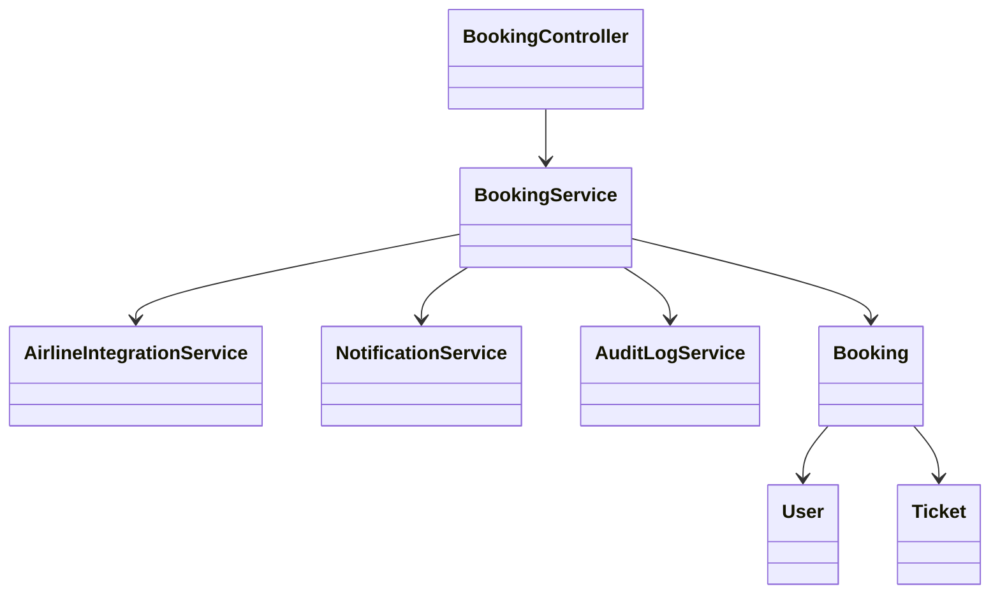
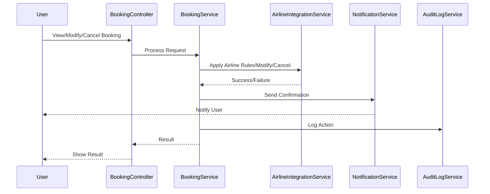
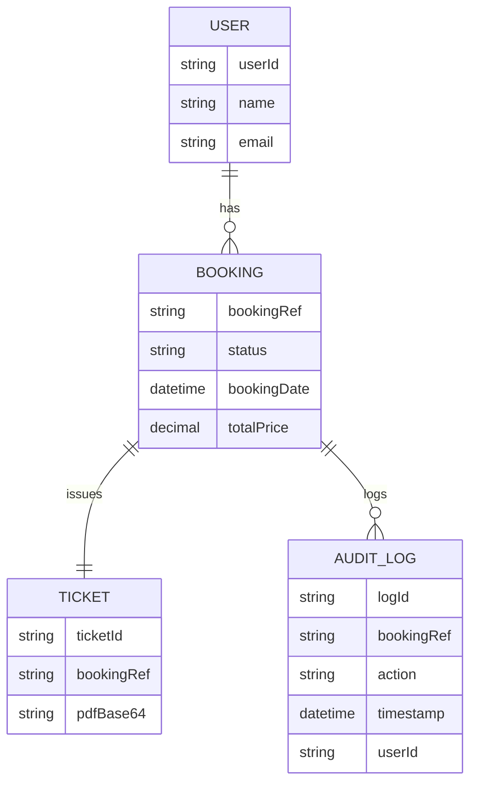

# For User Story Number [3]
1. Objective
This requirement enables travelers to manage their existing air transport bookings, including viewing, modifying, canceling, and downloading tickets. It ensures secure access, compliance with airline policies, and provides confirmation for all booking changes. The goal is to empower users with control over their reservations while maintaining data integrity and security.

2. API Model
  2.1 Common Components/Services
  - AuthenticationService (OAuth2 based authentication)
  - BookingService (for booking management)
  - AirlineIntegrationService (for booking modifications)
  - NotificationService (for confirmations)
  - AuditLogService

  2.2 API Details
| Operation      | REST Method | Type    | URL                                    | Request (Sample JSON)                                         | Response (Sample JSON)                                                                                 |
|---------------|-------------|---------|-----------------------------------------|---------------------------------------------------------------|--------------------------------------------------------------------------------------------------------|
| Get Bookings  | GET         | Success | /api/bookings                          | { "userId": "U123" }                                        | { "bookings": [{ "bookingRef": "BR123", "status": "CONFIRMED" }] }                              |
| Modify Booking| PUT         | Success | /api/bookings/{bookingRef}              | { "newDate": "2025-10-02", "newFlightId": "F456" }         | { "bookingRef": "BR123", "status": "RESCHEDULED" }                                             |
| Cancel Booking| DELETE      | Success | /api/bookings/{bookingRef}              | {}                                                          | { "bookingRef": "BR123", "status": "CANCELLED", "refund": 120 }                                |
| Download Ticket| GET        | Success | /api/bookings/{bookingRef}/ticket       | {}                                                          | { "ticket": "<PDF base64>" }                                                                      |
| Modify/Cancel | PUT/DELETE  | Failure | /api/bookings/{bookingRef}              | {}                                                          | { "error": "Modification not allowed as per fare rules" }                                         |

  2.3 Exceptions
  - UnauthorizedAccessException: Thrown when user is not authenticated.
  - BookingNotFoundException: Thrown when booking reference is invalid.
  - ModificationNotAllowedException: Thrown when change/cancel violates airline rules.
  - RefundProcessingException: Thrown when refund fails.

3 Functional Design
  3.1 Class Diagram

  3.2 UML Sequence Diagram

  3.3 Components
| Component Name            | Description                                                 | Existing/New |
|--------------------------|-------------------------------------------------------------|--------------|
| BookingController        | Handles booking management requests                         | New          |
| BookingService           | Orchestrates booking management logic                       | New          |
| AirlineIntegrationService| Integrates with airline APIs for modifications              | New          |
| NotificationService      | Sends notifications for changes/cancellations               | Existing     |
| AuditLogService          | Logs all booking modifications                             | New          |
| Booking                  | Entity representing a booking                               | Existing     |
| User                     | Entity representing a user                                  | Existing     |
| Ticket                   | Entity representing a ticket                                | New          |

  3.4 Service Layer Logic & Validations
| FieldName       | Validation                                       | Error Message                        | ClassUsed                 |
|-----------------|--------------------------------------------------|--------------------------------------|---------------------------|
| user            | Must be authenticated                            | Unauthorized access                  | BookingController         |
| bookingRef      | Must exist and belong to user                    | Booking not found                    | BookingService            |
| change/cancel   | Must comply with airline fare rules              | Modification not allowed             | AirlineIntegrationService |
| refund          | If applicable, processed as per policy           | Refund processing failed             | BookingService            |

4 Integrations
| SystemToBeIntegrated | IntegratedFor         | IntegrationType |
|----------------------|----------------------|-----------------|
| Airline API          | Booking modifications| API             |
| Notification Service | Change/cancel notif  | API             |
| Azure SQL Database   | Booking storage      | DB              |
| Audit Log System     | Audit trail          | DB/Log          |

5 DB Details
  5.1 ER Model

  5.2 DB Validations
  - Foreign key constraints between BOOKING, USER, TICKET, AUDIT_LOG
  - Unique constraint on bookingRef in BOOKING
  - Booking modification rules enforced at DB and service layer

6 Non-Functional Requirements
  6.1 Performance
  - Booking changes processed within 10 seconds.
  - Support at least 500 concurrent sessions.

  6.2 Security
    6.2.1 Authentication
    - OAuth2 authentication for all endpoints.
    6.2.2 Authorization
    - Only authenticated users can manage their bookings.

  6.3 Logging
    6.3.1 Application Logging
    - DEBUG: API request/response payloads (excluding sensitive data)
    - INFO: Booking changes, cancellations
    - ERROR: Failed modifications, refund issues
    - WARN: Policy violations
    6.3.2 Audit Log
    - Log all booking modifications with user, action, and timestamp

7 Dependencies
  - Airline APIs must be available for modifications.
  - Notification service must be operational.
  - Audit log system must be accessible.

8 Assumptions
  - Airline fare rules are provided and up-to-date.
  - Refunds are processed by integrated payment gateway.
  - Users have access to their email for confirmations.
