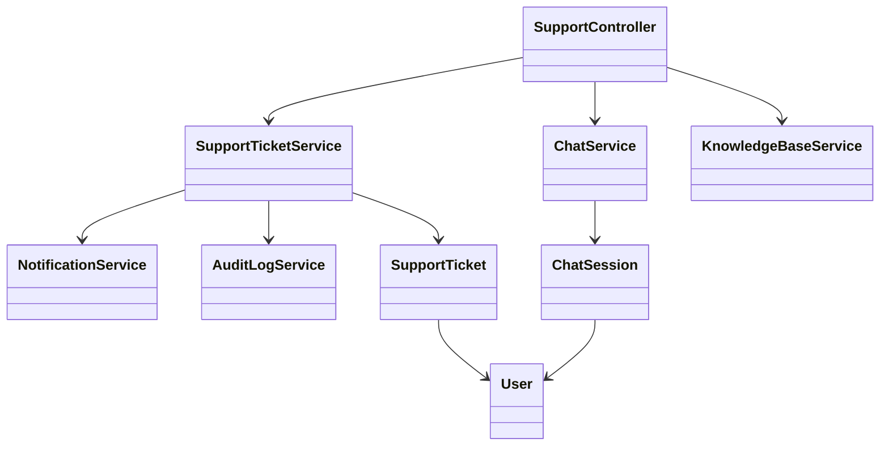
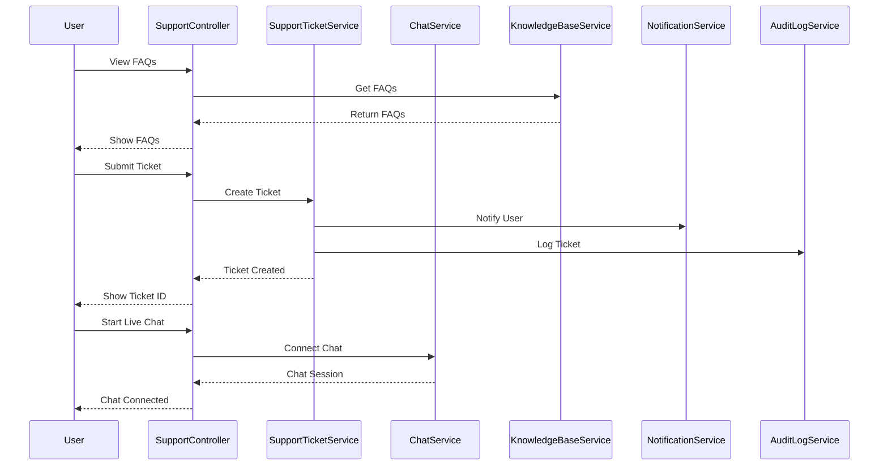
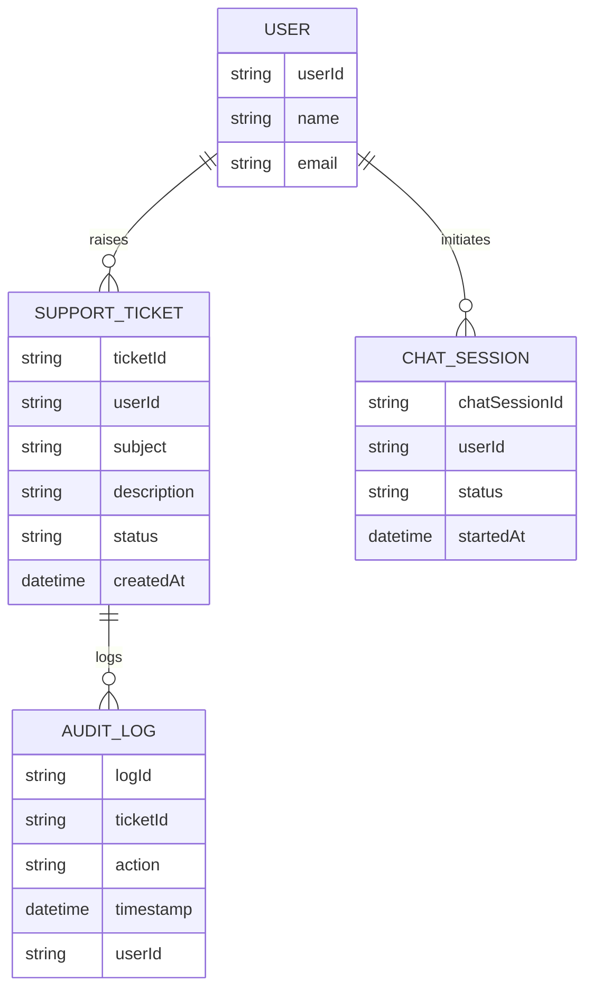

# For User Story Number [4]
1. Objective
This requirement enables travelers to access customer support for air transport bookings through multiple channels such as chat, email, or phone. It ensures users can get timely assistance, submit support tickets, and track resolution status. The goal is to provide a robust help center and effective support experience for all booking-related issues.

2. API Model
  2.1 Common Components/Services
  - AuthenticationService (OAuth2 based authentication)
  - SupportTicketService (for managing support tickets)
  - ChatService (for live chat support)
  - KnowledgeBaseService (for FAQs and articles)
  - NotificationService (for ticket updates)
  - AuditLogService

  2.2 API Details
| Operation         | REST Method | Type    | URL                                        | Request (Sample JSON)                                         | Response (Sample JSON)                                                                                 |
|-------------------|-------------|---------|---------------------------------------------|---------------------------------------------------------------|--------------------------------------------------------------------------------------------------------|
| Get FAQs          | GET         | Success | /api/support/faqs                          | {}                                                          | { "faqs": [{ "id": 1, "question": "How to book?", "answer": "..." }] }                        |
| Submit Ticket     | POST        | Success | /api/support/tickets                       | { "userId": "U123", "subject": "Issue", "description": "..." } | { "ticketId": "T123", "status": "OPEN" }                                                        |
| Live Chat Connect | POST        | Success | /api/support/chat/connect                   | { "userId": "U123" }                                        | { "chatSessionId": "C123", "status": "CONNECTED" }                                              |
| Get Ticket Status | GET         | Success | /api/support/tickets/{ticketId}/status      | {}                                                          | { "ticketId": "T123", "status": "RESOLVED" }                                                    |
| Submit Ticket     | POST        | Failure | /api/support/tickets                       | { "userId": "U123", "subject": "", "description": "..." }  | { "error": "Subject is required" }                                                                 |

  2.3 Exceptions
  - UnauthorizedAccessException: Thrown when user is not authenticated.
  - TicketNotFoundException: Thrown when ticket ID is invalid.
  - ChatConnectionException: Thrown when chat session cannot be established.
  - ValidationException: Thrown for missing required fields in support requests.

3 Functional Design
  3.1 Class Diagram

  3.2 UML Sequence Diagram

  3.3 Components
| Component Name            | Description                                                 | Existing/New |
|--------------------------|-------------------------------------------------------------|--------------|
| SupportController        | Handles support-related requests                            | New          |
| SupportTicketService     | Manages support ticket lifecycle                            | New          |
| ChatService              | Manages live chat sessions                                  | New          |
| KnowledgeBaseService     | Provides FAQs and support articles                          | New          |
| NotificationService      | Sends notifications for ticket updates                      | Existing     |
| AuditLogService          | Logs all support interactions                               | New          |
| SupportTicket            | Entity representing a support ticket                        | New          |
| ChatSession              | Entity representing a chat session                          | New          |
| User                     | Entity representing a user                                  | Existing     |

  3.4 Service Layer Logic & Validations
| FieldName       | Validation                                       | Error Message                        | ClassUsed                 |
|-----------------|--------------------------------------------------|--------------------------------------|---------------------------|
| user            | Must be authenticated                            | Unauthorized access                  | SupportController         |
| subject         | Must not be empty                                | Subject is required                  | SupportTicketService      |
| description     | Must not be empty                                | Description is required              | SupportTicketService      |
| ticketId        | Must exist and belong to user                    | Ticket not found                     | SupportTicketService      |
| chatSession     | Must be established successfully                 | Chat connection failed               | ChatService               |

4 Integrations
| SystemToBeIntegrated | IntegratedFor         | IntegrationType |
|----------------------|----------------------|-----------------|
| Customer Support Platform | Ticket management, chat | API         |
| Notification Service | Ticket/chat updates   | API             |
| Azure SQL Database   | Support data storage  | DB              |
| Audit Log System     | Audit trail           | DB/Log          |

5 DB Details
  5.1 ER Model

  5.2 DB Validations
  - Foreign key constraints between SUPPORT_TICKET, USER, AUDIT_LOG
  - Unique constraint on ticketId in SUPPORT_TICKET
  - Chat sessions linked to authenticated users

6 Non-Functional Requirements
  6.1 Performance
  - Average first response time under 5 minutes.
  - Support at least 200 concurrent live chat sessions.

  6.2 Security
    6.2.1 Authentication
    - OAuth2 authentication for all endpoints.
    6.2.2 Authorization
    - Only authenticated users can submit/view support tickets.

  6.3 Logging
    6.3.1 Application Logging
    - DEBUG: API request/response payloads (excluding sensitive data)
    - INFO: Ticket creation, chat connections
    - ERROR: Failed ticket/chat creation
    - WARN: Escalated/unresolved tickets
    6.3.2 Audit Log
    - Log all support interactions with user, action, and timestamp

7 Dependencies
  - Customer support platform (Zendesk/Freshdesk) must be available.
  - Notification service must be operational.
  - Audit log system must be accessible.

8 Assumptions
  - Support agents are available for live chat.
  - Knowledge base is maintained and up-to-date.
  - Users have access to their email for ticket updates.
