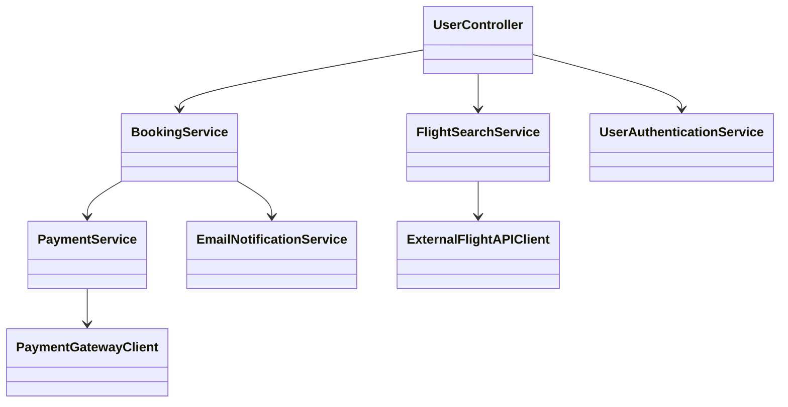
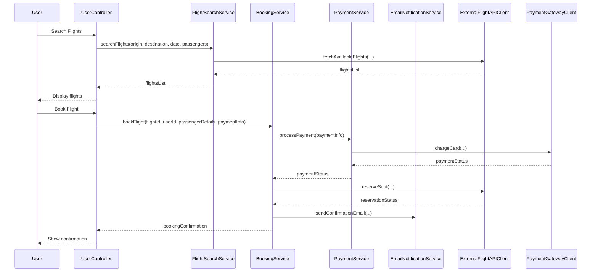
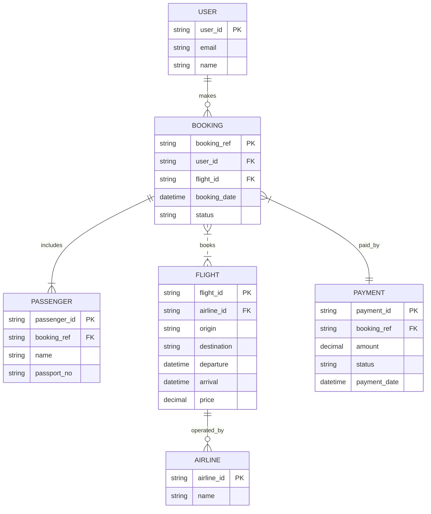

# For User Story Number [1]
1. Objective
This requirement enables travelers to search, compare, and book air transport tickets online. It streamlines the booking process by integrating flight search, selection, and payment functionalities. The goal is to provide a seamless and secure booking experience with automated confirmation and notifications.

2. API Model
  2.1 Common Components/Services
  - FlightSearchService (existing or new)
  - PaymentService (existing or new)
  - BookingService (new)
  - EmailNotificationService (existing)
  - UserAuthenticationService (existing)

  2.2 API Details
| Operation   | REST Method | Type        | URL                         | Request (sample JSON)                                                                                 | Response (sample JSON)                                                                                       |
|-------------|-------------|-------------|-----------------------------|------------------------------------------------------------------------------------------------------|--------------------------------------------------------------------------------------------------------------|
| Search      | GET         | Success     | /api/flights/search         | { "origin": "JFK", "destination": "LAX", "date": "2024-07-01", "passengers": 2 }           | { "flights": [ { "flightId": "F123", "airline": "Delta", "departure": "10:00", "arrival": "13:00", "price": 350.00 } ] } |
| Book        | POST        | Success     | /api/flights/book           | { "flightId": "F123", "userId": "U456", "passengerDetails": [ ... ], "paymentInfo": { ... } } | { "bookingRef": "BR789", "status": "CONFIRMED", "details": { ... } }                                 |
| Book        | POST        | Failure     | /api/flights/book           | { ... }                                                                                              | { "errorCode": "PAYMENT_FAILED", "message": "Payment validation failed." }                              |

  2.3 Exceptions
| API                   | Exception Type         | Description                                  |
|-----------------------|-----------------------|----------------------------------------------|
| /api/flights/search   | InvalidInputException | Invalid airport codes or date format         |
| /api/flights/search   | NoFlightsFound        | No flights available for given criteria      |
| /api/flights/book     | PaymentFailedException| Payment processing failed                    |
| /api/flights/book     | BookingFailedException| Booking could not be completed               |

3 Functional Design
  3.1 Class Diagram

  3.2 UML Sequence Diagram

  3.3 Components
| Component Name             | Description                                                  | Existing/New |
|---------------------------|--------------------------------------------------------------|--------------|
| UserController            | Handles user requests for search and booking                 | New          |
| FlightSearchService       | Manages flight search logic and API integration              | New          |
| BookingService            | Handles booking, seat reservation, and confirmation          | New          |
| PaymentService            | Processes payment and interacts with payment gateway         | Existing     |
| EmailNotificationService  | Sends booking confirmation emails                            | Existing     |
| ExternalFlightAPIClient   | Integrates with external flight data APIs                    | New          |
| PaymentGatewayClient      | Integrates with external payment gateway                     | Existing     |
| UserAuthenticationService | Manages user authentication (OAuth 2.0)                     | Existing     |

  3.4 Service Layer Logic and Validations
| FieldName      | Validation                                 | Error Message                        | ClassUsed                |
|---------------|--------------------------------------------|--------------------------------------|--------------------------|
| origin        | Must be valid IATA airport code             | Invalid origin airport code          | FlightSearchService      |
| destination   | Must be valid IATA airport code             | Invalid destination airport code     | FlightSearchService      |
| date          | Must be in the future and valid format      | Invalid or past travel date          | FlightSearchService      |
| paymentInfo   | Must pass payment gateway validation        | Payment validation failed            | PaymentService           |
| passengerDetails | Must be complete and valid               | Invalid passenger details            | BookingService           |

4 Integrations
| SystemToBeIntegrated   | IntegratedFor         | IntegrationType |
|-----------------------|-----------------------|-----------------|
| External Flight API   | Flight availability   | API             |
| Payment Gateway (Stripe) | Payment processing | API             |
| Email Service         | Booking confirmation  | API             |

5 DB Details
  5.1 ER Model

  5.2 DB Validations
- booking_ref must be unique
- payment_id must be unique and linked to booking_ref
- flight_id must exist in FLIGHT table
- user_id must exist in USER table

6 Non-Functional Requirements
  6.1 Performance
  - Flight search API response time < 2 seconds
  - Booking API response time < 3 seconds
  - Caching of frequent flight search queries at API layer

  6.2 Security
    6.2.1 Authentication
    - OAuth 2.0 based authentication for all APIs
    6.2.2 Authorization
    - Role-based access: only authenticated users can book flights

  6.3 Logging
    6.3.1 Application Logging
    - DEBUG: API request/response payloads (excluding sensitive data)
    - INFO: Successful bookings, payment status
    - ERROR: Payment failures, booking errors
    - WARN: Suspicious activity or repeated failed attempts
    6.3.2 Audit Log
    - Log booking creation, payment processing, and confirmation email events

7 Dependencies
- External flight data provider API
- Payment gateway (Stripe)
- Email service provider
- User authentication provider (OAuth 2.0)

8 Assumptions
- All external APIs are available and reliable
- Payment gateway is PCI DSS compliant
- User email is verified before booking
