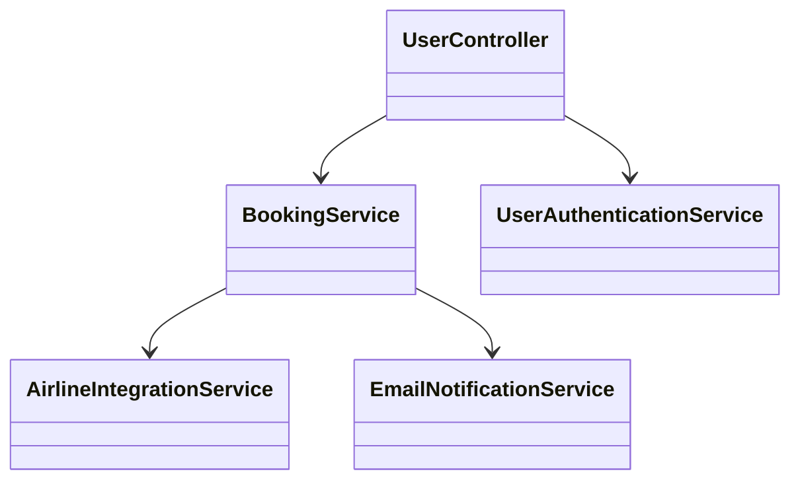
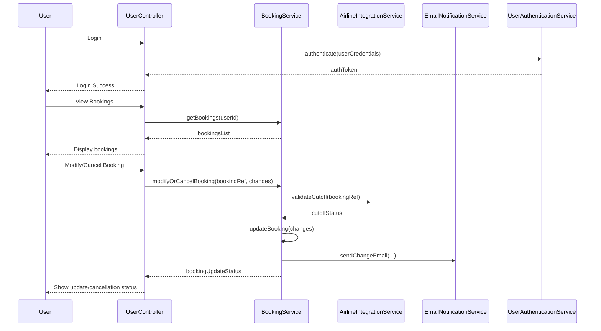
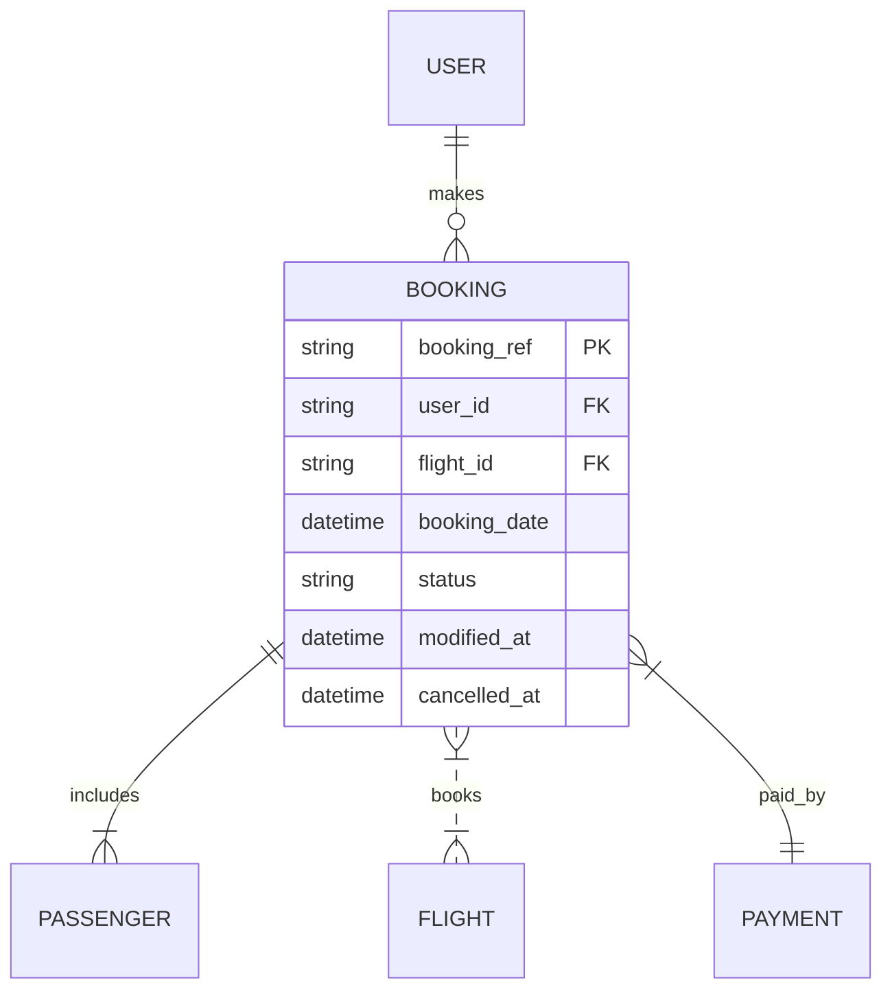

# For User Story Number [2]
1. Objective
This requirement allows travelers to view and manage their air transport bookings. Users can securely access their booking history, view details, and make modifications or cancellations as per airline rules. The feature ensures data privacy, real-time updates, and confirmation notifications for all changes.

2. API Model
  2.1 Common Components/Services
  - BookingService (existing)
  - UserAuthenticationService (existing)
  - EmailNotificationService (existing)
  - AirlineIntegrationService (new)

  2.2 API Details
| Operation   | REST Method | Type        | URL                                 | Request (sample JSON)                                               | Response (sample JSON)                                                                                       |
|-------------|-------------|-------------|-------------------------------------|---------------------------------------------------------------------|--------------------------------------------------------------------------------------------------------------|
| View        | GET         | Success     | /api/bookings                       | { "userId": "U456" }                                              | { "bookings": [ { "bookingRef": "BR789", "flight": { ... }, "status": "CONFIRMED" } ] }           |
| Details     | GET         | Success     | /api/bookings/{bookingRef}          | N/A                                                                 | { "bookingRef": "BR789", "flight": { ... }, "passengers": [ ... ], "paymentStatus": "PAID" }      |
| Modify      | PUT         | Success     | /api/bookings/{bookingRef}/modify   | { "seat": "12A", "date": "2024-07-02" }                        | { "bookingRef": "BR789", "status": "MODIFIED", "details": { ... } }                                 |
| Cancel      | DELETE      | Success     | /api/bookings/{bookingRef}/cancel   | N/A                                                                 | { "bookingRef": "BR789", "status": "CANCELLED" }                                                   |
| Modify/Cancel| PUT/DELETE | Failure     | /api/bookings/{bookingRef}/...      | { ... }                                                            | { "errorCode": "CUTOFF_EXCEEDED", "message": "Modification not allowed after cutoff time." }         |

  2.3 Exceptions
| API                         | Exception Type           | Description                                         |
|-----------------------------|-------------------------|-----------------------------------------------------|
| /api/bookings               | AuthenticationException | User not authenticated                              |
| /api/bookings/{bookingRef}  | NotFoundException       | Booking not found                                   |
| /api/bookings/{bookingRef}/modify | CutoffExceededException | Modification not allowed after cutoff time      |
| /api/bookings/{bookingRef}/cancel | CutoffExceededException | Cancellation not allowed after cutoff time      |

3 Functional Design
  3.1 Class Diagram

  3.2 UML Sequence Diagram

  3.3 Components
| Component Name             | Description                                                  | Existing/New |
|---------------------------|--------------------------------------------------------------|--------------|
| UserController            | Handles user requests for viewing and managing bookings      | New          |
| BookingService            | Manages booking retrieval, modification, and cancellation    | Existing     |
| AirlineIntegrationService | Integrates with airline systems for real-time rules/updates  | New          |
| EmailNotificationService  | Sends confirmation emails for changes                        | Existing     |
| UserAuthenticationService | Manages user authentication (JWT)                            | Existing     |

  3.4 Service Layer Logic and Validations
| FieldName      | Validation                                 | Error Message                        | ClassUsed                |
|---------------|--------------------------------------------|--------------------------------------|--------------------------|
| userId        | Must be authenticated                      | User not authenticated               | UserAuthenticationService|
| bookingRef    | Must exist in DB                           | Booking not found                    | BookingService           |
| changes       | Allowed only before cutoff time             | Modification not allowed after cutoff| AirlineIntegrationService|
| changes       | Must be confirmed by user                   | Change not confirmed                 | BookingService           |

4 Integrations
| SystemToBeIntegrated   | IntegratedFor         | IntegrationType |
|-----------------------|-----------------------|-----------------|
| Airline System        | Real-time rules/updates| API             |
| Email Service         | Change notifications  | API             |
| User Authentication   | Secure access         | API             |

5 DB Details
  5.1 ER Model

  5.2 DB Validations
- booking_ref must be unique
- Only bookings with status 'CONFIRMED' can be modified/cancelled
- modified_at/cancelled_at must be set on update

6 Non-Functional Requirements
  6.1 Performance
  - Booking retrieval API response time < 2 seconds
  - Scalable to support thousands of concurrent users

  6.2 Security
    6.2.1 Authentication
    - JWT-based authentication for all APIs
    6.2.2 Authorization
    - Only authenticated users can access their bookings

  6.3 Logging
    6.3.1 Application Logging
    - DEBUG: API request/response payloads (excluding sensitive data)
    - INFO: Successful modifications/cancellations
    - ERROR: Failed modification/cancellation attempts
    - WARN: Suspicious access patterns
    6.3.2 Audit Log
    - Log all modifications and cancellations with user and timestamp

7 Dependencies
- Airline system for real-time rules and updates
- Email service provider
- User authentication provider (JWT)

8 Assumptions
- Airline system provides real-time cutoff rules
- Email addresses are verified
- Users are responsible for confirming changes
