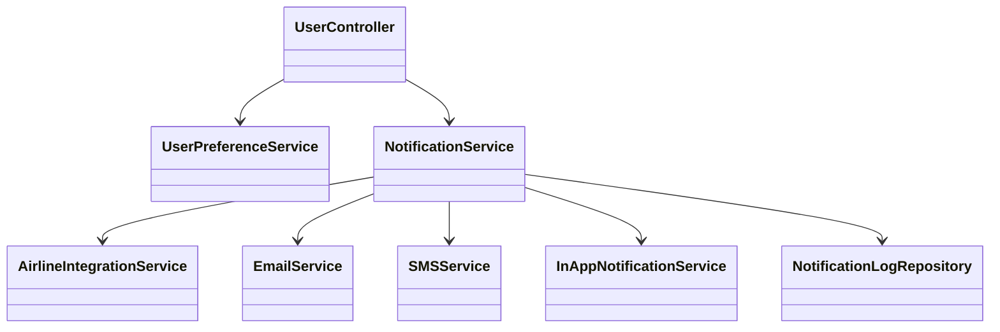
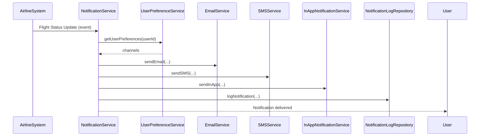
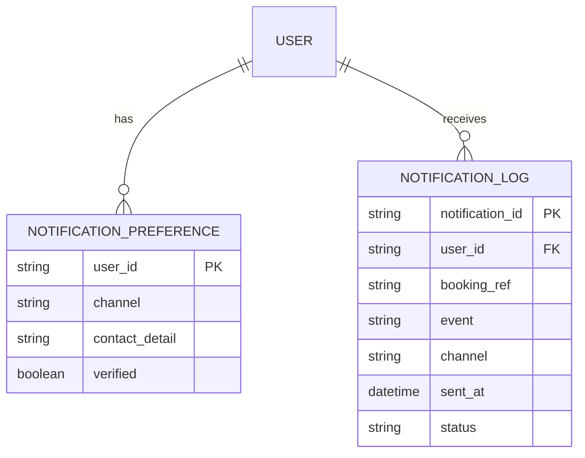

# For User Story Number [3]
1. Objective
This requirement enables travelers to receive timely notifications and alerts regarding their air transport bookings. The system will provide real-time updates on flight status, delays, and other important changes using the user's preferred communication channel. All notifications are logged for compliance and audit purposes.

2. API Model
  2.1 Common Components/Services
  - NotificationService (new)
  - UserPreferenceService (existing or new)
  - AirlineIntegrationService (existing)
  - EmailService (existing)
  - SMSService (new)
  - InAppNotificationService (existing)

  2.2 API Details
| Operation   | REST Method | Type        | URL                                 | Request (sample JSON)                                               | Response (sample JSON)                                                                                       |
|-------------|-------------|-------------|-------------------------------------|---------------------------------------------------------------------|--------------------------------------------------------------------------------------------------------------|
| Set Pref    | POST        | Success     | /api/notifications/preferences      | { "userId": "U456", "channels": ["email", "sms"] }              | { "status": "SAVED" }                                                                                    |
| Set Pref    | POST        | Failure     | /api/notifications/preferences      | { ... }                                                            | { "errorCode": "INVALID_PREF", "message": "Invalid notification channel." }                            |
| Send Alert  | POST        | Success     | /api/notifications/alert            | { "userId": "U456", "bookingRef": "BR789", "event": "DELAY", "message": "Flight delayed by 1 hour." } | { "status": "DELIVERED" }                                                                                |
| Send Alert  | POST        | Failure     | /api/notifications/alert            | { ... }                                                            | { "errorCode": "DELIVERY_FAIL", "message": "Failed to deliver notification." }                        |

  2.3 Exceptions
| API                                | Exception Type           | Description                                         |
|------------------------------------|-------------------------|-----------------------------------------------------|
| /api/notifications/preferences     | InvalidPreferenceException | Invalid notification channel or data              |
| /api/notifications/alert           | DeliveryFailedException  | Notification could not be delivered                 |
| /api/notifications/alert           | DuplicateNotificationException | Duplicate notification detected                |

3 Functional Design
  3.1 Class Diagram

  3.2 UML Sequence Diagram

  3.3 Components
| Component Name             | Description                                                  | Existing/New |
|---------------------------|--------------------------------------------------------------|--------------|
| NotificationService       | Orchestrates notification delivery and logging               | New          |
| UserPreferenceService     | Stores and retrieves user notification preferences           | New/Existing |
| AirlineIntegrationService | Receives real-time flight status updates                     | Existing     |
| EmailService              | Sends email notifications                                    | Existing     |
| SMSService                | Sends SMS notifications via Twilio                           | New          |
| InAppNotificationService  | Sends in-app notifications                                   | Existing     |
| NotificationLogRepository | Persists all sent notifications for audit                    | New          |

  3.4 Service Layer Logic and Validations
| FieldName      | Validation                                 | Error Message                        | ClassUsed                |
|---------------|--------------------------------------------|--------------------------------------|--------------------------|
| channels      | Must be valid (email, sms, app)             | Invalid notification channel         | UserPreferenceService    |
| contactDetails| Must be verified (email, phone)             | Contact not verified                 | UserPreferenceService    |
| event         | Must be mapped to user booking              | Booking not found for event          | NotificationService      |
| delivery      | No duplicate notification for same event    | Duplicate notification detected      | NotificationService      |

4 Integrations
| SystemToBeIntegrated   | IntegratedFor         | IntegrationType |
|-----------------------|-----------------------|-----------------|
| Airline System        | Real-time flight status| API             |
| Twilio                | SMS delivery          | API             |
| SendGrid              | Email delivery        | API             |
| In-App Notification   | App alerts            | API             |

5 DB Details
  5.1 ER Model

  5.2 DB Validations
- Only verified contact details can be used for notifications
- No duplicate notification for same event, user, and channel

6 Non-Functional Requirements
  6.1 Performance
  - Notification delivery within 1 minute of event
  - Scalable to mass notification events

  6.2 Security
    6.2.1 Authentication
    - All notification APIs require authenticated context
    6.2.2 Authorization
    - Only users can set their own preferences

  6.3 Logging
    6.3.1 Application Logging
    - DEBUG: Notification payloads and delivery attempts
    - INFO: Successful notification deliveries
    - ERROR: Failed deliveries
    - WARN: Delivery retries or delays
    6.3.2 Audit Log
    - Log all notifications with timestamp, channel, and status

7 Dependencies
- Airline system for real-time updates
- Twilio for SMS
- SendGrid for email
- In-app notification infrastructure

8 Assumptions
- Users have verified contact details
- Airline system provides timely updates
- Notification channels are reliable
