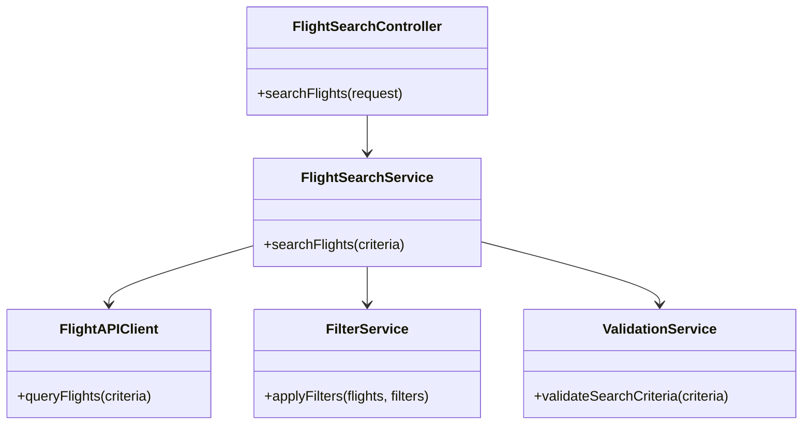
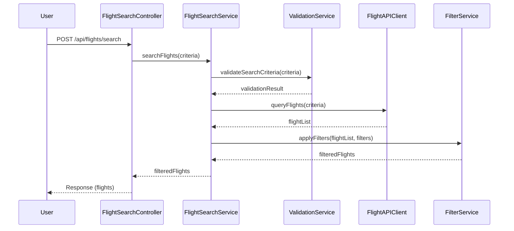
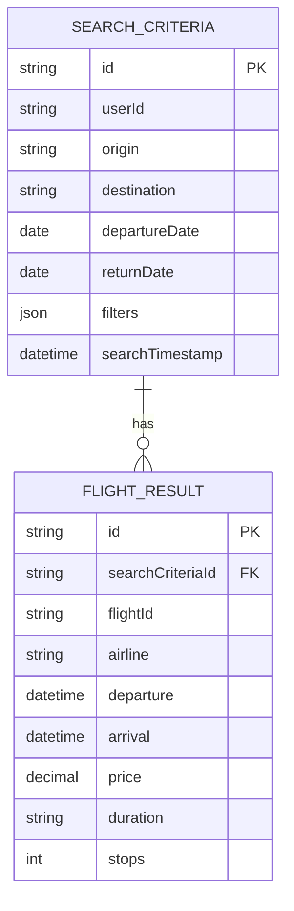

# For User Story Number [1]
1. Objective
This requirement enables travelers to search for available air transport options by specifying origin, destination, and travel dates. The system retrieves and displays a comprehensive list of matching flights, including details such as airline, timings, price, and duration. The goal is to help users efficiently plan their journeys with real-time, filterable search results.

2. API Model
  2.1 Common Components/Services
  - FlightSearchService (new): Handles flight search logic and integration with external flight APIs.
  - FlightAPIClient (new): Abstraction for querying third-party flight data providers (e.g., Amadeus, Sabre).
  - FilterService (new): Applies user-selected filters to search results.
  - ValidationService (existing/new): Validates user input for search criteria.

  2.2 API Details
| Operation | REST Method | Type      | URL                           | Request (JSON)                                                                 | Response (JSON)                                                                 |
|-----------|-------------|-----------|-------------------------------|--------------------------------------------------------------------------------|---------------------------------------------------------------------------------|
| Search    | POST        | Success   | /api/flights/search           | {"origin": "JFK", "destination": "LAX", "departureDate": "2024-07-01", "returnDate": "2024-07-10", "filters": {"airlines": ["Delta"], "priceRange": [100, 500], "stops": 1}} | {"flights": [{"flightId": "DL123", "airline": "Delta", "departure": "2024-07-01T08:00:00", "arrival": "2024-07-01T11:00:00", "price": 350, "duration": "3h", "stops": 0}]} |
| Search    | POST        | Failure   | /api/flights/search           | {"origin": "", "destination": "LAX", "departureDate": "2024-07-01"}           | {"error": "Origin and destination must not be empty."}                        |

  2.3 Exceptions
| Exception Type           | When Thrown                                    | Error Message                                 |
|-------------------------|------------------------------------------------|-----------------------------------------------|
| ValidationException     | Origin/destination empty, invalid dates        | Origin/destination must not be empty.         |
| ValidationException     | Travel date in the past                        | Travel dates must not be in the past.         |
| ExternalAPIException    | Flight API unavailable or error                | Unable to retrieve flights at this time.      |
| FilterMismatchException | No flights match filters                       | No flights found for the given criteria.      |

3 Functional Design
  3.1 Class Diagram

  3.2 UML Sequence Diagram

  3.3 Components
| Component Name         | Description                                                      | Existing/New |
|-----------------------|------------------------------------------------------------------|--------------|
| FlightSearchController| REST controller for handling search requests                      | New          |
| FlightSearchService   | Service layer for business logic and orchestration                | New          |
| FlightAPIClient       | Handles integration with external flight data APIs                | New          |
| FilterService         | Applies user-selected filters to flight results                   | New          |
| ValidationService     | Validates user input and search criteria                          | Existing/New |

  3.4 Service Layer Logic and Validations
| FieldName    | Validation                          | Error Message                             | ClassUsed           |
|--------------|-------------------------------------|-------------------------------------------|---------------------|
| origin       | Not empty                           | Origin and destination must not be empty. | ValidationService   |
| destination  | Not empty                           | Origin and destination must not be empty. | ValidationService   |
| departureDate| Not in the past, valid date format  | Travel dates must not be in the past.     | ValidationService   |
| filters      | Valid filter values                 | Invalid filter criteria.                  | FilterService       |

4 Integrations
| SystemToBeIntegrated | IntegratedFor         | IntegrationType |
|----------------------|----------------------|-----------------|
| Amadeus/Sabre APIs   | Flight data retrieval| API             |

5 DB Details
  5.1 ER Model

  5.2 DB Validations
- Ensure search criteria fields are not null.
- Index on searchTimestamp for analytics.

6 Non-Functional Requirements
  6.1 Performance
  - Search results must be returned within 2 seconds.
  - Consider caching frequent searches at API layer.

  6.2 Security
    6.2.1 Authentication
    - API endpoints should require user authentication (JWT/OAuth2 if applicable).
    6.2.2 Authorization
    - Only authorized users can perform searches.
  6.3 Logging
    6.3.1 Application Logging
    - DEBUG: API request/response payloads (excluding sensitive data)
    - INFO: Successful searches, filters applied
    - ERROR: API failures, validation errors
    - WARN: Slow external API responses
    6.3.2 Audit Log
    - Log search events with userId, timestamp, and criteria

7 Dependencies
- External flight data APIs (Amadeus, Sabre)
- User authentication service

8 Assumptions
- External APIs are available and reliable.
- User is authenticated before accessing search functionality.
- Filters and search criteria are extensible for future enhancements.
