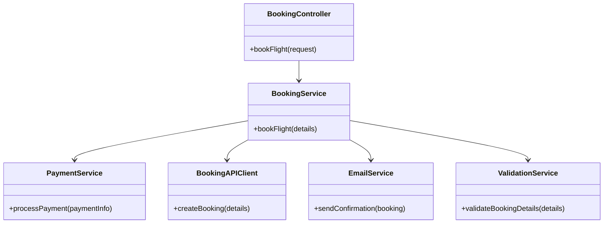
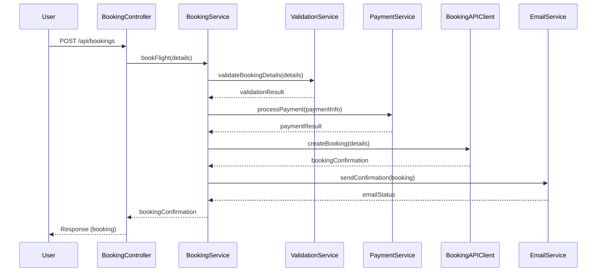
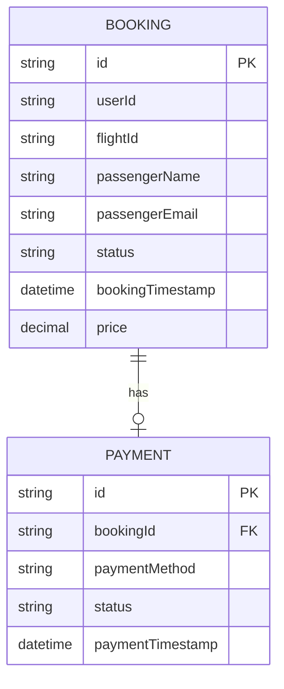

# For User Story Number [2]
1. Objective
This requirement enables travelers to book their selected air transport option by providing passenger and payment details. The system processes the booking securely, generates a confirmation, and provides users with booking details for download. The goal is to ensure a seamless, secure, and reliable booking experience for travelers.

2. API Model
  2.1 Common Components/Services
  - BookingService (new): Handles booking logic and orchestration.
  - PaymentService (new): Processes payments via external gateways.
  - BookingAPIClient (new): Integrates with external flight booking APIs.
  - EmailService (existing/new): Sends booking confirmation emails.
  - ValidationService (existing/new): Validates passenger and payment details.

  2.2 API Details
| Operation | REST Method | Type      | URL                          | Request (JSON)                                                                                               | Response (JSON)                                                                                                 |
|-----------|-------------|-----------|------------------------------|--------------------------------------------------------------------------------------------------------------|------------------------------------------------------------------------------------------------------------------|
| Book      | POST        | Success   | /api/bookings                | {"flightId": "DL123", "passenger": {"name": "John Doe", "email": "john@example.com"}, "payment": {"cardNumber": "****", "expiry": "12/26", "cvv": "***"}} | {"bookingId": "BK12345", "status": "CONFIRMED", "details": {"flightId": "DL123", "passenger": "John Doe"}} |
| Book      | POST        | Failure   | /api/bookings                | {"flightId": "DL123", "passenger": {}, "payment": {}}                                                   | {"error": "Passenger details and payment information are required."}                                          |

  2.3 Exceptions
| Exception Type           | When Thrown                                    | Error Message                                 |
|-------------------------|------------------------------------------------|-----------------------------------------------|
| ValidationException     | Missing/invalid passenger or payment details   | Passenger details and payment information are required. |
| PaymentException        | Payment gateway failure                        | Payment could not be processed.               |
| BookingAPIException     | Flight booking API failure                     | Unable to complete booking at this time.      |
| ConfirmationMismatchException | Booking confirmation mismatch           | Booking confirmation does not match flight.   |

3 Functional Design
  3.1 Class Diagram

  3.2 UML Sequence Diagram

  3.3 Components
| Component Name         | Description                                                      | Existing/New |
|-----------------------|------------------------------------------------------------------|--------------|
| BookingController     | REST controller for handling booking requests                     | New          |
| BookingService        | Service layer for booking logic and orchestration                 | New          |
| PaymentService        | Handles payment processing via external gateways                  | New          |
| BookingAPIClient      | Integrates with external flight booking APIs                      | New          |
| EmailService          | Sends booking confirmation emails                                 | Existing/New |
| ValidationService     | Validates passenger and payment details                           | Existing/New |

  3.4 Service Layer Logic and Validations
| FieldName        | Validation                          | Error Message                             | ClassUsed           |
|------------------|-------------------------------------|-------------------------------------------|---------------------|
| passenger        | All required fields present          | Passenger details are required.           | ValidationService   |
| payment          | Valid card, expiry, cvv             | Payment information is invalid.           | ValidationService   |
| flightId         | Must match selected flight           | Invalid flight selection.                 | ValidationService   |

4 Integrations
| SystemToBeIntegrated | IntegratedFor         | IntegrationType |
|----------------------|----------------------|-----------------|
| Stripe/PayPal        | Payment processing   | API             |
| Flight Booking APIs  | Booking confirmation | API             |
| Email Service        | Confirmation emails  | API             |

5 DB Details
  5.1 ER Model

  5.2 DB Validations
- Ensure all required fields are not null.
- Booking and payment status must be consistent.

6 Non-Functional Requirements
  6.1 Performance
  - Booking process must complete within 3 seconds.
  - Optimize API calls and use async email sending.

  6.2 Security
    6.2.1 Authentication
    - API endpoints require user authentication (JWT/OAuth2).
    6.2.2 Authorization
    - Only authorized users can book flights.
    - PCI DSS compliance for payment data.
  6.3 Logging
    6.3.1 Application Logging
    - DEBUG: API request/response payloads (excluding sensitive data)
    - INFO: Successful bookings, payment status
    - ERROR: Payment or booking failures
    - WARN: Slow payment gateway responses
    6.3.2 Audit Log
    - Log booking events with userId, timestamp, and flightId

7 Dependencies
- Payment gateways (Stripe, PayPal)
- External flight booking APIs
- Email service provider
- User authentication service

8 Assumptions
- Payment gateways and booking APIs are available and reliable.
- User is authenticated before booking.
- Email delivery is handled asynchronously.