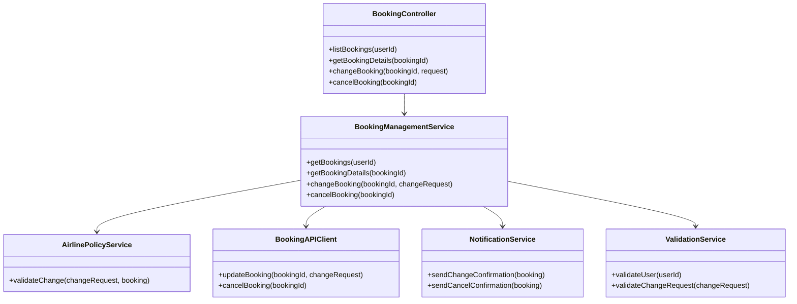
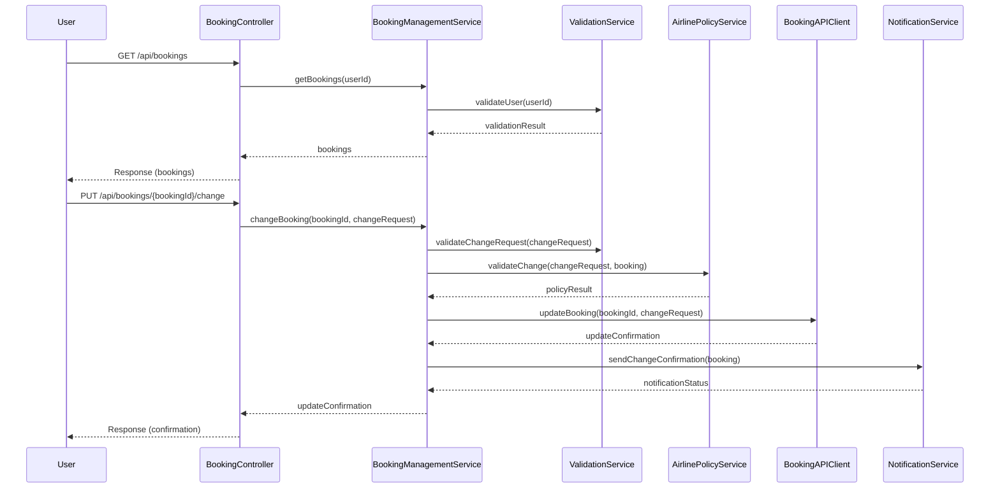
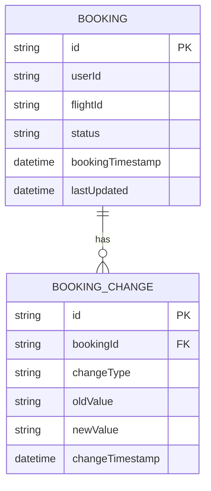

# For User Story Number [3]
1. Objective
This requirement enables travelers to view and manage their air transport bookings, including making changes or cancellations as allowed by airline policies. The system retrieves all bookings for authenticated users, allows modifications, and ensures confirmations are sent for any changes. The goal is to provide users with flexibility and control over their travel plans.

2. API Model
  2.1 Common Components/Services
  - BookingManagementService (new): Handles retrieval and management of bookings.
  - AirlinePolicyService (new): Validates requested changes against airline rules.
  - BookingAPIClient (existing/new): Integrates with airline booking APIs for updates.
  - NotificationService (existing/new): Sends confirmations for changes/cancellations.
  - ValidationService (existing/new): Validates user authentication and change requests.

  2.2 API Details
| Operation   | REST Method | Type      | URL                                | Request (JSON)                                                                 | Response (JSON)                                                                 |
|-------------|-------------|-----------|------------------------------------|--------------------------------------------------------------------------------|---------------------------------------------------------------------------------|
| List        | GET         | Success   | /api/bookings                      | -                                                                              | {"bookings": [{"bookingId": "BK12345", "flightId": "DL123", "status": "CONFIRMED"}]} |
| Details     | GET         | Success   | /api/bookings/{bookingId}          | -                                                                              | {"bookingId": "BK12345", "flightId": "DL123", "details": { ... }}              |
| Change      | PUT         | Success   | /api/bookings/{bookingId}/change   | {"action": "reschedule", "newDate": "2024-07-05"}                           | {"bookingId": "BK12345", "status": "RESCHEDULED", "confirmation": "..."}      |
| Cancel      | DELETE      | Success   | /api/bookings/{bookingId}          | -                                                                              | {"bookingId": "BK12345", "status": "CANCELLED", "confirmation": "..."}        |
| Change      | PUT         | Failure   | /api/bookings/{bookingId}/change   | {"action": "reschedule", "newDate": "2020-01-01"}                           | {"error": "Change not allowed as per airline policy."}                        |

  2.3 Exceptions
| Exception Type           | When Thrown                                    | Error Message                                 |
|-------------------------|------------------------------------------------|-----------------------------------------------|
| AuthenticationException | User not authenticated                         | Authentication required.                      |
| AuthorizationException  | User not authorized for booking                | Access denied.                                |
| ValidationException     | Invalid change/cancel request                  | Invalid request or not allowed by policy.     |
| BookingAPIException     | Airline API failure                            | Unable to update booking at this time.        |
| ConfirmationMismatchException | Confirmation does not match update      | Confirmation does not match booking status.   |

3 Functional Design
  3.1 Class Diagram

  3.2 UML Sequence Diagram

  3.3 Components
| Component Name         | Description                                                      | Existing/New |
|-----------------------|------------------------------------------------------------------|--------------|
| BookingController     | REST controller for booking management                            | New          |
| BookingManagementService | Service for booking retrieval and management                   | New          |
| AirlinePolicyService  | Validates changes against airline policies                        | New          |
| BookingAPIClient      | Integrates with airline APIs for booking updates                  | Existing/New |
| NotificationService   | Sends confirmations for changes/cancellations                     | Existing/New |
| ValidationService     | Validates authentication and change requests                      | Existing/New |

  3.4 Service Layer Logic and Validations
| FieldName        | Validation                          | Error Message                             | ClassUsed           |
|------------------|-------------------------------------|-------------------------------------------|---------------------|
| userId           | Must be authenticated                | Authentication required.                  | ValidationService   |
| changeRequest    | Must comply with airline policy      | Change not allowed as per airline policy. | AirlinePolicyService|
| bookingId        | Must belong to user                  | Access denied.                            | ValidationService   |

4 Integrations
| SystemToBeIntegrated | IntegratedFor         | IntegrationType |
|----------------------|----------------------|-----------------|
| Airline Booking APIs | Booking updates      | API             |
| Notification Service | Change/cancel alerts | API             |
| User Auth Service    | Authentication       | API             |

5 DB Details
  5.1 ER Model

  5.2 DB Validations
- Only authenticated users can access their bookings.
- Change/cancel requests must be logged in BOOKING_CHANGE.

6 Non-Functional Requirements
  6.1 Performance
  - All booking management actions must complete within 2 seconds.
  - Optimize DB queries and API calls for performance.

  6.2 Security
    6.2.1 Authentication
    - OAuth2 authentication for all endpoints.
    6.2.2 Authorization
    - Only authorized users can access/modify their bookings.
  6.3 Logging
    6.3.1 Application Logging
    - DEBUG: API request/response payloads (excluding sensitive data)
    - INFO: Booking changes/cancellations
    - ERROR: API or validation failures
    - WARN: Policy violations
    6.3.2 Audit Log
    - Log all booking changes/cancellations with userId, timestamp, and details

7 Dependencies
- Airline booking APIs
- Notification service
- User authentication service

8 Assumptions
- Airline APIs provide up-to-date booking and policy information.
- User is authenticated before accessing booking management.
- Change/cancel rules are enforced as per airline policies.