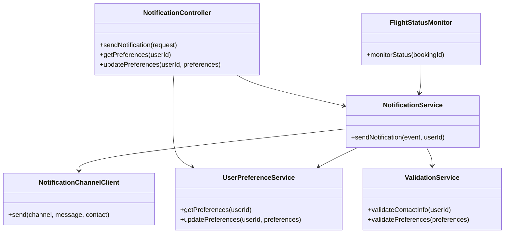
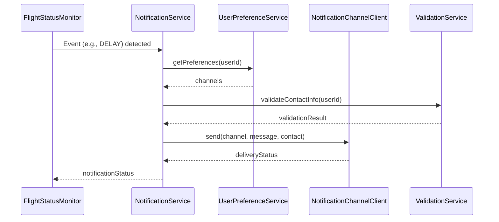
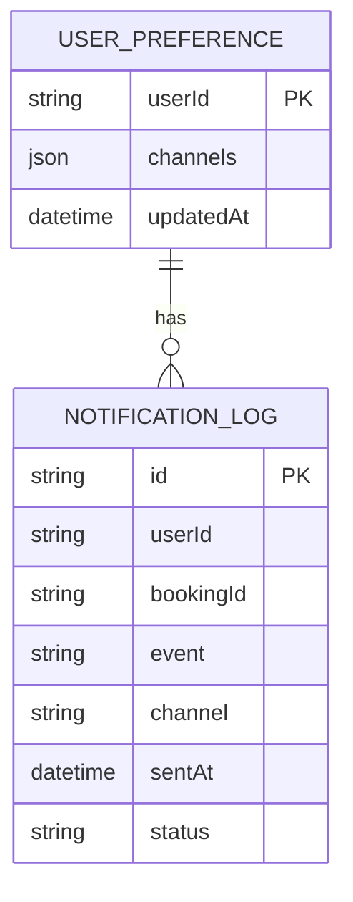

# For User Story Number [4]
1. Objective
This requirement enables travelers to receive timely notifications and updates about their air transport bookings, including confirmations, schedule changes, delays, and reminders. The system supports multiple notification channels (email, SMS, in-app) and allows users to manage their preferences. The goal is to keep travelers informed and reduce disruptions.

2. API Model
  2.1 Common Components/Services
  - NotificationService (new): Handles notification logic and orchestration.
  - NotificationChannelClient (new): Integrates with external notification providers (e.g., Twilio, SendGrid).
  - UserPreferenceService (existing/new): Manages user notification preferences.
  - FlightStatusMonitor (new): Monitors booking and flight status for relevant events.
  - ValidationService (existing/new): Validates contact information and preferences.

  2.2 API Details
| Operation     | REST Method | Type      | URL                                  | Request (JSON)                                                                 | Response (JSON)                                                                 |
|---------------|-------------|-----------|--------------------------------------|--------------------------------------------------------------------------------|---------------------------------------------------------------------------------|
| Notify        | POST        | Success   | /api/notifications/send              | {"userId": "U123", "event": "DELAY", "bookingId": "BK12345", "channel": "email"} | {"status": "SENT", "channel": "email", "timestamp": "2024-07-01T10:00:00"}        |
| Preferences   | GET         | Success   | /api/notifications/preferences       | -                                                                              | {"userId": "U123", "channels": ["email", "sms"]}                               |
| Preferences   | PUT         | Success   | /api/notifications/preferences       | {"channels": ["email", "app"]}                                              | {"status": "UPDATED"}                                                          |
| Notify        | POST        | Failure   | /api/notifications/send              | {"userId": "U123", "event": "DELAY", "channel": "sms"}                   | {"error": "Invalid contact information."}                                      |

  2.3 Exceptions
| Exception Type           | When Thrown                                    | Error Message                                 |
|-------------------------|------------------------------------------------|-----------------------------------------------|
| ValidationException     | Invalid contact info or preferences             | Invalid contact information.                  |
| ChannelException        | Notification channel failure                    | Notification could not be delivered.          |
| PreferenceException     | Preferences not saved/applied                   | Unable to update notification preferences.    |

3 Functional Design
  3.1 Class Diagram

  3.2 UML Sequence Diagram

  3.3 Components
| Component Name            | Description                                                      | Existing/New |
|--------------------------|------------------------------------------------------------------|--------------|
| NotificationController   | REST controller for notifications and preferences                 | New          |
| NotificationService      | Handles notification logic and orchestration                      | New          |
| NotificationChannelClient| Integrates with external notification providers                   | New          |
| UserPreferenceService    | Manages user notification preferences                             | Existing/New |
| FlightStatusMonitor      | Monitors booking/flight status and triggers notifications         | New          |
| ValidationService        | Validates contact info and preferences                            | Existing/New |

  3.4 Service Layer Logic and Validations
| FieldName        | Validation                          | Error Message                             | ClassUsed           |
|------------------|-------------------------------------|-------------------------------------------|---------------------|
| userId           | Must have valid contact info         | Invalid contact information.              | ValidationService   |
| preferences      | Valid channels, opt-in compliance    | Invalid notification preferences.         | ValidationService   |
| event            | Must match booking/flight status     | Invalid event for notification.           | NotificationService |

4 Integrations
| SystemToBeIntegrated | IntegratedFor         | IntegrationType |
|----------------------|----------------------|-----------------|
| Twilio/SendGrid      | SMS/Email delivery   | API             |
| Airline APIs         | Flight status events | API             |
| User Profile Service | Contact info         | API             |

5 DB Details
  5.1 ER Model

  5.2 DB Validations
- Ensure valid contact info and opt-in before sending notifications.
- Log all notifications sent for audit and analytics.

6 Non-Functional Requirements
  6.1 Performance
  - Notifications must be sent within 1 minute of event occurrence.
  - Use async processing for high volume.

  6.2 Security
    6.2.1 Authentication
    - Only authenticated users can manage preferences.
    6.2.2 Authorization
    - Only users can update their own preferences.
    - Opt-in/opt-out compliance for all channels.
  6.3 Logging
    6.3.1 Application Logging
    - DEBUG: Notification payloads (excluding sensitive data)
    - INFO: Notification sent, channel, status
    - ERROR: Delivery failures
    - WARN: Channel delays or retries
    6.3.2 Audit Log
    - Log all notifications with userId, bookingId, event, and channel

7 Dependencies
- Notification providers (Twilio, SendGrid)
- Airline APIs for status events
- User profile service

8 Assumptions
- Notification providers are reliable and available.
- Users have valid contact info and have opted in.
- Flight status events are received in real-time.