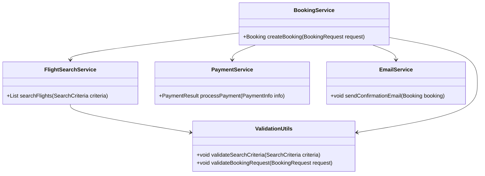
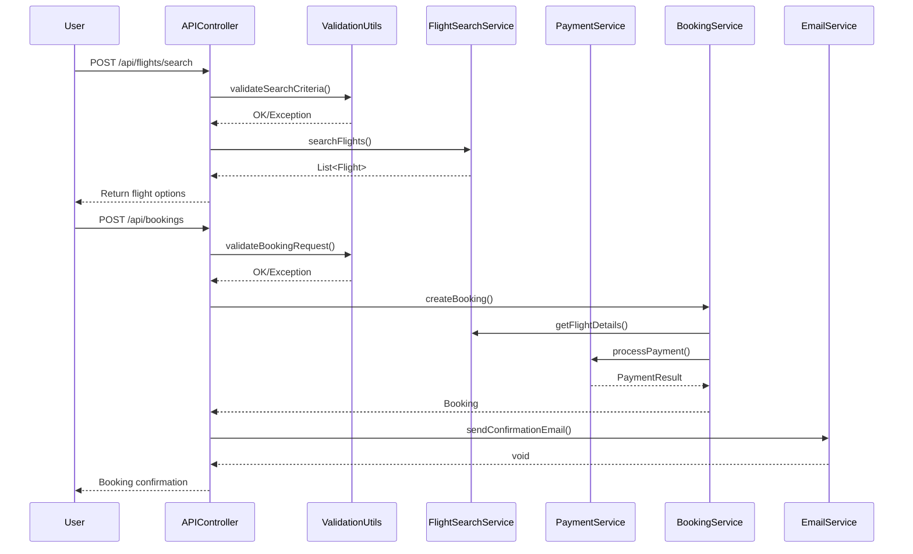
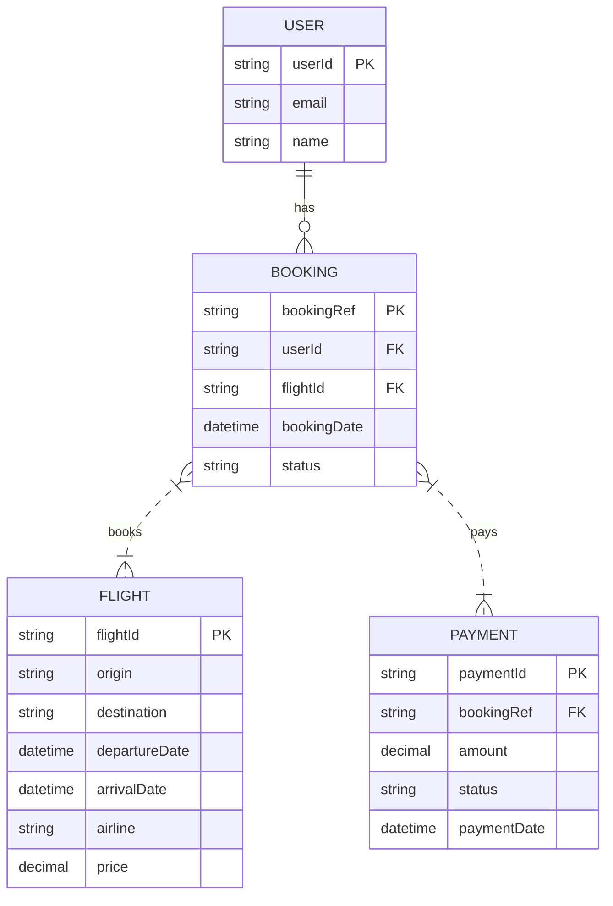

# For User Story Number [1]

## 1. Objective
The objective of this requirement is to enable travelers to search, compare, and book air transport tickets online. The system must provide a secure, user-friendly interface for entering travel details, viewing available flights, and completing bookings. The process should be seamless, secure, and efficient, ensuring a positive user experience.

## 2. API Model
### 2.1 Common Components/Services
- FlightSearchService (for querying airline APIs)
- PaymentService (for processing payments securely)
- BookingService (for managing bookings)
- EmailService (for sending confirmation emails)
- ValidationUtils (for input validations)

### 2.2 API Details
| Operation | REST Method | Type     | URL                        | Request (Sample JSON)                                                                 | Response (Sample JSON)                                                                 |
|-----------|-------------|----------|----------------------------|---------------------------------------------------------------------------------------|----------------------------------------------------------------------------------------|
| Create    | POST        | Success  | /api/flights/search        | { "origin": "JFK", "destination": "LAX", "departureDate": "2024-07-01", "returnDate": "2024-07-10", "passengers": 1 } | { "flights": [{ "flightId": "UA123", "price": 350.00, "duration": "6h", "airline": "United" }] } |
| Read      | GET         | Success  | /api/flights/{flightId}    | -                                                                                     | { "flightId": "UA123", "price": 350.00, "duration": "6h", "airline": "United", "details": {...} } |
| Create    | POST        | Success  | /api/bookings              | { "flightId": "UA123", "userId": "u001", "passengerInfo": {...}, "paymentInfo": {...} }             | { "bookingRef": "BR123456", "status": "CONFIRMED", "emailSent": true }                              |
| Failure   | POST/GET    | Failure  | (all above)                | Invalid or incomplete request                                                          | { "error": "Validation failed: origin and destination cannot be the same" }                             |

### 2.3 Exceptions
- InvalidInputException: Thrown when input validation fails (e.g., same origin and destination)
- FlightNotFoundException: Thrown when the requested flight is not found
- PaymentFailedException: Thrown when payment processing fails
- BookingException: Thrown for general booking errors

## 3. Functional Design
### 3.1 Class Diagram

### 3.2 UML Sequence Diagram

### 3.3 Components
| Component Name       | Description                                              | Existing/New |
|---------------------|----------------------------------------------------------|--------------|
| FlightSearchService | Handles flight search and integration with airline APIs   | New          |
| PaymentService      | Handles payment processing with payment gateway           | New          |
| BookingService      | Manages booking creation and persistence                  | New          |
| EmailService        | Sends booking confirmation emails                         | New          |
| ValidationUtils     | Performs input and business validations                   | New          |
| APIController       | REST API endpoint controller                             | New          |

### 3.4 Service Layer Logic and Validations
| FieldName         | Validation                                         | Error Message                                   | ClassUsed        |
|-------------------|----------------------------------------------------|-------------------------------------------------|------------------|
| origin, destination | Must not be the same                              | Origin and destination cannot be the same        | ValidationUtils  |
| departureDate     | Must not be in the past                            | Departure date cannot be in the past             | ValidationUtils  |
| paymentInfo       | Must be valid and pass payment gateway checks      | Invalid payment information                      | PaymentService   |

## 4. Integrations
| SystemToBeIntegrated | IntegratedFor         | IntegrationType |
|----------------------|----------------------|-----------------|
| Airline APIs         | Flight search/details | API             |
| Payment Gateway      | Payment processing    | API             |
| Email Service        | Confirmation emails   | API             |

## 5. DB Details
### 5.1 ER Model

### 5.2 DB Validations
- Unique constraint on bookingRef
- Foreign key constraints for userId and flightId in BOOKING
- Payment status must be CONFIRMED before booking status is set to CONFIRMED

## 6. Non-Functional Requirements
### 6.1 Performance
- Bookings must be processed within 5 seconds
- Caching of frequent flight search queries at API layer

### 6.2 Security
#### 6.2.1 Authentication
- All APIs secured via OAuth2/JWT tokens
#### 6.2.2 Authorization
- Only authenticated users can book flights
- Role-based access for admin operations (if applicable)

### 6.3 Logging
#### 6.3.1 Application Logging
- DEBUG: API request/response payloads (excluding sensitive data)
- INFO: Successful bookings, payment transactions
- ERROR: Failed payments, booking errors
- WARN: Suspicious activity, repeated validation failures
#### 6.3.2 Audit Log
- Log all booking and payment events with user and timestamp

## 7. Dependencies
- Airline APIs availability
- Payment gateway uptime
- Email service provider

## 8. Assumptions
- All airline APIs are RESTful and provide real-time data
- Payment gateway is PCI DSS compliant
- Email delivery is reliable and near real-time
