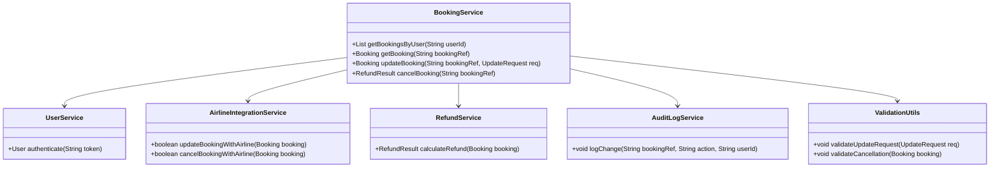
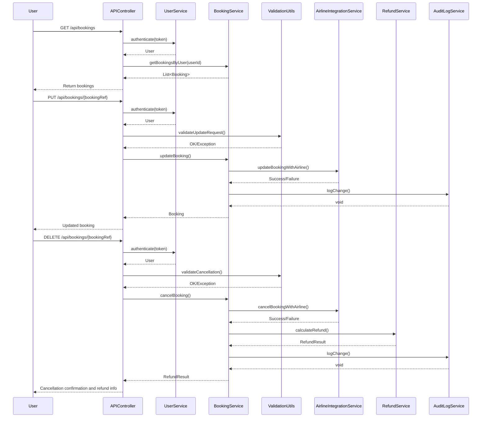
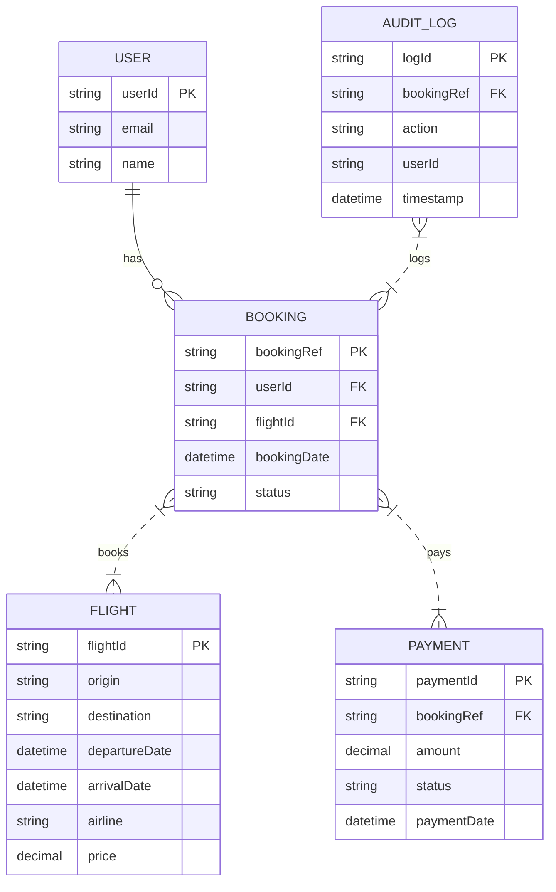

# For User Story Number [2]

## 1. Objective
The objective of this requirement is to enable travelers to view and manage their air transport bookings online. The system must allow authenticated users to access, modify, or cancel their bookings, ensuring secure handling of user data and compliance with airline policies. All changes and cancellations should be processed reliably, with appropriate validations and audit logging.

## 2. API Model
### 2.1 Common Components/Services
- BookingService (for managing bookings)
- UserService (for authentication and user data)
- AirlineIntegrationService (for interacting with airline APIs)
- RefundService (for processing cancellations and refunds)
- AuditLogService (for logging changes)
- ValidationUtils (for input and policy validations)

### 2.2 API Details
| Operation | REST Method | Type     | URL                              | Request (Sample JSON)                                         | Response (Sample JSON)                                                      |
|-----------|-------------|----------|----------------------------------|---------------------------------------------------------------|-------------------------------------------------------------------------------|
| Read      | GET         | Success  | /api/bookings                    | -                                                             | { "bookings": [{ "bookingRef": "BR123456", "flight": {...}, "status": "CONFIRMED" }] } |
| Read      | GET         | Success  | /api/bookings/{bookingRef}       | -                                                             | { "bookingRef": "BR123456", "flight": {...}, "passengerInfo": {...}, "status": "CONFIRMED" } |
| Update    | PUT         | Success  | /api/bookings/{bookingRef}       | { "passengerInfo": {...}, "flightChange": {...} }           | { "bookingRef": "BR123456", "status": "UPDATED", "changeFee": 50.00 } |
| Delete    | DELETE      | Success  | /api/bookings/{bookingRef}       | -                                                             | { "bookingRef": "BR123456", "status": "CANCELLED", "refund": 300.00 } |
| Failure   | GET/PUT/DELETE | Failure | (all above)                      | Invalid request, unauthorized, or policy violation            | { "error": "Change not allowed as per airline policy" }                    |

### 2.3 Exceptions
- AuthenticationException: Thrown when user authentication fails
- BookingNotFoundException: Thrown when a booking is not found
- PolicyViolationException: Thrown for changes/cancellations not allowed by airline policy
- RefundCalculationException: Thrown when refund calculation fails

## 3. Functional Design
### 3.1 Class Diagram

### 3.2 UML Sequence Diagram

### 3.3 Components
| Component Name           | Description                                              | Existing/New |
|-------------------------|----------------------------------------------------------|--------------|
| BookingService          | Manages booking retrieval, updates, and cancellations    | New          |
| UserService             | Handles authentication and user data                     | Existing     |
| AirlineIntegrationService | Integrates with airline APIs for modifications/cancels | New          |
| RefundService           | Calculates and processes refunds                         | New          |
| AuditLogService         | Logs all changes and cancellations                       | New          |
| ValidationUtils         | Performs input and policy validations                    | New          |
| APIController           | REST API endpoint controller                             | New          |

### 3.4 Service Layer Logic and Validations
| FieldName         | Validation                                         | Error Message                                   | ClassUsed        |
|-------------------|----------------------------------------------------|-------------------------------------------------|------------------|
| token             | Must be valid and authenticated                    | User authentication failed                      | UserService      |
| bookingRef        | Must exist and belong to user                      | Booking not found or unauthorized               | BookingService   |
| updateRequest     | Must comply with airline change policies           | Change not allowed as per airline policy        | ValidationUtils  |
| cancellation      | Must comply with airline cancellation policies     | Cancellation not allowed as per airline policy  | ValidationUtils  |
| refund            | Must be calculated as per policy                   | Refund calculation error                        | RefundService    |

## 4. Integrations
| SystemToBeIntegrated | IntegratedFor         | IntegrationType |
|----------------------|----------------------|-----------------|
| Airline APIs         | Booking changes/cancels | API           |
| Refund Service       | Refund calculation      | API           |
| Audit Log Service    | Change/cancel logging   | API           |

## 5. DB Details
### 5.1 ER Model

### 5.2 DB Validations
- Only authenticated users can access their bookings
- Booking status must be updated as per change/cancellation
- All changes/cancellations must be logged in AUDIT_LOG

## 6. Non-Functional Requirements
### 6.1 Performance
- Support high concurrency for viewing/managing bookings
- Optimize DB queries for quick retrieval

### 6.2 Security
#### 6.2.1 Authentication
- All APIs secured via OAuth2 tokens
#### 6.2.2 Authorization
- Only authenticated users can view/manage their bookings
- Admin access for audit log retrieval (if applicable)

### 6.3 Logging
#### 6.3.1 Application Logging
- DEBUG: API request/response payloads (excluding sensitive data)
- INFO: Successful changes/cancellations
- ERROR: Policy violations, refund calculation errors
- WARN: Suspicious access patterns
#### 6.3.2 Audit Log
- Log all changes/cancellations with user, action, and timestamp

## 7. Dependencies
- Airline APIs for booking changes/cancellations
- Refund service provider
- Audit log storage

## 8. Assumptions
- Airline APIs support real-time booking modifications
- Refund policies are accessible and up-to-date
- Audit log storage is reliable and secure
