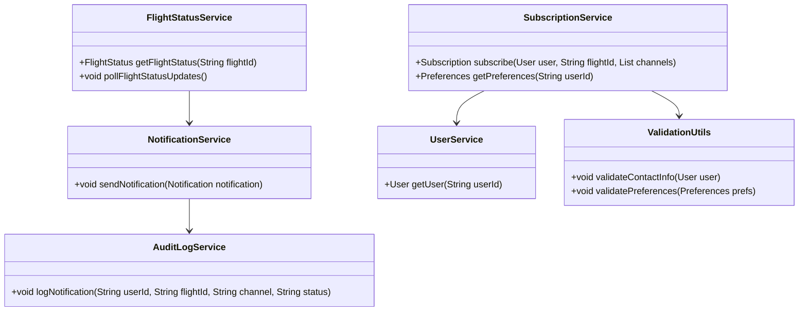
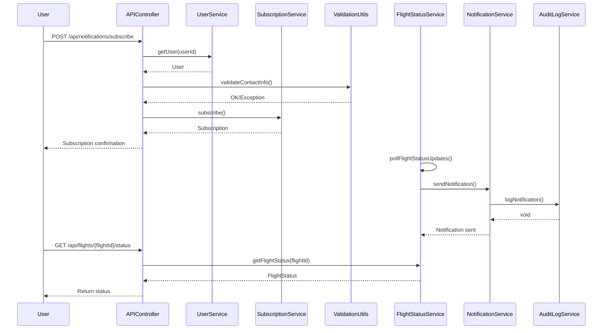
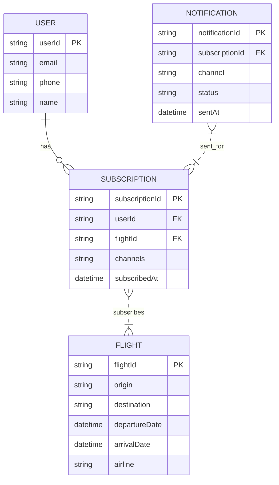

# For User Story Number [3]

## 1. Objective
The objective of this requirement is to provide travelers with real-time flight status updates and notifications. The system must allow users to subscribe to notifications, receive timely updates about delays, gate changes, and cancellations, and view real-time flight status within the application. Notifications should be sent via preferred channels (email, SMS, push) and logged for monitoring.

## 2. API Model
### 2.1 Common Components/Services
- FlightStatusService (for polling airline APIs)
- NotificationService (for sending notifications via multiple channels)
- SubscriptionService (for managing user notification preferences)
- UserService (for user data and contact info)
- AuditLogService (for logging sent notifications)
- ValidationUtils (for input and data validations)

### 2.2 API Details
| Operation | REST Method | Type     | URL                                 | Request (Sample JSON)                                                                 | Response (Sample JSON)                                                                 |
|-----------|-------------|----------|-------------------------------------|---------------------------------------------------------------------------------------|----------------------------------------------------------------------------------------|
| Create    | POST        | Success  | /api/notifications/subscribe        | { "userId": "u001", "flightId": "UA123", "channels": ["email", "sms"] }            | { "subscriptionId": "sub123", "status": "SUBSCRIBED" }                             |
| Read      | GET         | Success  | /api/flights/{flightId}/status      | -                                                                                     | { "flightId": "UA123", "status": "DELAYED", "gate": "B12", "updatedAt": "..." } |
| Read      | GET         | Success  | /api/notifications/preferences      | -                                                                                     | { "userId": "u001", "preferences": { ... } }                                       |
| Failure   | POST/GET    | Failure  | (all above)                         | Invalid request, invalid contact info, or subscription error                          | { "error": "Invalid contact information" }                                           |

### 2.3 Exceptions
- InvalidContactException: Thrown when user contact info is invalid
- SubscriptionException: Thrown when subscription fails
- NotificationSendException: Thrown when notification delivery fails
- DataAccuracyException: Thrown when airline API data is inconsistent

## 3. Functional Design
### 3.1 Class Diagram

### 3.2 UML Sequence Diagram

### 3.3 Components
| Component Name           | Description                                              | Existing/New |
|-------------------------|----------------------------------------------------------|--------------|
| FlightStatusService     | Polls airline APIs and manages flight status data        | New          |
| NotificationService     | Sends notifications via email, SMS, push                 | New          |
| SubscriptionService     | Manages user subscriptions and preferences               | New          |
| UserService             | Manages user data and contact info                       | Existing     |
| AuditLogService         | Logs all sent notifications                              | New          |
| ValidationUtils         | Validates contact info and preferences                   | New          |
| APIController           | REST API endpoint controller                             | New          |

### 3.4 Service Layer Logic and Validations
| FieldName         | Validation                                         | Error Message                                   | ClassUsed        |
|-------------------|----------------------------------------------------|-------------------------------------------------|------------------|
| contactInfo       | Must be valid for selected channels                | Invalid contact information                     | ValidationUtils  |
| preferences       | Must be valid and supported                        | Invalid notification preferences                | ValidationUtils  |
| flightStatusData  | Must be accurate and up-to-date                    | Inconsistent flight status data                 | FlightStatusService |

## 4. Integrations
| SystemToBeIntegrated | IntegratedFor         | IntegrationType |
|----------------------|----------------------|-----------------|
| Airline APIs         | Real-time flight data | API             |
| Twilio               | SMS notifications     | API             |
| Firebase             | Push notifications    | API             |
| Email Service        | Email notifications   | API             |
| Audit Log Service    | Notification logging  | API             |

## 5. DB Details
### 5.1 ER Model

### 5.2 DB Validations
- Unique constraint on subscriptionId
- Foreign key constraints for userId and flightId in SUBSCRIPTION
- Only valid contact info allowed in USER
- All sent notifications must be logged in NOTIFICATION

## 6. Non-Functional Requirements
### 6.1 Performance
- Notifications must be delivered within 1 minute of status change
- System must support high availability and scalability

### 6.2 Security
#### 6.2.1 Authentication
- All APIs secured via OAuth2/JWT tokens
#### 6.2.2 Authorization
- Only authenticated users can subscribe/view status
- Admin access for notification analytics (if applicable)

### 6.3 Logging
#### 6.3.1 Application Logging
- DEBUG: API request/response payloads (excluding sensitive data)
- INFO: Successful notification deliveries
- ERROR: Notification delivery failures, data inconsistencies
- WARN: Repeated notification failures
#### 6.3.2 Audit Log
- Log all sent notifications with user, flight, channel, and timestamp

## 7. Dependencies
- Airline APIs for real-time flight status
- Twilio, Firebase, Email service providers
- Audit log storage

## 8. Assumptions
- Airline APIs provide reliable and timely status updates
- Notification providers are highly available
- User preferences are up-to-date and accurate
