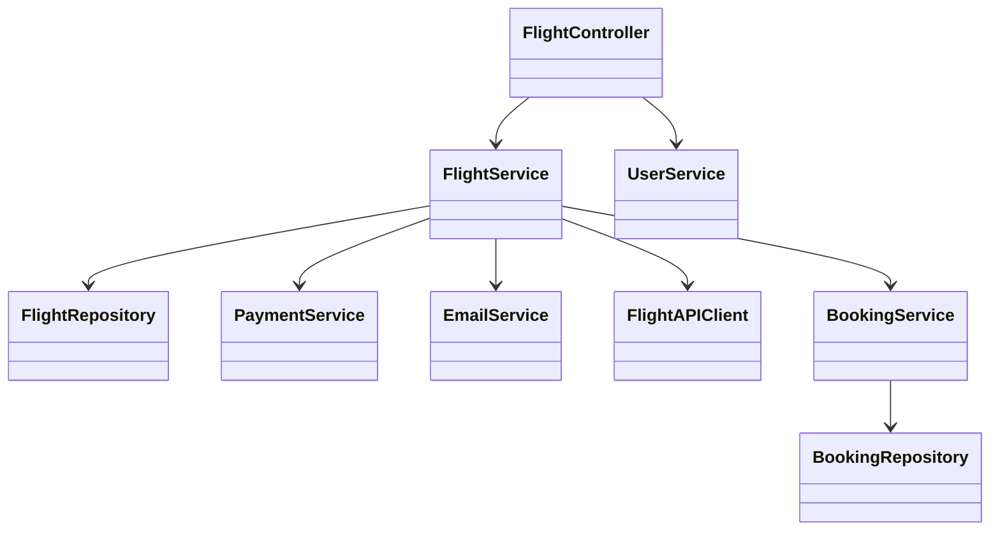
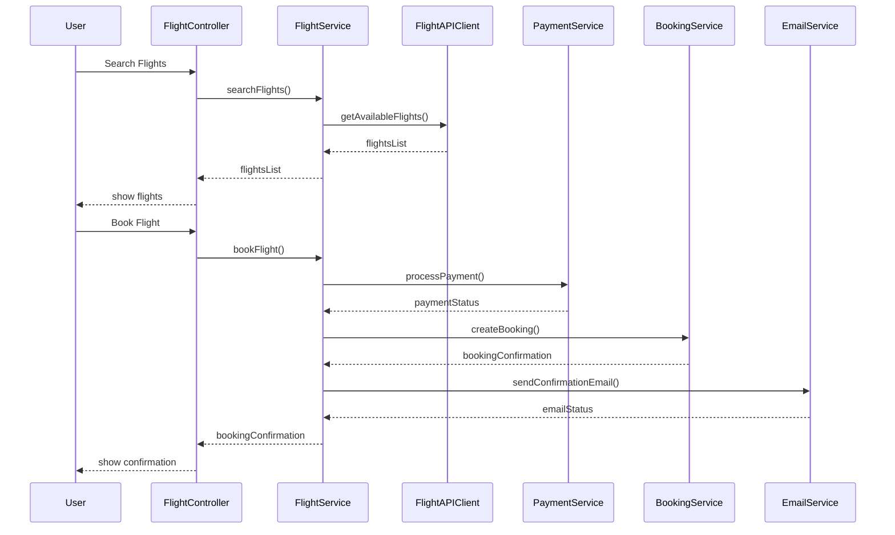
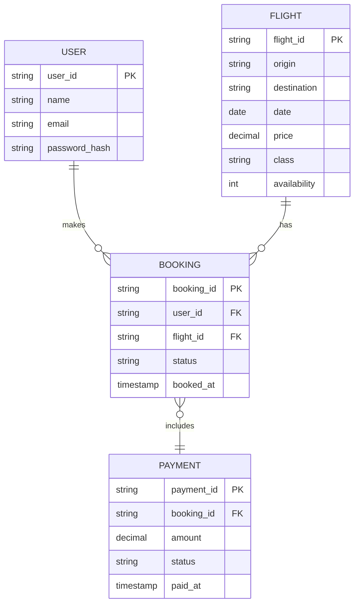

# For User Story Number [1]

1. Objective
This requirement enables passengers to search for available flights, compare options, and book air transport tickets online. The system provides real-time flight availability, dynamic pricing, and secure booking confirmation. The goal is to offer a seamless and convenient travel planning experience for users.

2. API Model
  2.1 Common Components/Services
  - AuthenticationService (OAuth2 based authentication)
  - PaymentService (Stripe integration)
  - EmailService (for confirmation emails)
  - FlightSearchService (integration with third-party flight APIs)

  2.2 API Details
| Operation | REST Method | Type | URL | Request | Response |
|-----------|-------------|------|-----|---------|----------|
| Search Flights | GET | Success/Failure | /api/flights/search?origin={origin}&destination={destination}&date={date} | N/A (query params) | { "flights": [ { "flightId": "F123", "origin": "JFK", "destination": "LAX", "date": "2024-07-10", "price": 350.00, "class": "Economy", "availability": 5 } ] } |
| Book Ticket | POST | Success/Failure | /api/flights/book | { "flightId": "F123", "userId": "U456", "passengerDetails": { ... }, "paymentDetails": { ... } } | { "bookingId": "B789", "status": "CONFIRMED", "confirmationEmail": "sent" } |
| Payment Processing | POST | Success/Failure | /api/payments/process | { "bookingId": "B789", "paymentDetails": { ... } } | { "paymentStatus": "SUCCESS", "transactionId": "T1011" } |

  2.3 Exceptions
| API | Exception | HTTP Code | Message |
|-----|-----------|-----------|---------|
| Search Flights | InvalidAirportCodeException | 400 | "Invalid airport code." |
| Search Flights | DateInPastException | 400 | "Travel date cannot be in the past." |
| Book Ticket | FlightNotAvailableException | 404 | "Flight not available." |
| Book Ticket | PaymentFailedException | 402 | "Payment processing failed." |
| Book Ticket | ValidationException | 400 | "Invalid booking details." |

3. Functional Design
  3.1 Class Diagram

  3.2 UML Sequence Diagram

  3.3 Components
| Component Name | Description | Existing/New |
|----------------|-------------|--------------|
| FlightController | REST API controller for flight operations | New |
| FlightService | Business logic for flight search and booking | New |
| FlightAPIClient | Integrates with third-party flight APIs | New |
| PaymentService | Handles payment processing via Stripe | New |
| EmailService | Sends confirmation emails | Existing |
| BookingService | Manages booking records | New |
| BookingRepository | Data access for bookings | New |
| FlightRepository | Data access for flights | Existing |
| UserService | User management and authentication | Existing |

  3.4 Service Layer Logic and Validations
| FieldName | Validation | Error Message | ClassUsed |
|-----------|-----------|--------------|-----------|
| origin | Must be valid airport code | "Invalid airport code." | FlightService |
| destination | Must be valid airport code | "Invalid airport code." | FlightService |
| date | Must not be in the past | "Travel date cannot be in the past." | FlightService |
| paymentDetails | Must be valid and PCI DSS compliant | "Invalid payment details." | PaymentService |

4. Integrations
| SystemToBeIntegrated | IntegratedFor | IntegrationType |
|----------------------|--------------|-----------------|
| Third-party Flight APIs | Real-time flight availability | API |
| Stripe Payment Gateway | Payment processing | API |
| Email Service Provider | Booking confirmation emails | API |

5. DB Details
  5.1 ER Model

  5.2 DB Validations
- Foreign key constraints between user, booking, and payment tables
- Unique constraint on booking_id
- Non-null constraints for all required fields

6. Non-Functional Requirements
  6.1 Performance
  - Response time for flight search < 2 seconds
  - Caching of frequent flight search queries at API layer

  6.2 Security
    6.2.1 Authentication
    - OAuth2 authentication for all endpoints
    - HTTPS enforced for all communications
    6.2.2 Authorization
    - Role-based access for booking endpoints (user only)

  6.3 Logging
    6.3.1 Application Logging
    - DEBUG: API request/response payloads (excluding sensitive data)
    - INFO: Successful bookings, payments
    - ERROR: Payment failures, API errors
    - WARN: Suspicious activity or repeated failures
    6.3.2 Audit Log
    - Log booking creation, payment transactions, and user access events

7. Dependencies
- Third-party flight APIs for real-time data
- Stripe payment gateway
- Email service provider

8. Assumptions
- All airport codes follow IATA standard
- Payment gateway (Stripe) is PCI DSS compliant
- Email delivery is reliable and monitored
