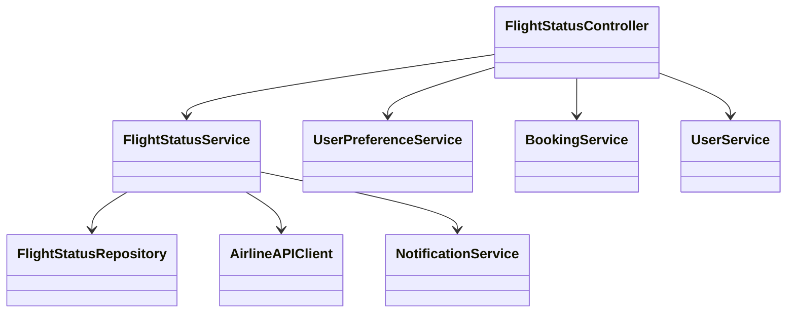
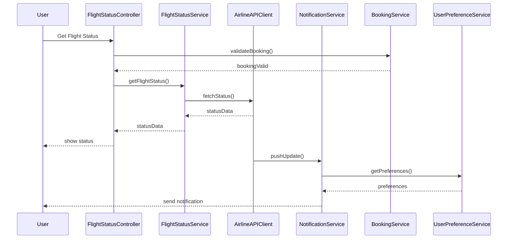
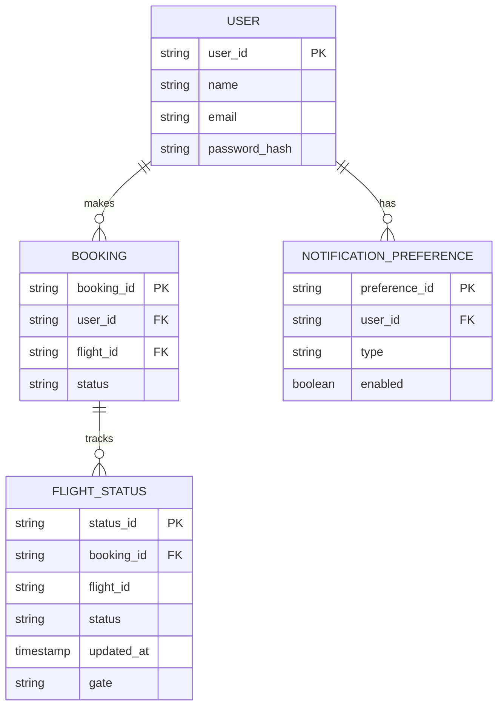

# For User Story Number [2]

1. Objective
This requirement allows passengers to track the real-time status of their booked flights, including updates on departure/arrival times, gate information, and notifications about delays or cancellations. The system ensures timely and accurate information delivery to users. The goal is to keep passengers informed and reduce uncertainty during their travel.

2. API Model
  2.1 Common Components/Services
  - AuthenticationService (JWT authentication)
  - NotificationService (Push notifications via Firebase Cloud Messaging)
  - FlightStatusService (integration with airline APIs)
  - UserPreferenceService (for notification preferences)

  2.2 API Details
| Operation | REST Method | Type | URL | Request | Response |
|-----------|-------------|------|-----|---------|----------|
| Get Flight Status | GET | Success/Failure | /api/flights/status?bookingId={bookingId} | N/A (query param) | { "flightId": "F123", "status": "ON_TIME", "departureTime": "2024-07-10T10:00:00Z", "arrivalTime": "2024-07-10T13:00:00Z", "gate": "A12", "notifications": [ ... ] } |
| Update Notification Preferences | PUT | Success/Failure | /api/users/preferences/notifications | { "userId": "U456", "preferences": { ... } } | { "status": "UPDATED" } |

  2.3 Exceptions
| API | Exception | HTTP Code | Message |
|-----|-----------|-----------|---------|
| Get Flight Status | BookingNotFoundException | 404 | "Booking not found." |
| Get Flight Status | UnauthorizedAccessException | 403 | "Access denied." |
| Get Flight Status | AirlineAPIException | 502 | "Unable to fetch flight status." |
| Update Notification Preferences | ValidationException | 400 | "Invalid preferences." |

3. Functional Design
  3.1 Class Diagram

  3.2 UML Sequence Diagram

  3.3 Components
| Component Name | Description | Existing/New |
|----------------|-------------|--------------|
| FlightStatusController | REST API controller for flight status | New |
| FlightStatusService | Business logic for fetching and updating flight status | New |
| AirlineAPIClient | Integrates with airline APIs for status | New |
| NotificationService | Pushes notifications to users | New |
| UserPreferenceService | Manages user notification preferences | Existing |
| BookingService | Validates booking ownership | Existing |
| FlightStatusRepository | Data access for flight status cache/history | New |
| UserService | User management and authentication | Existing |

  3.4 Service Layer Logic and Validations
| FieldName | Validation | Error Message | ClassUsed |
|-----------|-----------|--------------|-----------|
| bookingId | Must be a valid and owned booking | "Booking not found or unauthorized." | BookingService |
| preferences | Must be valid notification options | "Invalid preferences." | UserPreferenceService |

4. Integrations
| SystemToBeIntegrated | IntegratedFor | IntegrationType |
|----------------------|--------------|-----------------|
| Airline APIs | Real-time flight status | API |
| Firebase Cloud Messaging | Push notifications | API |

5. DB Details
  5.1 ER Model

  5.2 DB Validations
- Foreign key constraints for booking and user relationships
- Unique constraint on status_id
- Non-null constraints for all required fields

6. Non-Functional Requirements
  6.1 Performance
  - Status update latency < 1 minute
  - Efficient polling and caching of status data

  6.2 Security
    6.2.1 Authentication
    - JWT authentication for all endpoints
    - HTTPS enforced
    6.2.2 Authorization
    - Only booking owners can access status

  6.3 Logging
    6.3.1 Application Logging
    - DEBUG: API calls to airline status endpoints
    - INFO: Status updates, notification sends
    - ERROR: API failures, notification delivery errors
    - WARN: Unauthorized access attempts
    6.3.2 Audit Log
    - Log status access, notification sends, and preference changes

7. Dependencies
- Airline APIs for status data
- Firebase Cloud Messaging for notifications

8. Assumptions
- Airline APIs provide real-time and reliable status
- Notification delivery via Firebase is near-instant
- User preferences are pre-configured and up-to-date
