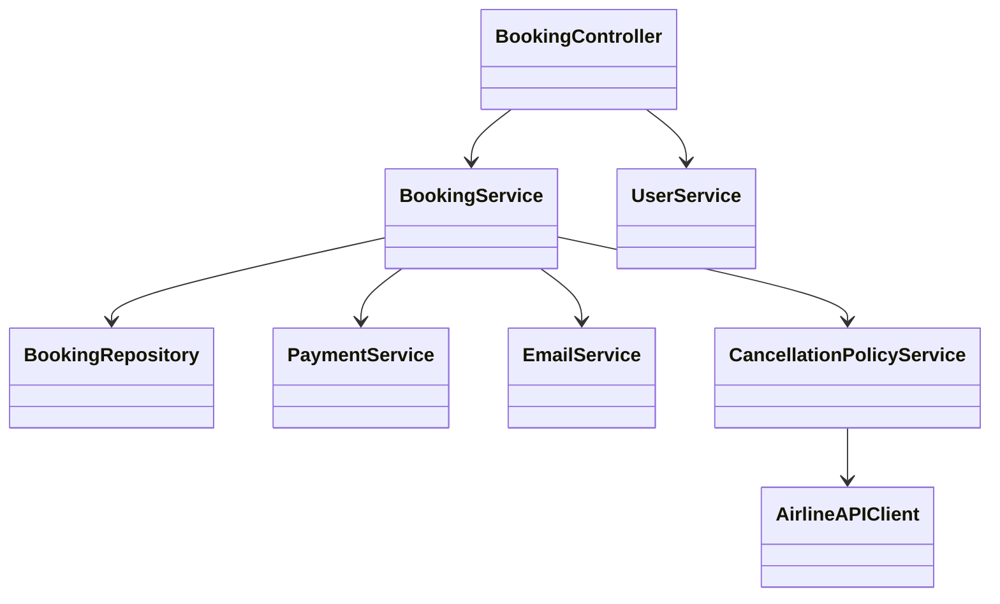
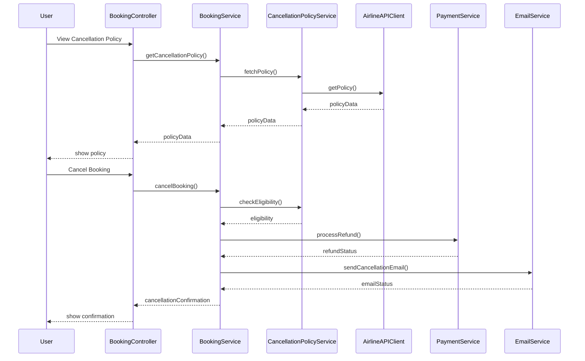
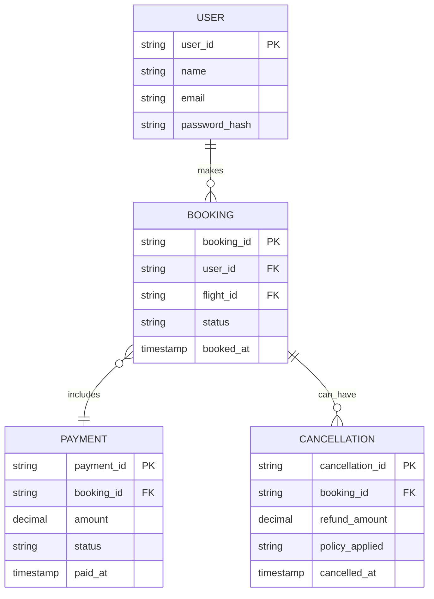

# For User Story Number [3]

1. Objective
This requirement enables passengers to cancel their booked air transport tickets and request refunds according to the airline's cancellation policy. The system ensures secure processing, displays refund eligibility, and provides confirmation of cancellation and refund. The goal is to offer flexibility and transparency for users managing changes in their travel plans.

2. API Model
  2.1 Common Components/Services
  - AuthenticationService (OAuth2 based authentication)
  - PaymentService (Stripe integration for refunds)
  - EmailService (for cancellation/refund confirmation)
  - CancellationPolicyService (integration with airline APIs)

  2.2 API Details
| Operation | REST Method | Type | URL | Request | Response |
|-----------|-------------|------|-----|---------|----------|
| View Cancellation Policy | GET | Success/Failure | /api/bookings/{bookingId}/cancellation-policy | N/A (path param) | { "bookingId": "B789", "eligible": true, "refundAmount": 200.00, "policy": "Full refund if cancelled 24h before departure" } |
| Cancel Booking | POST | Success/Failure | /api/bookings/{bookingId}/cancel | { "userId": "U456" } | { "status": "CANCELLED", "refundInitiated": true, "refundAmount": 200.00 } |
| Refund Processing | POST | Success/Failure | /api/payments/refund | { "bookingId": "B789", "amount": 200.00 } | { "refundStatus": "SUCCESS", "transactionId": "T2022" } |

  2.3 Exceptions
| API | Exception | HTTP Code | Message |
|-----|-----------|-----------|---------|
| View Cancellation Policy | BookingNotFoundException | 404 | "Booking not found." |
| Cancel Booking | NotEligibleForCancellationException | 400 | "Booking not eligible for cancellation." |
| Cancel Booking | UnauthorizedAccessException | 403 | "User not authorized." |
| Refund Processing | RefundFailedException | 502 | "Refund processing failed." |

3. Functional Design
  3.1 Class Diagram

  3.2 UML Sequence Diagram

  3.3 Components
| Component Name | Description | Existing/New |
|----------------|-------------|--------------|
| BookingController | REST API controller for booking operations | New |
| BookingService | Business logic for cancellation and refund | New |
| CancellationPolicyService | Integrates with airline APIs for policy | New |
| PaymentService | Handles refund processing via Stripe | New |
| EmailService | Sends cancellation/refund confirmation emails | Existing |
| BookingRepository | Data access for bookings | Existing |
| UserService | User management and authentication | Existing |
| AirlineAPIClient | Integrates with airline APIs | Existing |

  3.4 Service Layer Logic and Validations
| FieldName | Validation | Error Message | ClassUsed |
|-----------|-----------|--------------|-----------|
| bookingId | Must be eligible for cancellation | "Booking not eligible for cancellation." | BookingService |
| userId | Must match booking owner | "User not authorized." | BookingService |
| refundAmount | Must be calculated as per policy | "Invalid refund amount." | CancellationPolicyService |

4. Integrations
| SystemToBeIntegrated | IntegratedFor | IntegrationType |
|----------------------|--------------|-----------------|
| Airline APIs | Cancellation/refund policy | API |
| Stripe Payment Gateway | Refund processing | API |
| Email Service Provider | Cancellation/refund confirmation | API |

5. DB Details
  5.1 ER Model

  5.2 DB Validations
- Foreign key constraints for booking, payment, and cancellation
- Unique constraint on cancellation_id
- Non-null constraints for all required fields

6. Non-Functional Requirements
  6.1 Performance
  - Refund processing time < 24 hours
  - Efficient handling of peak cancellation requests

  6.2 Security
    6.2.1 Authentication
    - OAuth2 authentication for all endpoints
    - HTTPS enforced
    6.2.2 Authorization
    - Only booking owners can cancel and request refunds

  6.3 Logging
    6.3.1 Application Logging
    - DEBUG: API request/response for cancellation/refund
    - INFO: Successful cancellations and refunds
    - ERROR: Refund failures, API errors
    - WARN: Unauthorized cancellation attempts
    6.3.2 Audit Log
    - Log cancellation requests, refund transactions, and user access events

7. Dependencies
- Airline APIs for cancellation/refund rules
- Stripe payment gateway for refunds
- Email service provider

8. Assumptions
- Airline cancellation policies are reliably available via API
- Payment gateway (Stripe) supports timely refunds
- Email delivery is reliable and monitored
