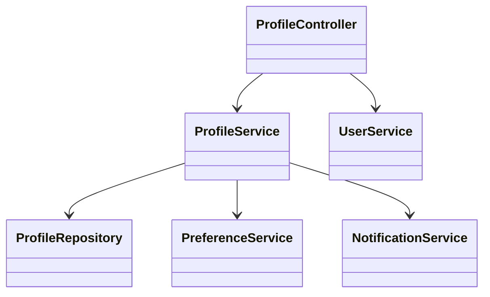
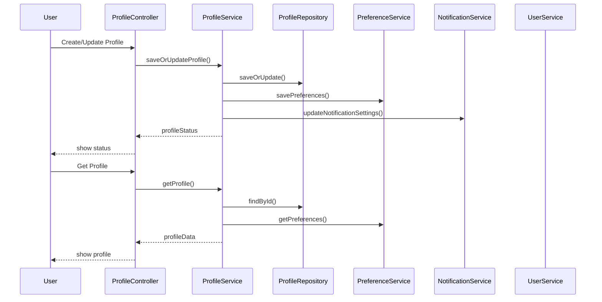
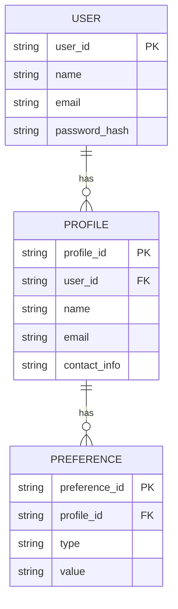

# For User Story Number [4]

1. Objective
This requirement enables passengers to create, update, and manage their profiles, including personal details, travel preferences, and notification settings. The system uses profile data to personalize booking and communication experiences. The goal is to improve user satisfaction through tailored services and streamlined interactions.

2. API Model
  2.1 Common Components/Services
  - AuthenticationService (OAuth2 based authentication)
  - ProfileService (profile management)
  - PreferenceService (travel and notification preferences)
  - NotificationService (for personalized notifications)

  2.2 API Details
| Operation | REST Method | Type | URL | Request | Response |
|-----------|-------------|------|-----|---------|----------|
| Create Profile | POST | Success/Failure | /api/users/profile | { "userId": "U456", "name": "John Doe", "email": "john@example.com", "contactInfo": { ... }, "preferences": { ... } } | { "status": "CREATED", "profileId": "P123" } |
| Update Profile | PUT | Success/Failure | /api/users/profile/{profileId} | { "name": "John Doe", "email": "john@example.com", "contactInfo": { ... }, "preferences": { ... } } | { "status": "UPDATED" } |
| Get Profile | GET | Success/Failure | /api/users/profile/{profileId} | N/A (path param) | { "profileId": "P123", "userId": "U456", "name": "John Doe", "email": "john@example.com", "contactInfo": { ... }, "preferences": { ... } } |

  2.3 Exceptions
| API | Exception | HTTP Code | Message |
|-----|-----------|-----------|---------|
| Create/Update Profile | ValidationException | 400 | "Invalid profile data." |
| Get Profile | ProfileNotFoundException | 404 | "Profile not found." |
| All | UnauthorizedAccessException | 403 | "Access denied." |

3. Functional Design
  3.1 Class Diagram

  3.2 UML Sequence Diagram

  3.3 Components
| Component Name | Description | Existing/New |
|----------------|-------------|--------------|
| ProfileController | REST API controller for profile management | New |
| ProfileService | Business logic for profile CRUD | New |
| ProfileRepository | Data access for user profiles | New |
| PreferenceService | Manages travel and notification preferences | New |
| NotificationService | Sends personalized notifications | Existing |
| UserService | User management and authentication | Existing |

  3.4 Service Layer Logic and Validations
| FieldName | Validation | Error Message | ClassUsed |
|-----------|-----------|--------------|-----------|
| name | Must be non-empty | "Name is required." | ProfileService |
| email | Must be valid email format | "Invalid email address." | ProfileService |
| contactInfo | Must be complete and valid | "Contact information required." | ProfileService |
| preferences | Must be valid options | "Invalid preferences." | PreferenceService |

4. Integrations
| SystemToBeIntegrated | IntegratedFor | IntegrationType |
|----------------------|--------------|-----------------|
| Notification Service | Personalized notifications | API |

5. DB Details
  5.1 ER Model

  5.2 DB Validations
- Foreign key constraints for user and profile relationships
- Unique constraint on profile_id
- Non-null constraints for all required fields

6. Non-Functional Requirements
  6.1 Performance
  - Profile update latency < 2 seconds
  - Efficient handling of large user base

  6.2 Security
    6.2.1 Authentication
    - OAuth2 authentication for all endpoints
    - HTTPS enforced
    6.2.2 Authorization
    - Only profile owners can update/view profiles
    - Data encryption at rest and in transit

  6.3 Logging
    6.3.1 Application Logging
    - DEBUG: API request/response for profile management
    - INFO: Profile creation and updates
    - ERROR: Validation and access errors
    - WARN: Unauthorized access attempts
    6.3.2 Audit Log
    - Log profile changes and access events

7. Dependencies
- Notification service for personalized notifications

8. Assumptions
- User data is securely stored and encrypted
- Notification service is reliable and scalable
- GDPR compliance is enforced for all personal data
