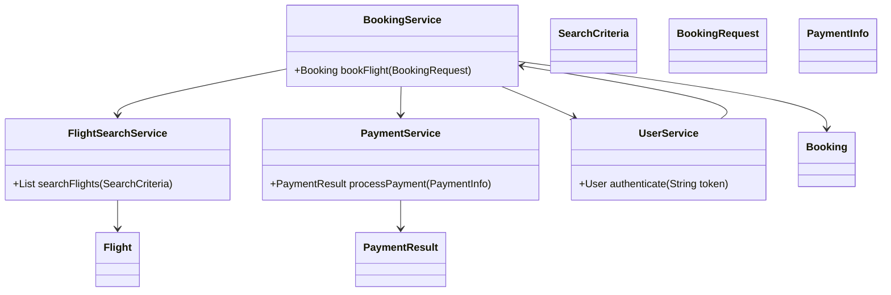
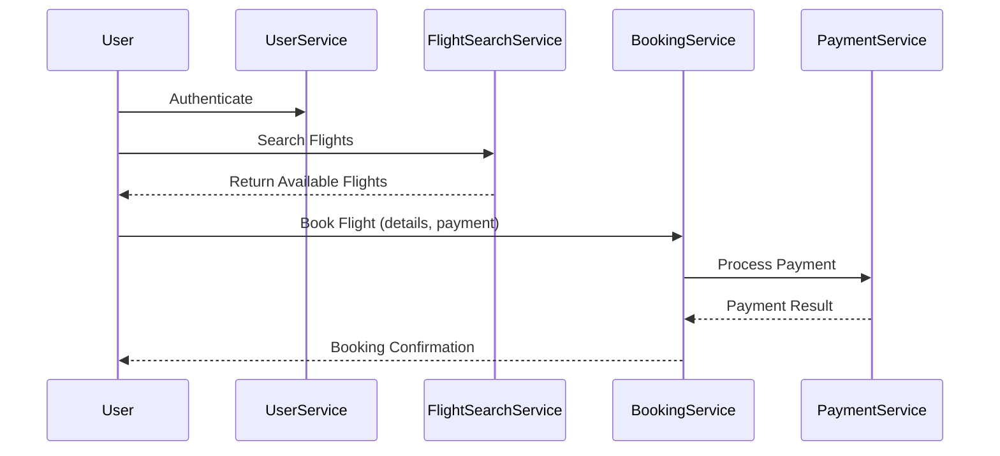
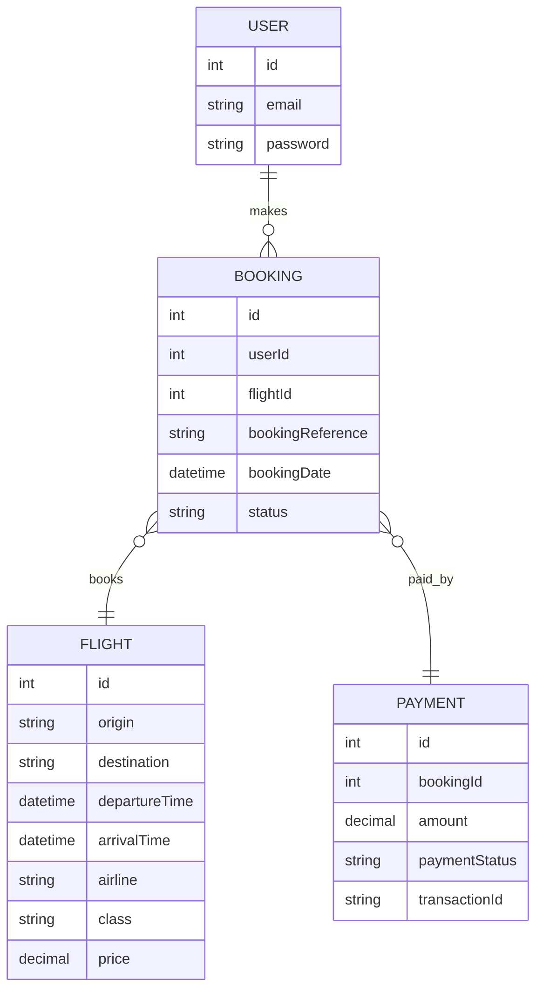

# For User Story Number [1]
1. Objective
This requirement enables travelers to search for available flights based on specific criteria and book tickets online. The system will display available options, pricing, and allow users to complete the booking process with payment. The goal is to provide a seamless and secure flight booking experience.

2. API Model
	2.1 Common Components/Services
	- User Authentication Service (existing)
	- Payment Gateway Integration (existing)
	- Flight Search Service (new)
	- Booking Service (new)

	2.2 API Details
| Operation | REST Method | Type | URL | Request | Response |
|-----------|-------------|------|-----|---------|----------|
| Search Flights | GET | Success/Failure | /api/flights/search | {"origin": "JFK", "destination": "LAX", "departureDate": "2025-10-01", "returnDate": "2025-10-10", "class": "Economy", "passengers": 2} | {"flights": [{"flightId": "F123", "airline": "Delta", "price": 350.00, "departureTime": "2025-10-01T09:00:00", "arrivalTime": "2025-10-01T12:00:00", "class": "Economy"}]} |
| Book Flight | POST | Success/Failure | /api/bookings | {"flightId": "F123", "passengerDetails": [{"name": "John Doe", "dob": "1990-01-01", "passport": "A1234567"}], "paymentInfo": {"cardNumber": "****", "expiry": "12/28", "cvv": "***"}} | {"bookingReference": "BR987654", "status": "CONFIRMED", "ticketDetails": {...}} |
| Payment Processing | POST | Success/Failure | /api/payments/process | {"bookingReference": "BR987654", "amount": 350.00, "paymentInfo": {"cardNumber": "****", "expiry": "12/28", "cvv": "***"}} | {"paymentStatus": "SUCCESS", "transactionId": "TX123456"} |

	2.3 Exceptions
| API | Exception | Error Code | Message |
|-----|-----------|------------|---------|
| Search Flights | InvalidInputException | 400 | Invalid search criteria |
| Book Flight | PaymentFailedException | 402 | Payment failed |
| Book Flight | FlightNotAvailableException | 404 | Selected flight not available |
| Book Flight | ValidationException | 400 | Validation failed for booking details |

3 Functional Design
	3.1 Class Diagram

	3.2 UML Sequence Diagram

	3.3 Components
| Component Name | Description | Existing/New |
|----------------|-------------|--------------|
| UserService | Handles user authentication and session | Existing |
| FlightSearchService | Searches flights based on criteria | New |
| BookingService | Manages booking and ticketing | New |
| PaymentService | Handles payment processing | Existing |

	3.4 Service Layer Logic and Validations
| FieldName | Validation | Error Message | ClassUsed |
|-----------|------------|--------------|-----------|
| origin, destination | Cannot be the same | Origin and destination cannot be the same | FlightSearchService |
| departureDate, returnDate | Must be valid and in the future | Invalid travel dates | FlightSearchService |
| paymentInfo | Must be valid (PCI DSS) | Invalid payment details | PaymentService |

4 Integrations
| SystemToBeIntegrated | IntegratedFor | IntegrationType |
|----------------------|---------------|-----------------|
| Payment Gateway | Payment processing | API |
| Airline Inventory | Flight availability | API |

5 DB Details
	5.1 ER Model

	5.2 DB Validations
- Unique constraint on bookingReference in BOOKING
- Foreign key constraints between BOOKING, USER, FLIGHT, PAYMENT

6 Non-Functional Requirements
	6.1 Performance
	- Search results must be returned within 2 seconds (consider API caching for frequent searches).
	- Use database indexing on flight search columns.
	6.2 Security
		6.2.1 Authentication
		- User authentication required for booking (JWT/OAuth2).
		- HTTPS for all endpoints.
		6.2.2 Authorization
		- Only authenticated users can book flights.
	6.3 Logging
		6.3.1 Application Logging
		- Log all API requests (INFO), errors (ERROR), and payment attempts (WARN/ERROR).
		6.3.2 Audit Log
		- Audit log for all booking transactions, including user, flight, and payment details.

7 Dependencies
- Payment gateway availability
- Airline inventory API reliability

8 Assumptions
- All users are registered and authenticated.
- Payment gateway is PCI DSS compliant.
- Airline inventory API provides real-time data.
