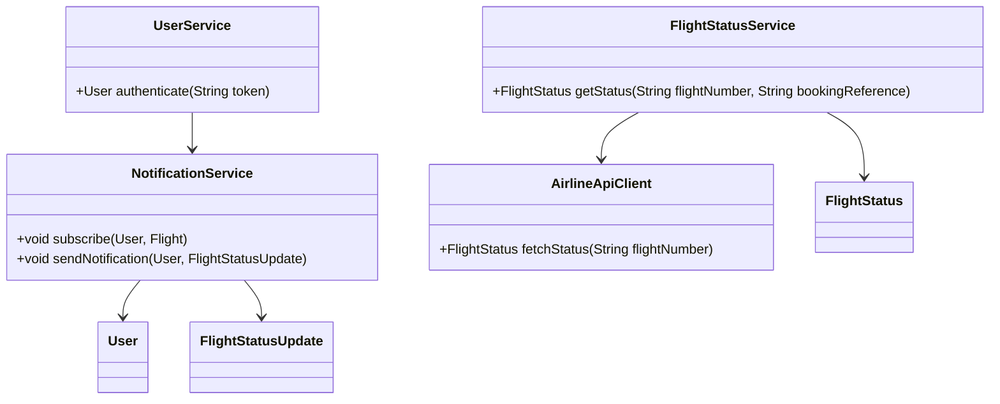
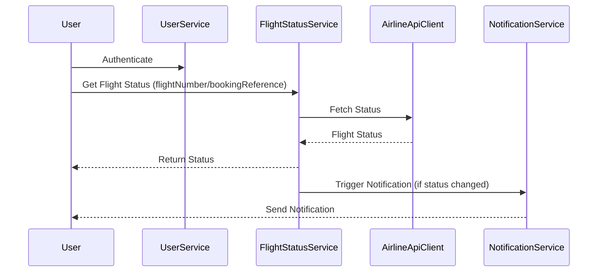
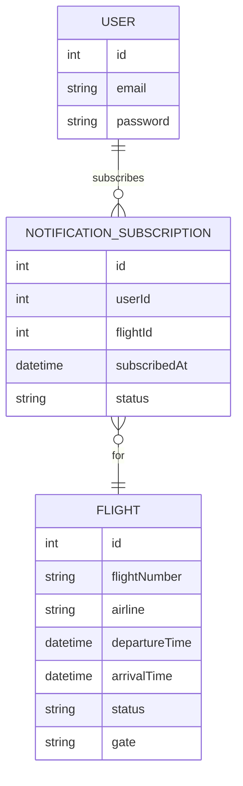

# For User Story Number [2]
1. Objective
This requirement enables travelers to track the real-time status of their booked flights, including departure and arrival times, gate information, and any delays or cancellations. The system will integrate with airline APIs to provide up-to-date information and send notifications to users for any status changes. The goal is to keep travelers informed and reduce uncertainty during their journey.

2. API Model
	2.1 Common Components/Services
	- User Authentication Service (existing)
	- Notification Service (new)
	- Flight Status Service (new)
	- Airline API Integration (new)

	2.2 API Details
| Operation | REST Method | Type | URL | Request | Response |
|-----------|-------------|------|-----|---------|----------|
| Get Flight Status | GET | Success/Failure | /api/flights/status | {"flightNumber": "DL123", "date": "2025-10-01"} or {"bookingReference": "BR987654"} | {"flightNumber": "DL123", "status": "Delayed", "departureTime": "2025-10-01T09:00:00", "arrivalTime": "2025-10-01T12:00:00", "gate": "A12", "updates": [{"type": "Delay", "message": "Flight delayed by 30 minutes"}]} |
| Subscribe to Notifications | POST | Success/Failure | /api/notifications/subscribe | {"userId": 123, "flightNumber": "DL123", "bookingReference": "BR987654"} | {"subscriptionStatus": "ACTIVE"} |

	2.3 Exceptions
| API | Exception | Error Code | Message |
|-----|-----------|------------|---------|
| Get Flight Status | FlightNotFoundException | 404 | Flight not found |
| Get Flight Status | InvalidInputException | 400 | Invalid flight number or booking reference |
| Subscribe to Notifications | NotificationException | 500 | Failed to subscribe for notifications |

3 Functional Design
	3.1 Class Diagram

	3.2 UML Sequence Diagram

	3.3 Components
| Component Name | Description | Existing/New |
|----------------|-------------|--------------|
| UserService | Handles user authentication and session | Existing |
| FlightStatusService | Fetches and processes flight status | New |
| NotificationService | Manages user notifications | New |
| AirlineApiClient | Integrates with airline APIs | New |

	3.4 Service Layer Logic and Validations
| FieldName | Validation | Error Message | ClassUsed |
|-----------|------------|--------------|-----------|
| flightNumber, bookingReference | Must be valid and exist | Invalid flight number or booking reference | FlightStatusService |
| userId | Must be authenticated | Unauthorized access | UserService |
| notificationSubscription | Must be active for updates | Notification subscription failed | NotificationService |

4 Integrations
| SystemToBeIntegrated | IntegratedFor | IntegrationType |
|----------------------|---------------|-----------------|
| Airline API | Real-time flight status | API |
| Notification Gateway | Sending notifications | API |

5 DB Details
	5.1 ER Model

	5.2 DB Validations
- Unique constraint on (userId, flightId) in NOTIFICATION_SUBSCRIPTION
- Foreign key constraints between NOTIFICATION_SUBSCRIPTION, USER, FLIGHT

6 Non-Functional Requirements
	6.1 Performance
	- Real-time updates within 1 minute of airline status change.
	- Efficient polling or webhook mechanism for airline API integration.
	6.2 Security
		6.2.1 Authentication
		- User authentication required for accessing personal flight status.
		- HTTPS for all endpoints.
		6.2.2 Authorization
		- Only authenticated users can subscribe to notifications.
	6.3 Logging
		6.3.1 Application Logging
		- Log all API requests (INFO), errors (ERROR), and notification deliveries (INFO/WARN).
		6.3.2 Audit Log
		- Audit log for all status changes and notification events.

7 Dependencies
- Airline API availability for real-time data
- Notification gateway reliability

8 Assumptions
- Airline APIs provide real-time and accurate status data.
- Users have valid contact details for notifications.
