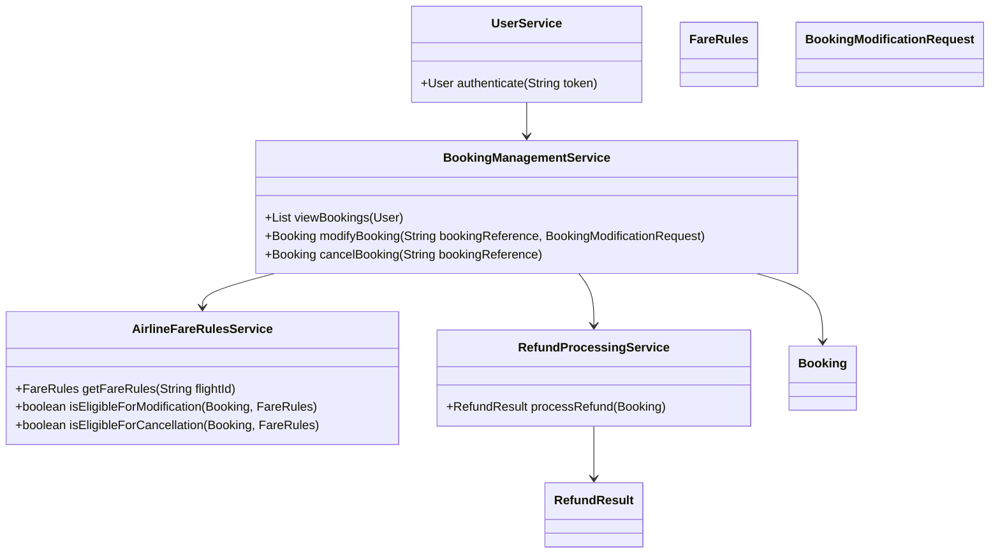
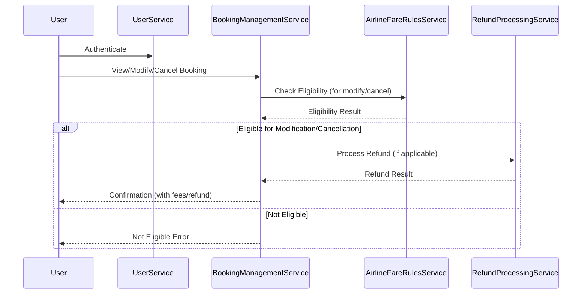
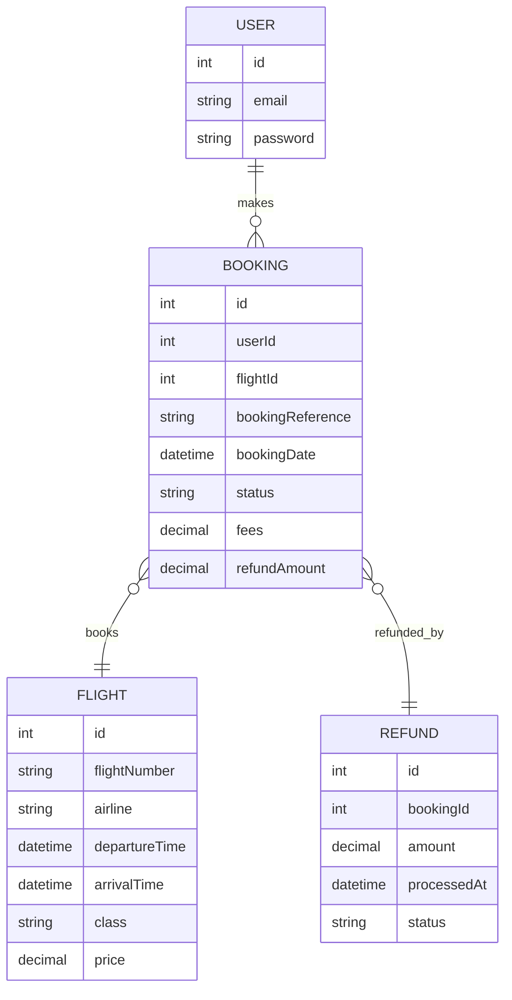

# For User Story Number [3]
1. Objective
This requirement enables travelers to view, modify, or cancel their existing flight bookings. The system enforces airline rules for changes, displays applicable fees, and processes refunds as per policy. The goal is to provide flexibility and transparency for users managing their travel plans.

2. API Model
	2.1 Common Components/Services
	- User Authentication Service (existing)
	- Booking Management Service (new)
	- Airline Fare Rules Service (new)
	- Refund Processing Service (new)

	2.2 API Details
| Operation | REST Method | Type | URL | Request | Response |
|-----------|-------------|------|-----|---------|----------|
| View Bookings | GET | Success/Failure | /api/bookings | {"userId": 123} | {"bookings": [{"bookingReference": "BR987654", "flightId": "F123", "status": "CONFIRMED", "details": {...}}]} |
| Modify Booking | PUT | Success/Failure | /api/bookings/{bookingReference} | {"newTravelDate": "2025-10-15", "passengerDetails": [{...}]} | {"bookingReference": "BR987654", "status": "MODIFIED", "fees": 50.00, "refund": 0.00} |
| Cancel Booking | DELETE | Success/Failure | /api/bookings/{bookingReference} | {} | {"bookingReference": "BR987654", "status": "CANCELLED", "refund": 100.00, "fees": 25.00} |

	2.3 Exceptions
| API | Exception | Error Code | Message |
|-----|-----------|------------|---------|
| View Bookings | UnauthorizedException | 401 | Unauthorized access |
| Modify Booking | NotEligibleException | 403 | Booking not eligible for modification |
| Modify Booking | ValidationException | 400 | Invalid modification details |
| Cancel Booking | NotEligibleException | 403 | Booking not eligible for cancellation |
| Cancel Booking | RefundFailedException | 500 | Refund processing failed |

3 Functional Design
	3.1 Class Diagram

	3.2 UML Sequence Diagram

	3.3 Components
| Component Name | Description | Existing/New |
|----------------|-------------|--------------|
| UserService | Handles user authentication and session | Existing |
| BookingManagementService | Manages viewing, modifying, and cancelling bookings | New |
| AirlineFareRulesService | Applies airline fare rules for eligibility | New |
| RefundProcessingService | Handles refund calculations and processing | New |

	3.4 Service Layer Logic and Validations
| FieldName | Validation | Error Message | ClassUsed |
|-----------|------------|--------------|-----------|
| bookingReference | Must exist and belong to user | Unauthorized access or booking not found | BookingManagementService |
| modification/cancellation eligibility | Must comply with fare rules | Not eligible for modification/cancellation | AirlineFareRulesService |
| refund processing | Refund as per policy | Refund processing failed | RefundProcessingService |

4 Integrations
| SystemToBeIntegrated | IntegratedFor | IntegrationType |
|----------------------|---------------|-----------------|
| Airline System | Fare rules and booking management | API |
| Payment Gateway | Refund processing | API |

5 DB Details
	5.1 ER Model

	5.2 DB Validations
- Unique constraint on bookingReference in BOOKING
- Foreign key constraints between BOOKING, USER, FLIGHT, REFUND

6 Non-Functional Requirements
	6.1 Performance
	- All changes processed within 30 seconds.
	- Efficient DB queries for booking lookups and updates.
	6.2 Security
		6.2.1 Authentication
		- User authentication required for all booking changes.
		- HTTPS for all endpoints.
		6.2.2 Authorization
		- Only booking owner can modify/cancel their bookings.
	6.3 Logging
		6.3.1 Application Logging
		- Log all API requests (INFO), errors (ERROR), and refund attempts (WARN/ERROR).
		6.3.2 Audit Log
		- Audit log for all modifications and cancellations, including user, booking, and refund details.

7 Dependencies
- Airline system API for fare rules and booking updates
- Payment gateway for refund processing

8 Assumptions
- Airline systems provide up-to-date fare rules and booking status.
- Refunds are processed via integrated payment gateway.
