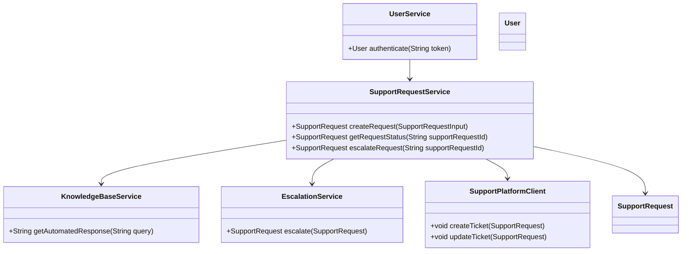
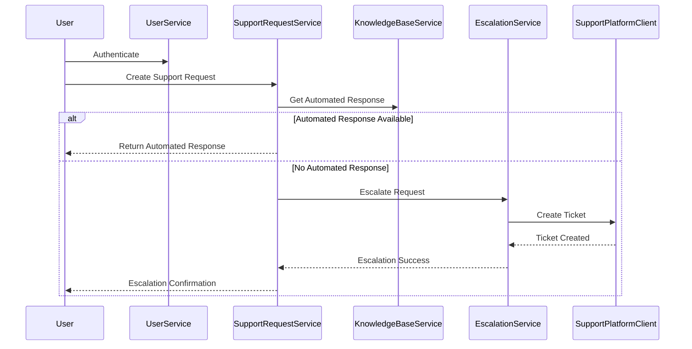
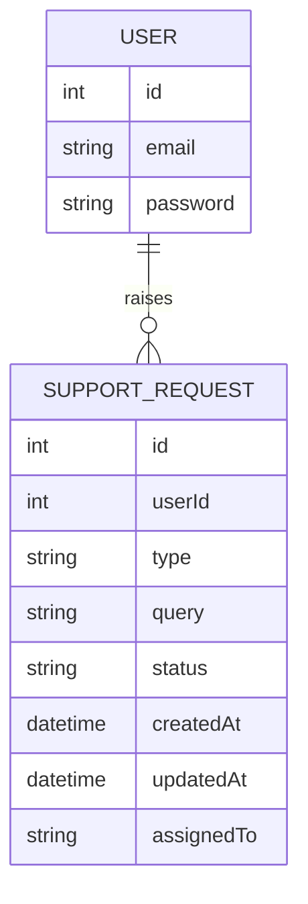

# For User Story Number [4]
1. Objective
This requirement enables travelers to access customer support via chat, email, or phone for resolving issues or obtaining information. The system provides automated responses for common queries and escalates complex issues to human agents, ensuring user requests are tracked and resolved efficiently. The goal is to deliver prompt, reliable, and user-friendly support at all times.

2. API Model
	2.1 Common Components/Services
	- User Authentication Service (existing)
	- Support Request Service (new)
	- Knowledge Base Service (new)
	- Escalation Service (new)
	- Integration with Support Platform (e.g., Zendesk) (new)

	2.2 API Details
| Operation | REST Method | Type | URL | Request | Response |
|-----------|-------------|------|-----|---------|----------|
| Create Support Request | POST | Success/Failure | /api/support/requests | {"userId": 123, "type": "chat/email/phone", "query": "How do I change my booking?"} | {"supportRequestId": "SR123456", "status": "OPEN", "response": "Please follow these steps..."} |
| Get Support Request Status | GET | Success/Failure | /api/support/requests/{supportRequestId} | {} | {"supportRequestId": "SR123456", "status": "IN_PROGRESS", "assignedTo": "Agent123", "lastUpdate": "2025-10-01T10:00:00"} |
| Escalate Support Request | POST | Success/Failure | /api/support/requests/{supportRequestId}/escalate | {} | {"supportRequestId": "SR123456", "status": "ESCALATED", "assignedTo": "Agent456"} |

	2.3 Exceptions
| API | Exception | Error Code | Message |
|-----|-----------|------------|---------|
| Create Support Request | ValidationException | 400 | Invalid support request details |
| Create Support Request | KnowledgeBaseNotFoundException | 404 | No automated response available |
| Escalate Support Request | EscalationFailedException | 500 | Escalation failed |
| Get Support Request Status | NotFoundException | 404 | Support request not found |

3 Functional Design
	3.1 Class Diagram

	3.2 UML Sequence Diagram

	3.3 Components
| Component Name | Description | Existing/New |
|----------------|-------------|--------------|
| UserService | Handles user authentication and session | Existing |
| SupportRequestService | Manages support request lifecycle | New |
| KnowledgeBaseService | Provides automated responses | New |
| EscalationService | Handles escalation to human agents | New |
| SupportPlatformClient | Integrates with external support platform | New |

	3.4 Service Layer Logic and Validations
| FieldName | Validation | Error Message | ClassUsed |
|-----------|------------|--------------|-----------|
| userId | Must be authenticated | Unauthorized access | UserService |
| query | Must not be empty | Invalid support request details | SupportRequestService |
| supportRequestId | Must exist | Support request not found | SupportRequestService |
| escalation | Must be within SLA | Escalation failed | EscalationService |

4 Integrations
| SystemToBeIntegrated | IntegratedFor | IntegrationType |
|----------------------|---------------|-----------------|
| Support Platform (Zendesk) | Ticket creation and updates | API |
| Knowledge Base | Automated responses | API |

5 DB Details
	5.1 ER Model

	5.2 DB Validations
- Unique constraint on supportRequestId in SUPPORT_REQUEST
- Foreign key constraint between SUPPORT_REQUEST and USER

6 Non-Functional Requirements
	6.1 Performance
	- Automated responses within 5 seconds.
	- 24/7 availability of support services.
	6.2 Security
		6.2.1 Authentication
		- User authentication required for all support requests.
		- HTTPS for all endpoints.
		6.2.2 Authorization
		- Only request owner can view/escalate their support requests.
	6.3 Logging
		6.3.1 Application Logging
		- Log all API requests (INFO), errors (ERROR), and escalations (WARN/ERROR).
		6.3.2 Audit Log
		- Audit log for all support requests and escalations, including user and request details.

7 Dependencies
- External support platform (Zendesk) availability
- Knowledge base API reliability

8 Assumptions
- Knowledge base is regularly updated with common queries.
- Support platform is available 24/7 for escalations.
