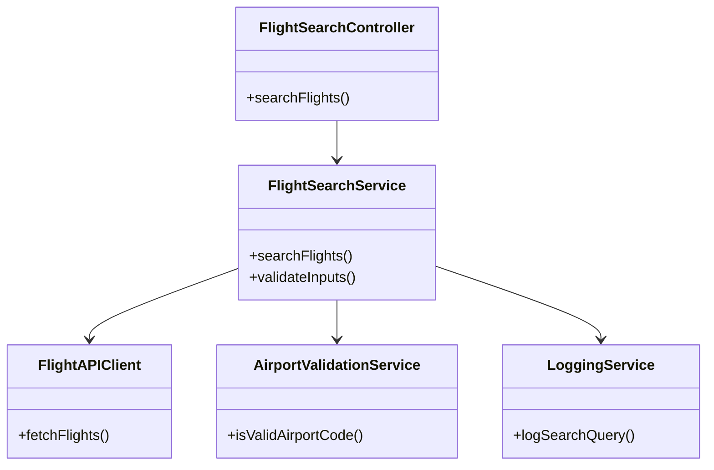
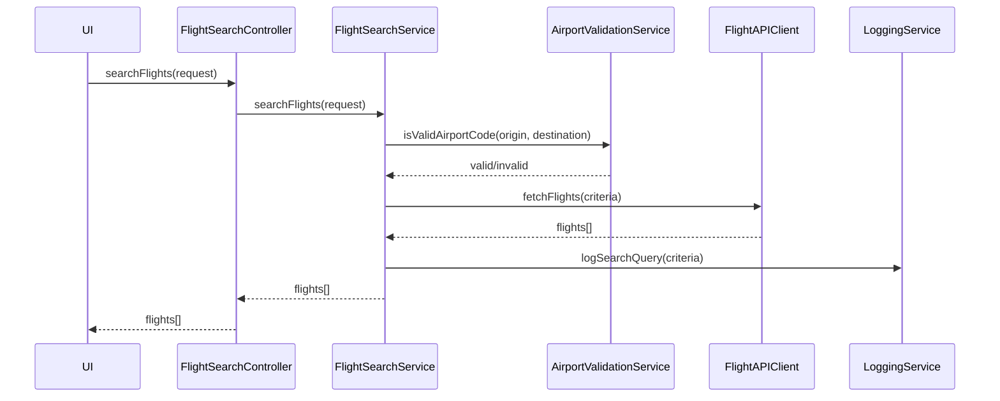
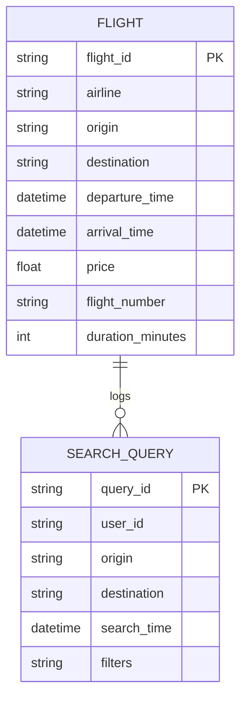

# For User Story Number [1]
1. Objective
This requirement enables passengers to search for available flights based on origin, destination, and travel dates. The system must provide a list of flights with details such as airline, departure/arrival times, duration, and price. Passengers should be able to filter and sort results as per their preferences.

2. API Model
  2.1 Common Components/Services
  - FlightSearchService (new)
  - FlightAPIClient (new, for third-party integration)
  - AirportValidationService (existing or new)
  - LoggingService (existing)

  2.2 API Details
| Operation | REST Method | Type           | URL                          | Request (sample JSON)                                                                 | Response (sample JSON)                                                                 |
|-----------|-------------|----------------|------------------------------|---------------------------------------------------------------------------------------|----------------------------------------------------------------------------------------|
| Search    | POST        | Success/Failure| /api/v1/flights/search       | {"origin": "JFK", "destination": "LAX", "departureDate": "2024-10-01", "returnDate": "2024-10-10", "filters": {"airline": "Delta", "sortBy": "price"}} | {"flights": [{"flightNumber": "DL123", "airline": "Delta", "departure": "2024-10-01T08:00:00", "arrival": "2024-10-01T11:00:00", "duration": "3h", "price": 350.00}] }
| Validate  | POST        | Failure        | /api/v1/flights/validate     | {"origin": "JFK", "destination": "LAX", "departureDate": "2024-10-01"}                                            | {"valid": true, "errors": []}                                                      |

  2.3 Exceptions
| API                       | Exception Type         | Description                                  |
|--------------------------|-----------------------|----------------------------------------------|
| /api/v1/flights/search   | InvalidInputException | Origin/destination code invalid              |
| /api/v1/flights/search   | DateValidationException| Travel date in the past                      |
| /api/v1/flights/search   | NoFlightsFoundException| No flights found for given criteria          |
| /api/v1/flights/search   | ExternalAPIException  | Third-party API failure                      |

3 Functional Design
  3.1 Class Diagram

  3.2 UML Sequence Diagram

  3.3 Components
| Component Name            | Description                                            | Existing/New |
|--------------------------|--------------------------------------------------------|--------------|
| FlightSearchController    | REST controller for handling search requests           | New          |
| FlightSearchService       | Service for search logic, validation, and orchestration| New          |
| FlightAPIClient           | Client for third-party flight data APIs                | New          |
| AirportValidationService  | Validates airport codes                                | Existing/New |
| LoggingService            | Logs search queries for analytics                      | Existing     |

  3.4 Service Layer Logic and Validations
| FieldName      | Validation                              | Error Message                      | ClassUsed                |
|---------------|-----------------------------------------|------------------------------------|--------------------------|
| origin        | Must be valid IATA airport code          | Invalid origin airport code        | AirportValidationService |
| destination   | Must be valid IATA airport code          | Invalid destination airport code   | AirportValidationService |
| departureDate | Must not be in the past                  | Departure date cannot be in past   | FlightSearchService      |
| returnDate    | Must not be in the past                  | Return date cannot be in past      | FlightSearchService      |

4 Integrations
| SystemToBeIntegrated | IntegratedFor      | IntegrationType |
|---------------------|--------------------|-----------------|
| Amadeus/Sabre API   | Flight data lookup | API             |

5 DB Details
  5.1 ER Model

  5.2 DB Validations
- Ensure flight_id is unique.
- Ensure origin and destination are valid airport codes.
- Ensure departure_time is after current time.

6 Non-Functional Requirements
  6.1 Performance
  - Search results must be returned within 3 seconds.
  - Consider caching frequent queries at API layer.

  6.2 Security
    6.2.1 Authentication
    - API authentication required for all endpoints.
    6.2.2 Authorization
    - Only authenticated users can search flights.

  6.3 Logging
    6.3.1 Application Logging
    - Log all search requests at INFO level.
    - Log errors/exceptions at ERROR level.
    6.3.2 Audit Log
    - Log search queries with user ID and timestamp for analytics.

7 Dependencies
- Third-party flight data APIs (Amadeus, Sabre)
- PostgreSQL database

8 Assumptions
- All airport codes follow IATA standard.
- Third-party APIs are available and reliable.
- User authentication is handled by a separate service.