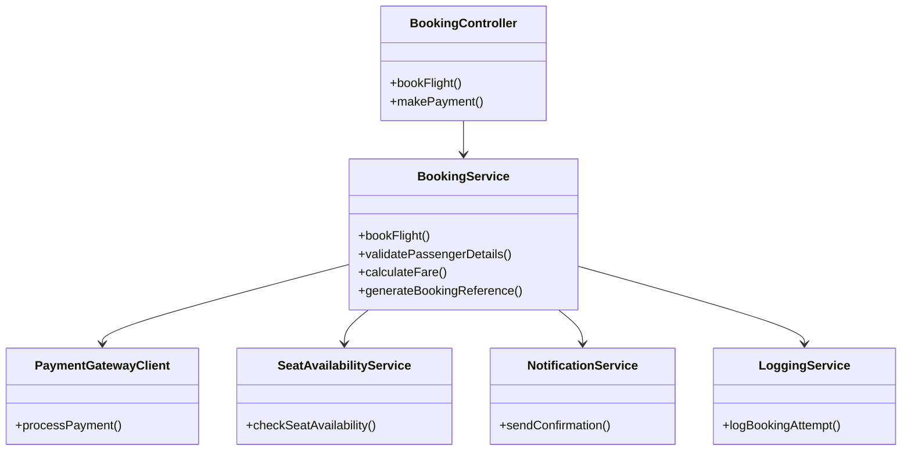
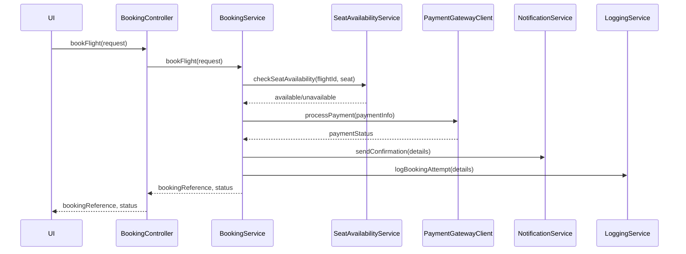
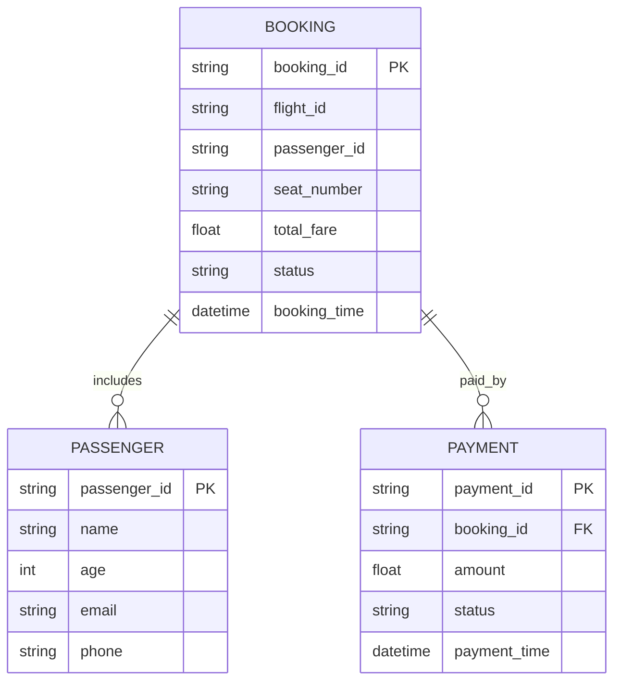

# For User Story Number [2]
1. Objective
This requirement enables passengers to book a selected flight by entering passenger details, selecting seats, and making payment. The system must generate a booking reference and send confirmation via email/SMS. All booking, payment, and seat selection processes must be secure and reliable.

2. API Model
  2.1 Common Components/Services
  - BookingService (new)
  - PaymentGatewayClient (new)
  - SeatAvailabilityService (existing/new)
  - NotificationService (existing)
  - LoggingService (existing)

  2.2 API Details
| Operation | REST Method | Type           | URL                          | Request (sample JSON)                                                                 | Response (sample JSON)                                                                 |
|-----------|-------------|----------------|------------------------------|---------------------------------------------------------------------------------------|----------------------------------------------------------------------------------------|
| Book      | POST        | Success/Failure| /api/v1/bookings             | {"flightId": "DL123", "passengerDetails": [{"name": "John Doe", "age": 30}], "seatPreference": "Aisle", "paymentInfo": {"method": "card", "token": "xyz"}} | {"bookingReference": "ABC123", "status": "CONFIRMED", "totalFare": 420.00} |
| Payment   | POST        | Success/Failure| /api/v1/bookings/payment     | {"bookingReference": "ABC123", "paymentInfo": {"method": "card", "token": "xyz"}} | {"status": "PAID", "receiptId": "RCP123"} |

  2.3 Exceptions
| API                       | Exception Type         | Description                                  |
|--------------------------|-----------------------|----------------------------------------------|
| /api/v1/bookings         | InvalidInputException | Missing/invalid passenger details            |
| /api/v1/bookings         | SeatUnavailableException | Selected seat not available                 |
| /api/v1/bookings/payment | PaymentFailedException| Payment not authorized or failed             |
| /api/v1/bookings         | ExternalAPIException  | Payment gateway or notification failure      |

3 Functional Design
  3.1 Class Diagram

  3.2 UML Sequence Diagram

  3.3 Components
| Component Name            | Description                                            | Existing/New |
|--------------------------|--------------------------------------------------------|--------------|
| BookingController        | REST controller for booking requests                   | New          |
| BookingService           | Service for booking logic and orchestration            | New          |
| PaymentGatewayClient     | Client for payment gateway integration                 | New          |
| SeatAvailabilityService  | Checks seat availability                              | Existing/New |
| NotificationService      | Sends booking confirmation                            | Existing     |
| LoggingService           | Logs booking attempts and outcomes                     | Existing     |

  3.4 Service Layer Logic and Validations
| FieldName        | Validation                              | Error Message                      | ClassUsed                |
|------------------|-----------------------------------------|------------------------------------|--------------------------|
| passengerDetails | Must be provided and valid              | Missing/invalid passenger details  | BookingService           |
| seatPreference   | Seat must be available                  | Selected seat not available        | SeatAvailabilityService  |
| paymentInfo      | Payment must be authorized and complete | Payment failed                     | PaymentGatewayClient     |

4 Integrations
| SystemToBeIntegrated | IntegratedFor      | IntegrationType |
|---------------------|--------------------|-----------------|
| Stripe/PayPal       | Payment processing | API             |
| Email/SMS Gateway   | Confirmation       | API             |

5 DB Details
  5.1 ER Model

  5.2 DB Validations
- Ensure booking_id is unique.
- Ensure seat_number is available at the time of booking.
- Ensure payment status is updated after transaction.

6 Non-Functional Requirements
  6.1 Performance
  - Booking process should complete within 5 seconds after payment.
  - Optimize DB transactions and API calls for speed.

  6.2 Security
    6.2.1 Authentication
    - All APIs require user authentication.
    6.2.2 Authorization
    - Only authorized users can book flights.
    - PCI DSS compliance for payment data.

  6.3 Logging
    6.3.1 Application Logging
    - Log all booking attempts at INFO level.
    - Log payment failures at ERROR level.
    6.3.2 Audit Log
    - Log booking reference, user, and timestamp for audit.

7 Dependencies
- Payment gateway APIs (Stripe, PayPal)
- Email/SMS gateway
- PostgreSQL database

8 Assumptions
- Payment gateway integration is reliable.
- Seat availability is real-time.
- User authentication and notification services are available.