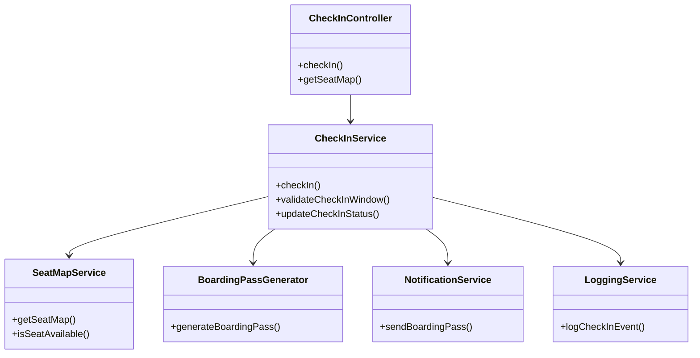
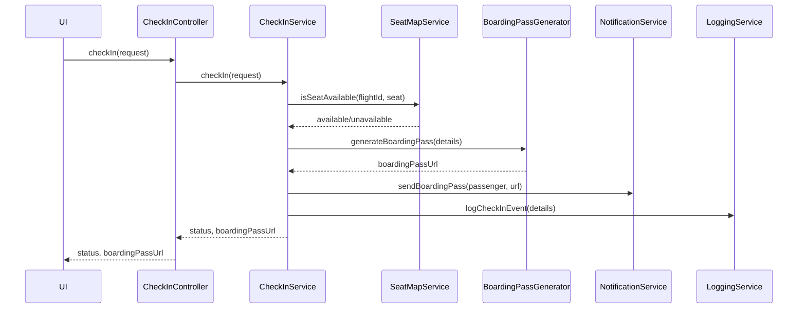
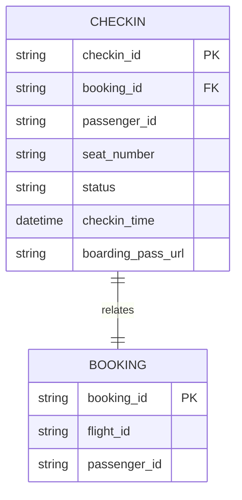

# For User Story Number [3]
1. Objective
This requirement enables passengers to check in online within the allowed time window, select or change seats, and receive a digital boarding pass. The system must validate eligibility for online check-in and update the check-in status. Boarding passes must be generated and delivered digitally.

2. API Model
  2.1 Common Components/Services
  - CheckInService (new)
  - SeatMapService (existing/new)
  - BoardingPassGenerator (new)
  - NotificationService (existing)
  - LoggingService (existing)

  2.2 API Details
| Operation | REST Method | Type           | URL                          | Request (sample JSON)                                                                 | Response (sample JSON)                                                                 |
|-----------|-------------|----------------|------------------------------|---------------------------------------------------------------------------------------|----------------------------------------------------------------------------------------|
| Check-in  | POST        | Success/Failure| /api/v1/checkin              | {"bookingReference": "ABC123", "passengerId": "PAX1", "seat": "12A"} | {"status": "CHECKED_IN", "boardingPassUrl": "https://.../bp/ABC123.pdf"} |
| Seat Map  | GET         | Success/Failure| /api/v1/checkin/seatmap      | {"flightId": "DL123"} | {"seats": [{"seat": "12A", "available": true}, ...]} |

  2.3 Exceptions
| API                       | Exception Type         | Description                                  |
|--------------------------|-----------------------|----------------------------------------------|
| /api/v1/checkin          | InvalidInputException | Invalid booking reference or passenger ID     |
| /api/v1/checkin          | CheckInWindowException| Check-in not allowed at this time            |
| /api/v1/checkin          | SeatUnavailableException | Selected seat not available                 |
| /api/v1/checkin          | ExternalAPIException  | Seat map API or PDF generation failure       |

3 Functional Design
  3.1 Class Diagram

  3.2 UML Sequence Diagram

  3.3 Components
| Component Name            | Description                                            | Existing/New |
|--------------------------|--------------------------------------------------------|--------------|
| CheckInController        | REST controller for check-in requests                  | New          |
| CheckInService           | Service for check-in logic and orchestration           | New          |
| SeatMapService           | Provides seat map and availability                     | Existing/New |
| BoardingPassGenerator    | Generates digital boarding pass (PDF/QR)               | New          |
| NotificationService      | Sends boarding pass to passenger                       | Existing     |
| LoggingService           | Logs check-in and seat selection events                | Existing     |

  3.4 Service Layer Logic and Validations
| FieldName        | Validation                              | Error Message                      | ClassUsed                |
|------------------|-----------------------------------------|------------------------------------|--------------------------|
| bookingReference | Must be valid and match passenger       | Invalid booking reference          | CheckInService           |
| checkInWindow    | Only within 24-2 hours before departure | Check-in not allowed at this time  | CheckInService           |
| seat             | Seat must be available                  | Selected seat not available        | SeatMapService           |

4 Integrations
| SystemToBeIntegrated | IntegratedFor      | IntegrationType |
|---------------------|--------------------|-----------------|
| Airline Seat Map API| Seat availability  | API             |
| PDF/QR Generator    | Boarding pass      | API             |
| Email/SMS Gateway   | Boarding pass      | API             |

5 DB Details
  5.1 ER Model

  5.2 DB Validations
- Ensure check-in is within allowed window.
- Ensure seat is available at check-in.
- Ensure boarding_pass_url is unique per check-in.

6 Non-Functional Requirements
  6.1 Performance
  - Boarding pass generation should take less than 2 seconds.
  - Support 5,000 concurrent check-ins.

  6.2 Security
    6.2.1 Authentication
    - All APIs require user authentication.
    6.2.2 Authorization
    - Only authorized users can check in for their booking.
    - Data privacy compliance for passenger data.

  6.3 Logging
    6.3.1 Application Logging
    - Log all check-in and seat selection events at INFO level.
    - Log errors/exceptions at ERROR level.
    6.3.2 Audit Log
    - Log check-in reference, user, and timestamp for audit.

7 Dependencies
- Airline seat map API
- PDF/QR code generator
- Email/SMS gateway
- PostgreSQL database

8 Assumptions
- Seat map API provides real-time seat availability.
- Boarding pass generator is reliable and fast.
- User authentication and notification services are available.