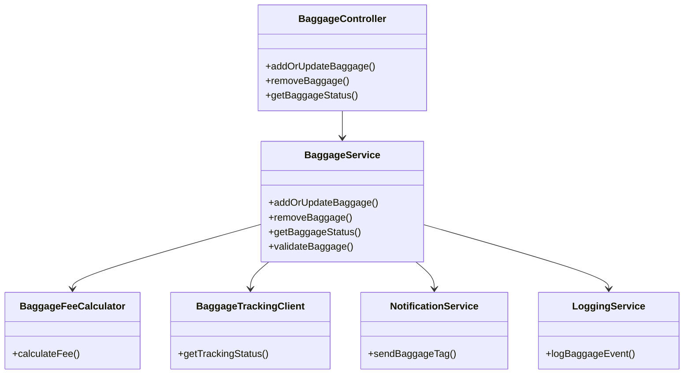
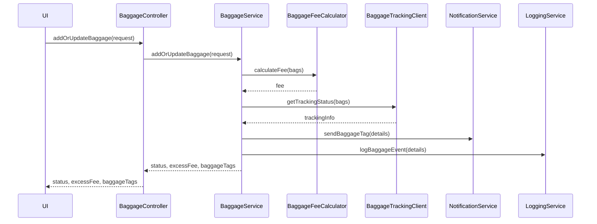
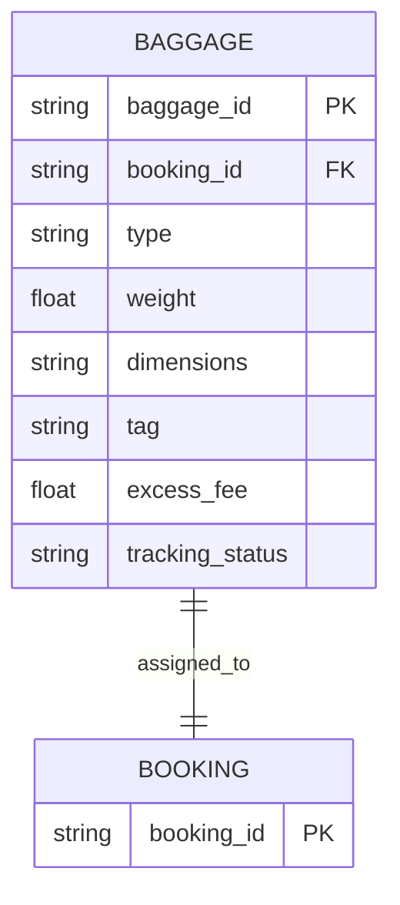

# For User Story Number [4]
1. Objective
This requirement enables passengers to manage baggage information during booking or check-in, including adding, modifying, or removing baggage. The system must calculate excess baggage fees and provide baggage tracking and tagging. All baggage data must be linked to booking and check-in records and comply with airline policies.

2. API Model
  2.1 Common Components/Services
  - BaggageService (new)
  - BaggageFeeCalculator (new)
  - BaggageTrackingClient (new)
  - NotificationService (existing)
  - LoggingService (existing)

  2.2 API Details
| Operation | REST Method | Type           | URL                          | Request (sample JSON)                                                                 | Response (sample JSON)                                                                 |
|-----------|-------------|----------------|------------------------------|---------------------------------------------------------------------------------------|----------------------------------------------------------------------------------------|
| Add/Update Baggage | POST/PUT   | Success/Failure| /api/v1/baggage              | {"bookingReference": "ABC123", "bags": [{"type": "checked", "weight": 23, "dimensions": "55x40x23"}]} | {"status": "SUCCESS", "excessFee": 50.00, "baggageTags": ["TAG123"]} |
| Remove Baggage     | DELETE     | Success/Failure| /api/v1/baggage/{bagId}      | N/A                                                                                   | {"status": "REMOVED"} |
| Get Baggage Status | GET        | Success/Failure| /api/v1/baggage/status       | {"bookingReference": "ABC123"}                                                     | {"bags": [{"tag": "TAG123", "status": "IN_TRANSIT"}]} |

  2.3 Exceptions
| API                       | Exception Type         | Description                                  |
|--------------------------|-----------------------|----------------------------------------------|
| /api/v1/baggage          | InvalidInputException | Invalid baggage details                      |
| /api/v1/baggage          | PolicyViolationException | Baggage exceeds airline policy             |
| /api/v1/baggage          | FeeNotPaidException   | Excess baggage fee not paid                  |
| /api/v1/baggage/status   | TrackingUnavailableException | Tracking info not available               |

3 Functional Design
  3.1 Class Diagram

  3.2 UML Sequence Diagram

  3.3 Components
| Component Name            | Description                                            | Existing/New |
|--------------------------|--------------------------------------------------------|--------------|
| BaggageController        | REST controller for baggage management                 | New          |
| BaggageService           | Service for baggage logic and orchestration            | New          |
| BaggageFeeCalculator     | Calculates excess baggage fees                         | New          |
| BaggageTrackingClient    | Integrates with tracking APIs                          | New          |
| NotificationService      | Sends baggage tags and updates                         | Existing     |
| LoggingService           | Logs baggage transactions                              | Existing     |

  3.4 Service Layer Logic and Validations
| FieldName        | Validation                              | Error Message                      | ClassUsed                |
|------------------|-----------------------------------------|------------------------------------|--------------------------|
| bags             | Must comply with airline policy          | Baggage policy violation           | BaggageService           |
| weight/dimensions| Must be within allowed limits            | Exceeds allowed weight/dimensions  | BaggageService           |
| excessFee        | Must be paid before check-in             | Excess baggage fee not paid        | BaggageFeeCalculator     |

4 Integrations
| SystemToBeIntegrated | IntegratedFor      | IntegrationType |
|---------------------|--------------------|-----------------|
| Airline Baggage API | Baggage tracking   | API             |
| Email/SMS Gateway   | Baggage tags/info  | API             |

5 DB Details
  5.1 ER Model

  5.2 DB Validations
- Ensure baggage_id is unique.
- Ensure baggage weight/dimensions comply with policy.
- Ensure excess_fee is paid before check-in.

6 Non-Functional Requirements
  6.1 Performance
  - Support 2,000 concurrent baggage updates.
  - Real-time tracking updates.

  6.2 Security
    6.2.1 Authentication
    - All APIs require user authentication.
    6.2.2 Authorization
    - Only authorized users can manage baggage for their booking.

  6.3 Logging
    6.3.1 Application Logging
    - Log all baggage transactions at INFO level.
    - Log errors/exceptions at ERROR level.
    6.3.2 Audit Log
    - Log baggage ID, user, and timestamp for audit.

7 Dependencies
- Airline baggage tracking API
- Email/SMS gateway
- PostgreSQL database

8 Assumptions
- Airline baggage policy is accessible and up-to-date.
- Baggage tracking API is reliable and real-time.
- User authentication and notification services are available.