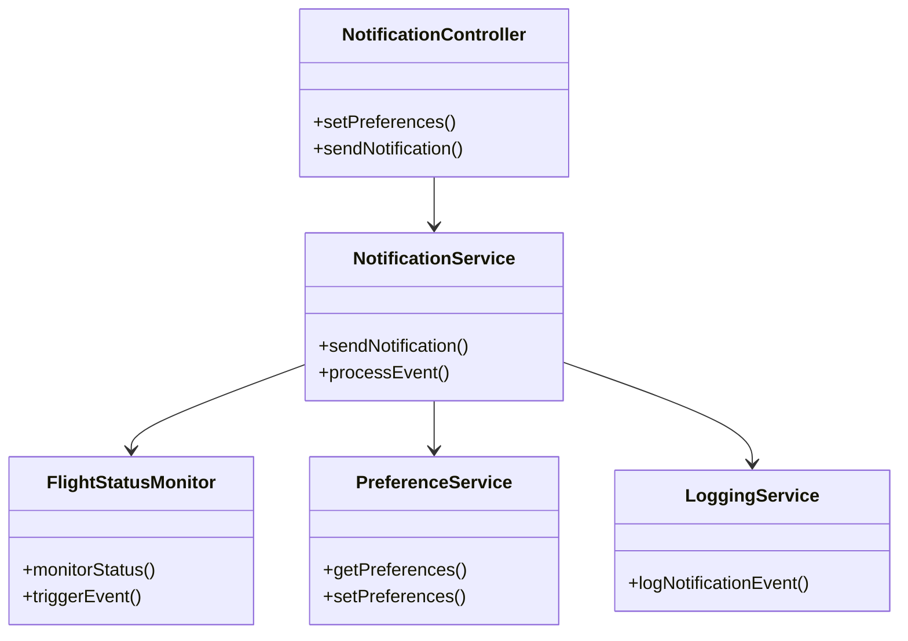
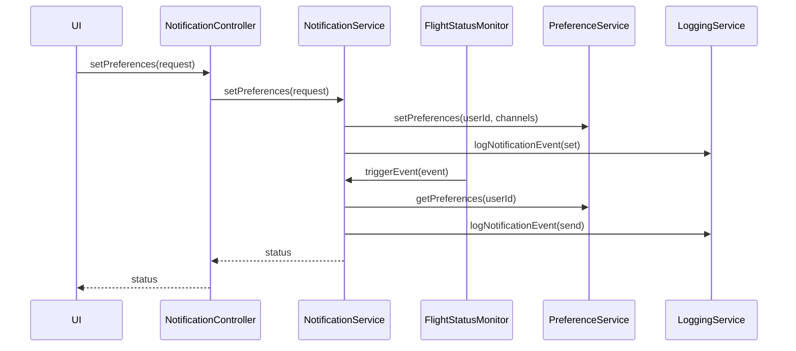
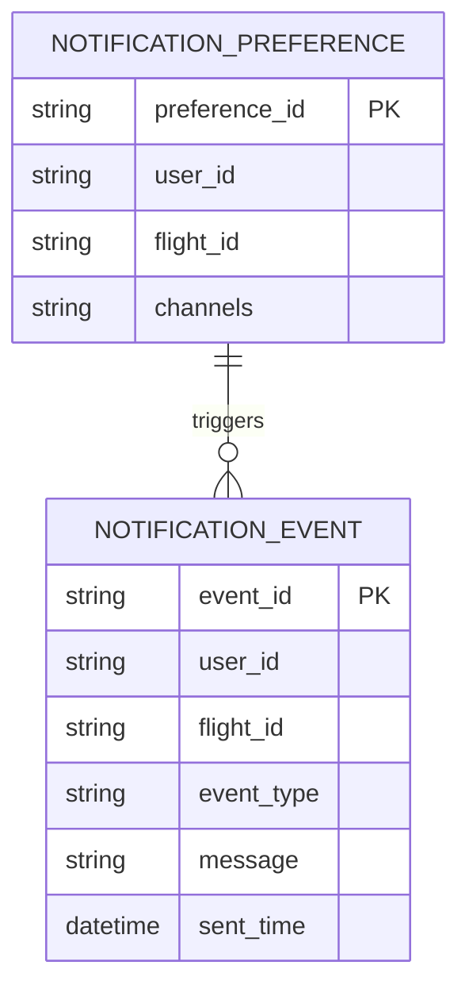

# For User Story Number [5]
1. Objective
This requirement enables passengers to receive timely notifications about flight status, gate changes, delays, cancellations, and boarding reminders via email, SMS, or push notifications. Passengers can manage their notification preferences. The system must ensure notifications are accurate, relevant, and delivered promptly.

2. API Model
  2.1 Common Components/Services
  - NotificationService (new)
  - FlightStatusMonitor (new)
  - PreferenceService (new)
  - LoggingService (existing)

  2.2 API Details
| Operation | REST Method | Type           | URL                          | Request (sample JSON)                                                                 | Response (sample JSON)                                                                 |
|-----------|-------------|----------------|------------------------------|---------------------------------------------------------------------------------------|----------------------------------------------------------------------------------------|
| Set Preferences | POST/PUT   | Success/Failure| /api/v1/notifications/preferences | {"userId": "U123", "channels": ["email", "sms"], "flightId": "DL123"} | {"status": "SUCCESS"} |
| Send Notification | POST     | Success/Failure| /api/v1/notifications/send    | {"userId": "U123", "flightId": "DL123", "event": "DELAY", "message": "Flight DL123 delayed by 30 min"} | {"status": "SENT"} |

  2.3 Exceptions
| API                       | Exception Type         | Description                                  |
|--------------------------|-----------------------|----------------------------------------------|
| /api/v1/notifications/preferences | InvalidInputException | Invalid or missing preference data         |
| /api/v1/notifications/send       | NotificationFailedException | Notification could not be delivered     |
| /api/v1/notifications/send       | ExternalAPIException  | SMS/Email/Push service failure              |

3 Functional Design
  3.1 Class Diagram

  3.2 UML Sequence Diagram

  3.3 Components
| Component Name            | Description                                            | Existing/New |
|--------------------------|--------------------------------------------------------|--------------|
| NotificationController   | REST controller for notification requests              | New          |
| NotificationService      | Handles notification logic and delivery                | New          |
| FlightStatusMonitor      | Monitors and triggers flight status events             | New          |
| PreferenceService        | Manages user notification preferences                  | New          |
| LoggingService           | Logs notification events                               | Existing     |

  3.4 Service Layer Logic and Validations
| FieldName        | Validation                              | Error Message                      | ClassUsed                |
|------------------|-----------------------------------------|------------------------------------|--------------------------|
| userId           | Must be valid and exist                  | Invalid user ID                    | PreferenceService        |
| channels         | Must be valid (email, sms, push)         | Invalid notification channel       | PreferenceService        |
| event/message    | Must be relevant and accurate            | Invalid notification message       | NotificationService      |

4 Integrations
| SystemToBeIntegrated | IntegratedFor      | IntegrationType |
|---------------------|--------------------|-----------------|
| Twilio/Firebase     | SMS/Push delivery  | API             |
| Email Gateway       | Email delivery     | API             |

5 DB Details
  5.1 ER Model

  5.2 DB Validations
- Ensure preference_id and event_id are unique.
- Ensure channels are valid and stored.
- Ensure event messages are logged with timestamp.

6 Non-Functional Requirements
  6.1 Performance
  - Deliver notifications within 1 minute of event.
  - Support 50,000 concurrent notifications.

  6.2 Security
    6.2.1 Authentication
    - All APIs require user authentication.
    6.2.2 Authorization
    - Only authorized users can manage their preferences.
    - Data privacy compliance for user data.

  6.3 Logging
    6.3.1 Application Logging
    - Log all notification events at INFO level.
    - Log delivery failures at ERROR level.
    6.3.2 Audit Log
    - Log notification event, user, and timestamp for compliance.

7 Dependencies
- Twilio/Firebase for notifications
- Email gateway
- PostgreSQL database

8 Assumptions
- Notification channels are reliable and available.
- Flight status data is real-time.
- User authentication is handled by a separate service.