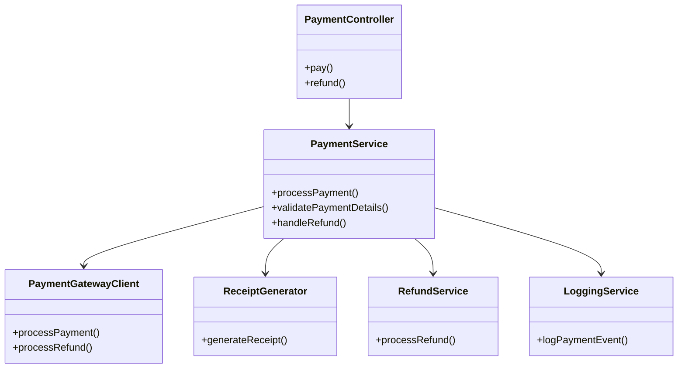
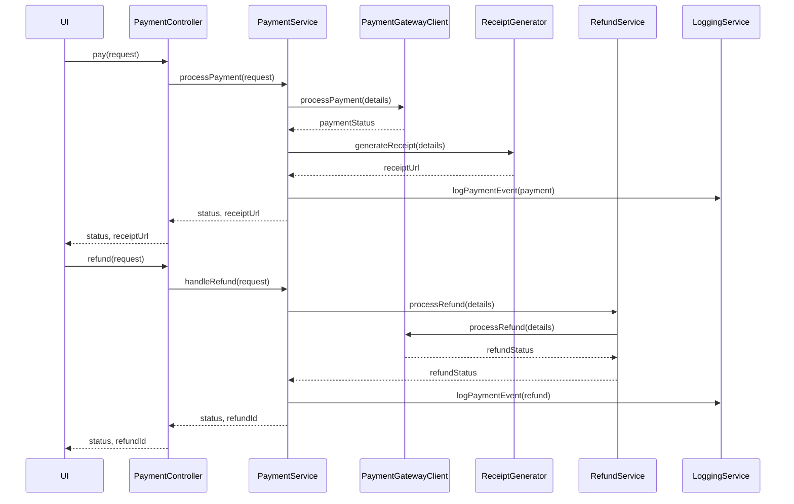
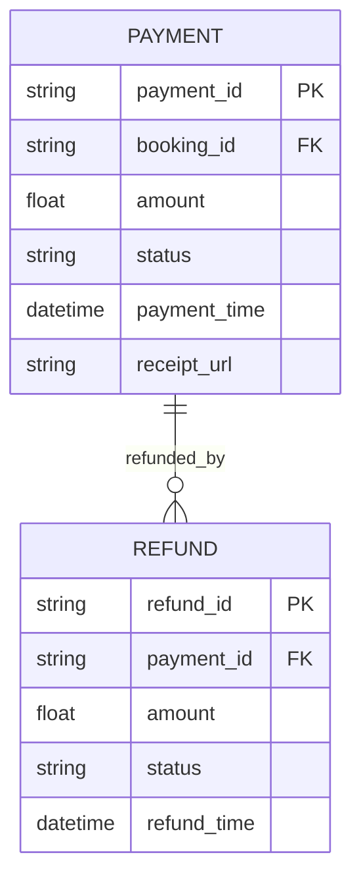

# For User Story Number [6]
1. Objective
This requirement enables passengers to securely pay for their bookings and additional services using multiple payment methods. The system must process payments, handle refunds, and issue receipts in a secure and auditable manner. All payment and refund transactions must comply with security standards and be logged for audit.

2. API Model
  2.1 Common Components/Services
  - PaymentService (new)
  - PaymentGatewayClient (new)
  - ReceiptGenerator (new)
  - RefundService (new)
  - LoggingService (existing)

  2.2 API Details
| Operation | REST Method | Type           | URL                          | Request (sample JSON)                                                                 | Response (sample JSON)                                                                 |
|-----------|-------------|----------------|------------------------------|---------------------------------------------------------------------------------------|----------------------------------------------------------------------------------------|
| Pay       | POST        | Success/Failure| /api/v1/payment              | {"bookingReference": "ABC123", "amount": 420.00, "method": "card", "token": "xyz"} | {"status": "PAID", "receiptUrl": "https://.../receipt/ABC123.pdf"} |
| Refund    | POST        | Success/Failure| /api/v1/payment/refund       | {"bookingReference": "ABC123", "reason": "CANCELLED"} | {"status": "REFUNDED", "refundId": "RF123"} |

  2.3 Exceptions
| API                       | Exception Type         | Description                                  |
|--------------------------|-----------------------|----------------------------------------------|
| /api/v1/payment          | InvalidInputException | Invalid payment details                      |
| /api/v1/payment          | PaymentFailedException| Payment not authorized or failed             |
| /api/v1/payment/refund   | RefundNotAllowedException | Refund not allowed for booking            |
| /api/v1/payment/refund   | ExternalAPIException  | Payment gateway failure                      |

3 Functional Design
  3.1 Class Diagram

  3.2 UML Sequence Diagram

  3.3 Components
| Component Name            | Description                                            | Existing/New |
|--------------------------|--------------------------------------------------------|--------------|
| PaymentController        | REST controller for payment and refund requests         | New          |
| PaymentService           | Service for payment/refund logic and orchestration      | New          |
| PaymentGatewayClient     | Integrates with payment gateways                       | New          |
| ReceiptGenerator         | Generates digital receipts (PDF)                       | New          |
| RefundService            | Handles refund logic                                   | New          |
| LoggingService           | Logs payment and refund transactions                   | Existing     |

  3.4 Service Layer Logic and Validations
| FieldName        | Validation                              | Error Message                      | ClassUsed                |
|------------------|-----------------------------------------|------------------------------------|--------------------------|
| paymentInfo      | Must be valid and securely transmitted   | Invalid payment details            | PaymentService           |
| bookingReference | Must be valid and eligible for payment   | Invalid booking reference          | PaymentService           |
| refund           | Only allowed for eligible bookings       | Refund not allowed                 | RefundService            |

4 Integrations
| SystemToBeIntegrated | IntegratedFor      | IntegrationType |
|---------------------|--------------------|-----------------|
| Stripe/PayPal       | Payment/refund     | API             |
| PDF Generator       | Receipt            | API             |
| Email Gateway       | Receipt delivery   | API             |

5 DB Details
  5.1 ER Model

  5.2 DB Validations
- Ensure payment_id and refund_id are unique.
- Ensure payment/refund status is updated after transaction.
- Ensure receipt_url is unique per payment.

6 Non-Functional Requirements
  6.1 Performance
  - Payment processing should complete within 3 seconds.
  - Support 5,000 concurrent payments.

  6.2 Security
    6.2.1 Authentication
    - All APIs require user authentication.
    6.2.2 Authorization
    - Only authorized users can pay/refund for their booking.
    - PCI DSS compliance for payment data.
    - All payment data must be encrypted.

  6.3 Logging
    6.3.1 Application Logging
    - Log all payment and refund transactions at INFO level.
    - Log failures at ERROR level.
    6.3.2 Audit Log
    - Log payment/refund event, user, and timestamp for audit.

7 Dependencies
- Stripe/PayPal for payments/refunds
- PDF generator for receipts
- Email gateway
- PostgreSQL database

8 Assumptions
- Payment gateway APIs are reliable and PCI DSS compliant.
- Receipt generator is available and secure.
- User authentication and notification services are available.