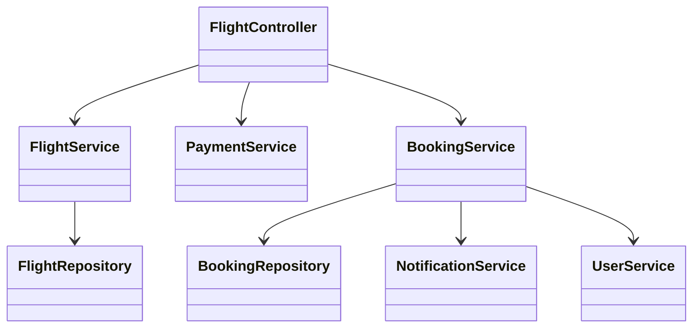
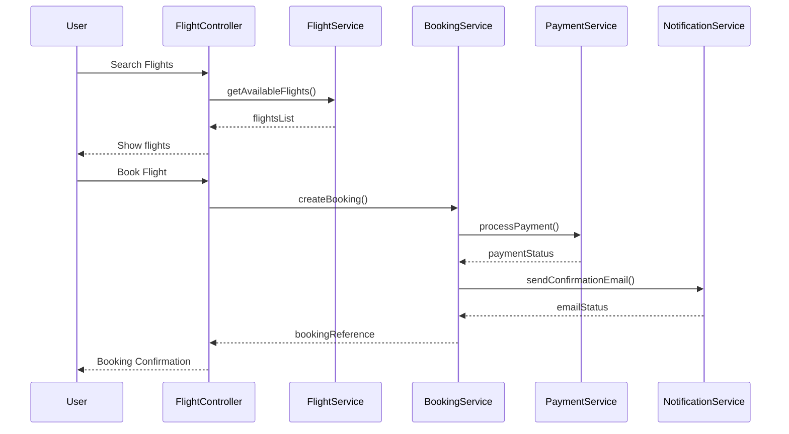
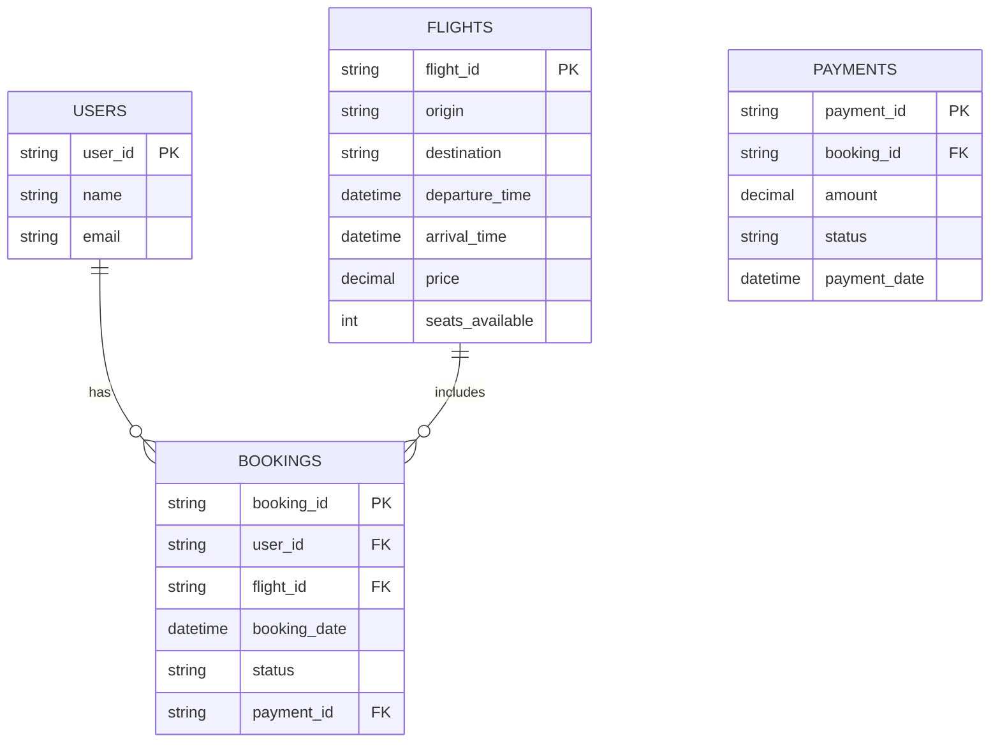

# For User Story Number [1]

1. Objective
This requirement enables travelers to search, compare, and book air transport tickets online. The process must be intuitive, secure, and provide real-time booking confirmation. The goal is to streamline the booking experience and ensure reliability and security for users.

2. API Model
  2.1 Common Components/Services
  - User Authentication Service (OAuth2)
  - Payment Gateway Integration Service (e.g., Stripe)
  - Email Notification Service
  - Flight Inventory Service

  2.2 API Details
| Operation | REST Method | Type | URL | Request | Response |
|-----------|-------------|------|-----|---------|----------|
| Search Flights | GET | Success/Failure | /api/flights/search?origin={origin}&destination={destination}&date={date} | N/A | {"flights": [{"flightId": "F123", "origin": "JFK", "destination": "LAX", "date": "2025-10-01", "price": 350.00, "timing": "10:00-14:00"}]} |
| Book Flight | POST | Success/Failure | /api/flights/book | {"userId": "U1", "flightId": "F123", "passengerDetails": [{"name": "John Doe", "age": 30}], "paymentInfo": {"cardToken": "tok_abc"}} | {"bookingReference": "BR123456", "status": "CONFIRMED", "ticketDetails": {}} |
| Payment | POST | Success/Failure | /api/payment/process | {"userId": "U1", "amount": 350.00, "paymentMethod": "card", "cardToken": "tok_abc"} | {"paymentStatus": "SUCCESS", "transactionId": "TXN123"} |
| Send Confirmation Email | POST | Success/Failure | /api/notifications/email | {"userId": "U1", "email": "john@example.com", "bookingReference": "BR123456"} | {"status": "SENT"} |

  2.3 Exceptions
| API | Exception | Description |
|-----|-----------|-------------|
| Search Flights | FlightNotFoundException | No flights found for given criteria |
| Book Flight | SeatUnavailableException | Selected seat is no longer available |
| Payment | PaymentFailedException | Payment processing failed |
| Book Flight | InvalidPassengerDetailsException | Passenger details are invalid |
| Book Flight | ValidationException | Required fields missing |

3 Functional Design
  3.1 Class Diagram

  3.2 UML Sequence Diagram

  3.3 Components
| Component Name | Description | Existing/New |
|----------------|-------------|--------------|
| FlightController | REST controller for flight operations | New |
| FlightService | Handles flight search logic | New |
| BookingService | Manages booking and seat reservation | New |
| PaymentService | Integrates with payment gateway | New |
| NotificationService | Sends confirmation emails | New |
| FlightRepository | Data access for flights | New |
| BookingRepository | Data access for bookings | New |
| UserService | Handles user authentication and details | Existing |

  3.4 Service Layer Logic and Validations
| FieldName | Validation | Error Message | ClassUsed |
|-----------|-----------|--------------|-----------|
| origin | Not empty | "Origin cannot be empty" | FlightService |
| destination | Not empty | "Destination cannot be empty" | FlightService |
| date | Future date | "Date must be in the future" | FlightService |
| paymentInfo | Payment success | "Payment failed" | PaymentService |
| passengerDetails | Valid format | "Invalid passenger details" | BookingService |

4 Integrations
| SystemToBeIntegrated | IntegratedFor | IntegrationType |
|----------------------|---------------|-----------------|
| Payment Gateway (Stripe) | Payment processing | API |
| Email Service | Booking confirmation | API |
| User Authentication (OAuth2) | Secure access | API |

5 DB Details
  5.1 ER Model

  5.2 DB Validations
- Booking must reference valid user and flight.
- Payment must be successful before booking status is CONFIRMED.
- Seats available decremented atomically on booking.

6 Non-Functional Requirements
  6.1 Performance
  - System should handle up to 10,000 concurrent users.
  - API response time < 2 seconds for search and booking.
  - Caching for frequent flight search queries.

  6.2 Security
    6.2.1 Authentication
    - OAuth2 authentication for all endpoints.
    - IAM integration for user management.
    6.2.2 Authorization
    - Only authenticated users can book flights.
    - Role-based access for admin endpoints.

  6.3 Logging
    6.3.1 Application Logging
    - DEBUG: API requests/responses, payment gateway calls
    - INFO: Successful bookings, payment confirmations
    - ERROR: Payment failures, booking errors
    - WARN: Suspicious activity, failed login attempts
    6.3.2 Audit Log
    - All booking and payment actions logged with user ID and timestamp

7 Dependencies
- Payment gateway (Stripe)
- Email service provider
- OAuth2 IAM provider

8 Assumptions
- All users have valid email addresses.
- Payment gateway is PCI DSS compliant.
- Flight inventory is updated in real-time from airline partners.
