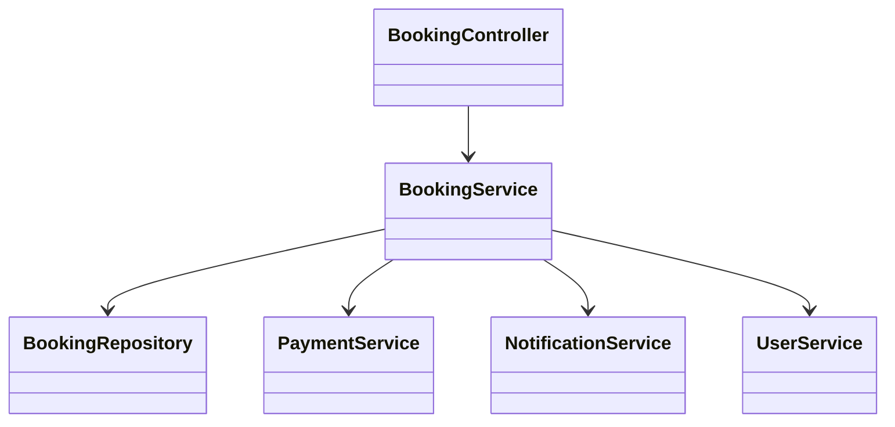
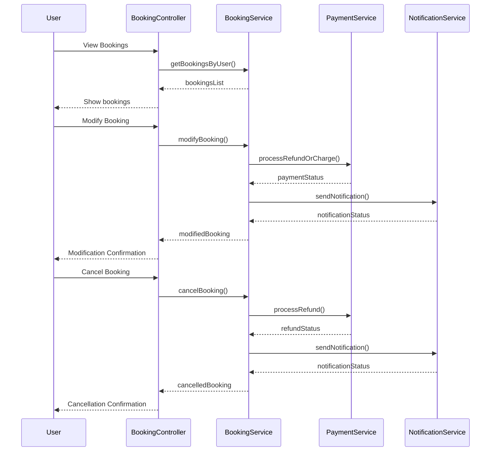
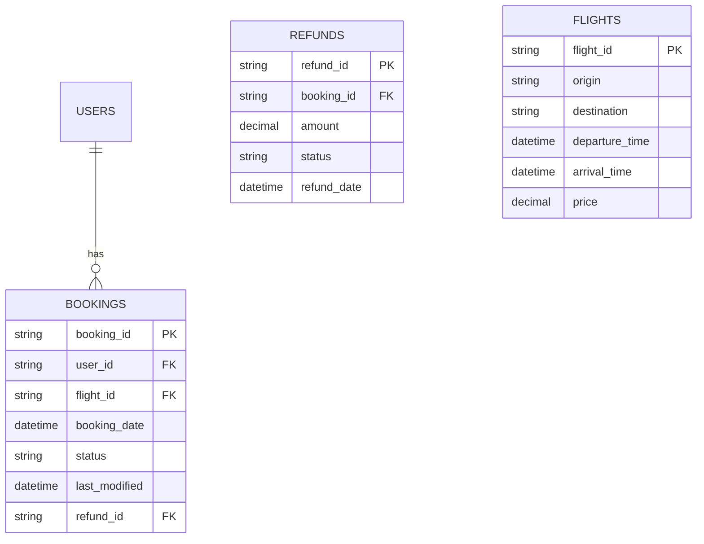

# For User Story Number [2]

1. Objective
This requirement enables travelers to view, modify, or cancel their air transport bookings online. The system must enforce airline policies for modifications and cancellations, and provide real-time updates and notifications for all booking changes. The goal is to empower users to manage their travel plans conveniently and securely.

2. API Model
  2.1 Common Components/Services
  - User Authentication Service (OAuth2)
  - Booking Management Service
  - Notification Service
  - Payment/Refund Processing Service

  2.2 API Details
| Operation | REST Method | Type | URL | Request | Response |
|-----------|-------------|------|-----|---------|----------|
| View Bookings | GET | Success/Failure | /api/bookings/user/{userId} | N/A | {"bookings": [{"bookingId": "BR123456", "flightId": "F123", "status": "CONFIRMED", "date": "2025-10-01"}]} |
| Modify Booking | PUT | Success/Failure | /api/bookings/{bookingId} | {"passengerDetails": [{"name": "Jane Doe"}], "date": "2025-10-02"} | {"bookingId": "BR123456", "status": "MODIFIED"} |
| Cancel Booking | DELETE | Success/Failure | /api/bookings/{bookingId} | N/A | {"bookingId": "BR123456", "status": "CANCELLED", "refundStatus": "INITIATED"} |
| Refund Process | POST | Success/Failure | /api/payment/refund | {"bookingId": "BR123456", "amount": 300.00} | {"refundStatus": "SUCCESS", "transactionId": "TXN456"} |
| Send Notification | POST | Success/Failure | /api/notifications/send | {"userId": "U1", "message": "Booking modified"} | {"status": "SENT"} |

  2.3 Exceptions
| API | Exception | Description |
|-----|-----------|-------------|
| View Bookings | UnauthorizedAccessException | User not authenticated |
| Modify Booking | ModificationNotAllowedException | Modification not allowed as per policy |
| Cancel Booking | CancellationNotAllowedException | Cancellation not allowed as per policy |
| Refund Process | RefundFailedException | Refund processing failed |
| All | ValidationException | Invalid or missing fields |

3 Functional Design
  3.1 Class Diagram

  3.2 UML Sequence Diagram

  3.3 Components
| Component Name | Description | Existing/New |
|----------------|-------------|--------------|
| BookingController | REST controller for booking management | New |
| BookingService | Handles booking retrieval, modification, cancellation | New |
| PaymentService | Integrates with payment/refund gateway | Existing |
| NotificationService | Sends notifications for booking changes | Existing |
| BookingRepository | Data access for bookings | Existing |
| UserService | Handles user authentication and details | Existing |

  3.4 Service Layer Logic and Validations
| FieldName | Validation | Error Message | ClassUsed |
|-----------|-----------|--------------|-----------|
| userId | Authenticated | "User not authenticated" | UserService |
| bookingId | Exists and belongs to user | "Booking not found or access denied" | BookingService |
| modificationTime | Within allowed timeframe | "Modification not allowed as per policy" | BookingService |
| cancellationTime | Within allowed timeframe | "Cancellation not allowed as per policy" | BookingService |
| refund | As per airline rules | "Refund not allowed as per policy" | PaymentService |

4 Integrations
| SystemToBeIntegrated | IntegratedFor | IntegrationType |
|----------------------|---------------|-----------------|
| Payment Gateway | Refund processing | API |
| Notification Service | Booking change notifications | API |
| User Authentication (OAuth2) | Secure access | API |

5 DB Details
  5.1 ER Model

  5.2 DB Validations
- Booking modifications/cancellations only allowed within permitted timeframes.
- Refunds processed only if eligible as per airline rules.
- Changes are logged with timestamp and user ID for audit.

6 Non-Functional Requirements
  6.1 Performance
  - Booking changes reflected within 1 minute.
  - API response time < 2 seconds for view/modify/cancel.

  6.2 Security
    6.2.1 Authentication
    - OAuth2 authentication for all endpoints.
    6.2.2 Authorization
    - Only authenticated users can manage their bookings.

  6.3 Logging
    6.3.1 Application Logging
    - DEBUG: API requests/responses, refund gateway calls
    - INFO: Booking modifications, cancellations
    - ERROR: Refund failures, booking errors
    - WARN: Unauthorized access attempts
    6.3.2 Audit Log
    - All booking changes and refunds logged with user ID and timestamp

7 Dependencies
- Payment gateway for refunds
- Notification service provider
- OAuth2 IAM provider

8 Assumptions
- Users have valid contact details for notifications.
- Airline rules for modifications and refunds are up-to-date in the system.
- All actions are tracked for compliance.