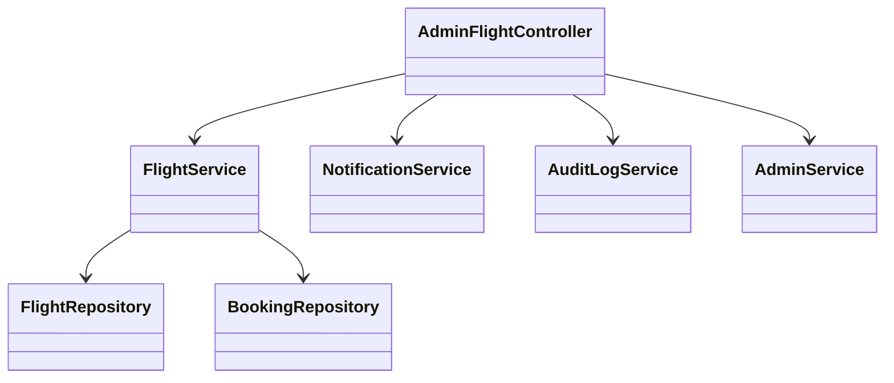
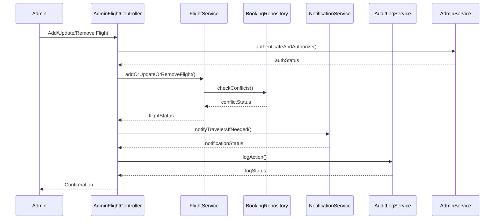
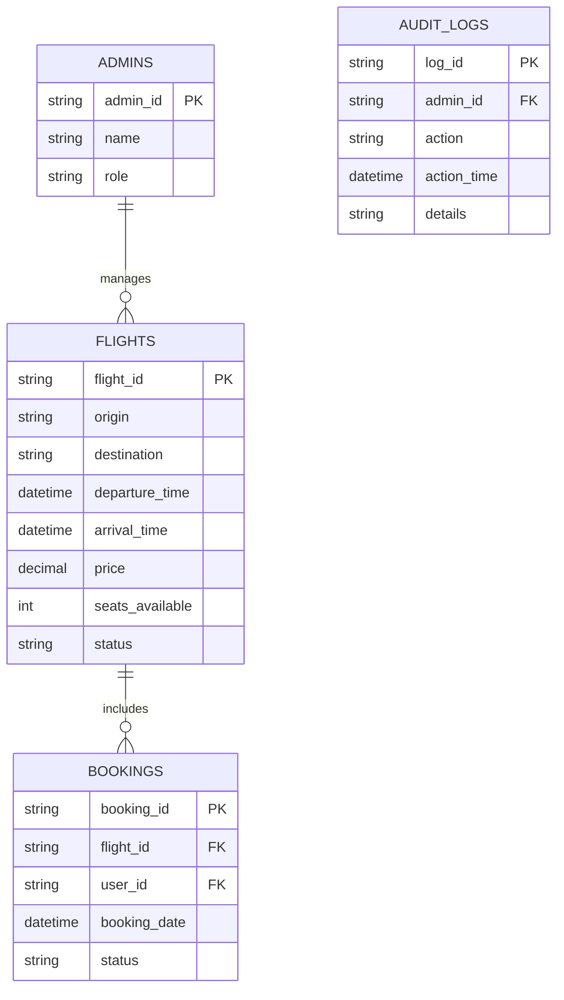

# For User Story Number [3]

1. Objective
This requirement enables airline administrators to manage flight inventory and schedules through an admin portal. The system must validate all changes, prevent conflicts with existing bookings, and update the public flight search results in real-time. The goal is to ensure travelers always have access to accurate and up-to-date flight information.

2. API Model
  2.1 Common Components/Services
  - Admin Authentication & Role-based Access Service
  - Flight Inventory Management Service
  - Notification Service
  - Audit Logging Service

  2.2 API Details
| Operation | REST Method | Type | URL | Request | Response |
|-----------|-------------|------|-----|---------|----------|
| Add Flight | POST | Success/Failure | /api/admin/flights | {"flightId": "F456", "origin": "LHR", "destination": "DXB", "departureTime": "2025-11-01T10:00:00Z", "arrivalTime": "2025-11-01T18:00:00Z", "price": 500.00, "seatsAvailable": 200} | {"flightId": "F456", "status": "ADDED"} |
| Update Flight | PUT | Success/Failure | /api/admin/flights/{flightId} | {"departureTime": "2025-11-01T12:00:00Z", "seatsAvailable": 180} | {"flightId": "F456", "status": "UPDATED"} |
| Remove/Deactivate Flight | DELETE | Success/Failure | /api/admin/flights/{flightId} | N/A | {"flightId": "F456", "status": "DEACTIVATED"} |
| Notify Travelers | POST | Success/Failure | /api/notifications/flight-change | {"flightId": "F456", "message": "Flight schedule changed"} | {"status": "SENT"} |

  2.3 Exceptions
| API | Exception | Description |
|-----|-----------|-------------|
| Add/Update/Remove Flight | UnauthorizedAccessException | Admin not authorized |
| Add/Update Flight | ValidationException | Required fields missing or invalid |
| Update Flight | ScheduleConflictException | Schedule conflicts with existing bookings |
| Notify Travelers | NotificationFailedException | Notification could not be sent |

3 Functional Design
  3.1 Class Diagram

  3.2 UML Sequence Diagram

  3.3 Components
| Component Name | Description | Existing/New |
|----------------|-------------|--------------|
| AdminFlightController | REST controller for admin flight management | New |
| FlightService | Handles flight inventory and schedule logic | Existing |
| NotificationService | Sends notifications to travelers | Existing |
| AuditLogService | Logs all admin actions | New |
| FlightRepository | Data access for flights | Existing |
| BookingRepository | Data access for bookings | Existing |
| AdminService | Handles admin authentication and roles | New |

  3.4 Service Layer Logic and Validations
| FieldName | Validation | Error Message | ClassUsed |
|-----------|-----------|--------------|-----------|
| adminId | Authorized and has admin role | "Unauthorized admin access" | AdminService |
| flightId | Must be unique when adding | "Flight ID already exists" | FlightService |
| requiredFields | All required fields present | "Missing required fields" | FlightService |
| schedule | No conflicts with bookings | "Schedule conflicts with existing bookings" | FlightService |
| seatsAvailable | Non-negative integer | "Invalid seat count" | FlightService |

4 Integrations
| SystemToBeIntegrated | IntegratedFor | IntegrationType |
|----------------------|---------------|-----------------|
| Notification Service | Notify travelers for major changes | API |
| Admin Authentication (OAuth2/Role-based) | Secure admin access | API |
| Audit Logging Service | Compliance logging | API |

5 DB Details
  5.1 ER Model

  5.2 DB Validations
- Only admins with correct role can modify flights.
- Flight schedule changes checked for conflicts with bookings.
- All admin actions logged in AUDIT_LOGS.

6 Non-Functional Requirements
  6.1 Performance
  - Admin actions processed within 1 minute.
  - Real-time update of flight search results (max 2 min lag).

  6.2 Security
    6.2.1 Authentication
    - OAuth2/Role-based authentication for admin endpoints.
    6.2.2 Authorization
    - Only authorized admins can manage flights.

  6.3 Logging
    6.3.1 Application Logging
    - DEBUG: API requests/responses, admin actions
    - INFO: Flight additions, updates, removals
    - ERROR: Schedule conflicts, unauthorized attempts
    - WARN: Suspicious admin activity
    6.3.2 Audit Log
    - All admin actions logged with admin ID and timestamp

7 Dependencies
- Notification service provider
- OAuth2 IAM provider for admin roles
- Audit logging system

8 Assumptions
- Admins have correct roles and permissions assigned.
- Flight search cache is invalidated after inventory changes.
- All changes are tracked for compliance and audit.