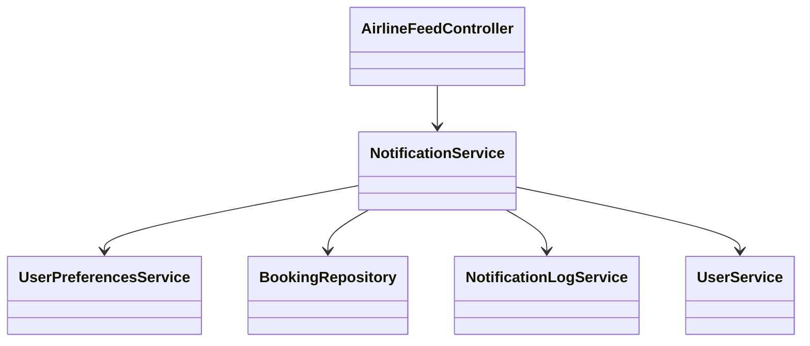
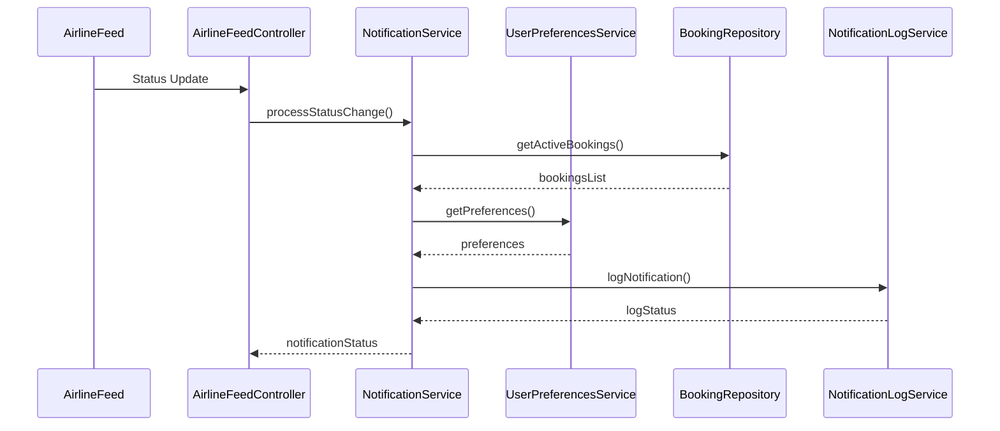
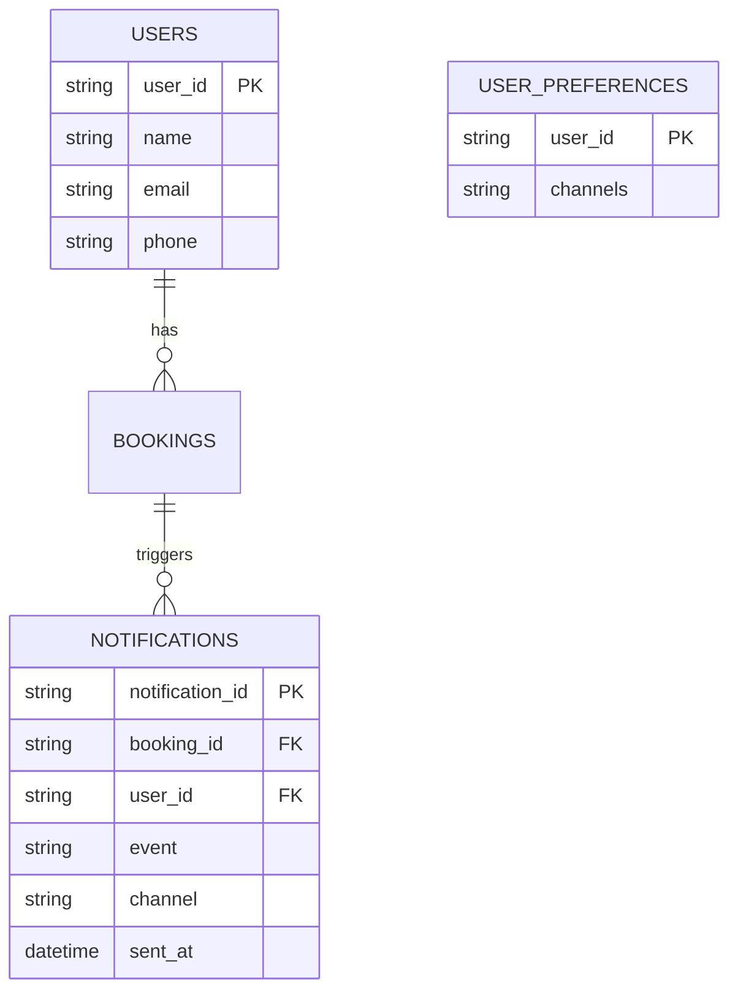

# For User Story Number [4]

1. Objective
This requirement enables travelers to receive real-time notifications about flight status changes, such as delays, cancellations, or gate changes. The system must integrate with airline data feeds and respect user notification preferences. The goal is to keep travelers informed promptly and reliably.

2. API Model
  2.1 Common Components/Services
  - Airline Data Feed Integration Service
  - Notification Service (Email, SMS, In-App)
  - User Profile/Preferences Service
  - Audit Logging Service

  2.2 API Details
| Operation | REST Method | Type | URL | Request | Response |
|-----------|-------------|------|-----|---------|----------|
| Receive Status Update | POST | Success/Failure | /api/airline/status-update | {"flightId": "F123", "status": "DELAYED", "gate": "A12", "timestamp": "2025-10-01T09:00:00Z"} | {"status": "RECEIVED"} |
| Send Notification | POST | Success/Failure | /api/notifications/send | {"userId": "U1", "channels": ["EMAIL", "SMS"], "message": "Flight F123 delayed"} | {"status": "SENT"} |
| Update Notification Preferences | PUT | Success/Failure | /api/user/preferences/notifications | {"userId": "U1", "channels": ["EMAIL", "APP"]} | {"status": "UPDATED"} |
| Get Notification Log | GET | Success/Failure | /api/notifications/logs?userId=U1 | N/A | {"logs": [{"event": "DELAYED", "timestamp": "2025-10-01T09:00:00Z", "channel": "EMAIL"}]} |

  2.3 Exceptions
| API | Exception | Description |
|-----|-----------|-------------|
| Receive Status Update | DataFeedException | Error receiving data from airline feed |
| Send Notification | NotificationFailedException | Notification could not be sent |
| Update Preferences | ValidationException | Invalid notification channel |
| Get Notification Log | UnauthorizedAccessException | User not authenticated |

3 Functional Design
  3.1 Class Diagram

  3.2 UML Sequence Diagram

  3.3 Components
| Component Name | Description | Existing/New |
|----------------|-------------|--------------|
| AirlineFeedController | Handles airline status updates | New |
| NotificationService | Sends notifications based on status changes | New |
| UserPreferencesService | Manages user notification preferences | Existing |
| NotificationLogService | Logs all notification events | New |
| BookingRepository | Data access for bookings | Existing |
| UserService | Handles user authentication and details | Existing |

  3.4 Service Layer Logic and Validations
| FieldName | Validation | Error Message | ClassUsed |
|-----------|-----------|--------------|-----------|
| userId | Has active booking | "No active booking found" | BookingRepository |
| channels | Valid and enabled | "Invalid notification channel" | UserPreferencesService |
| preferences | Stored and respected | "Preference update failed" | UserPreferencesService |
| event | Logged for audit | "Notification log failure" | NotificationLogService |

4 Integrations
| SystemToBeIntegrated | IntegratedFor | IntegrationType |
|----------------------|---------------|-----------------|
| Airline Data Feed | Real-time status updates | API |
| Notification Service Providers (Email, SMS, App) | Notification delivery | API |
| User Profile Service | Notification preferences | API |
| Audit Logging Service | Notification event logging | API |

5 DB Details
  5.1 ER Model

  5.2 DB Validations
- Only users with active bookings receive notifications.
- Notification preferences are validated and stored.
- All notification events logged for audit.

6 Non-Functional Requirements
  6.1 Performance
  - Notifications delivered within 2 minutes of status change.
  - System scalable for peak travel periods.

  6.2 Security
    6.2.1 Authentication
    - User authentication required for managing preferences and viewing logs.
    6.2.2 Authorization
    - Only users with bookings receive notifications.

  6.3 Logging
    6.3.1 Application Logging
    - DEBUG: Data feed events, notification attempts
    - INFO: Successful notifications
    - ERROR: Notification failures
    - WARN: Data feed anomalies
    6.3.2 Audit Log
    - All notification events logged with user ID, event, and timestamp

7 Dependencies
- Airline data feed provider
- Notification service providers (Email, SMS, App)
- Audit logging system

8 Assumptions
- Airline data feeds are reliable and real-time.
- Users have set up notification preferences in their profiles.
- Notification channels are available and operational.