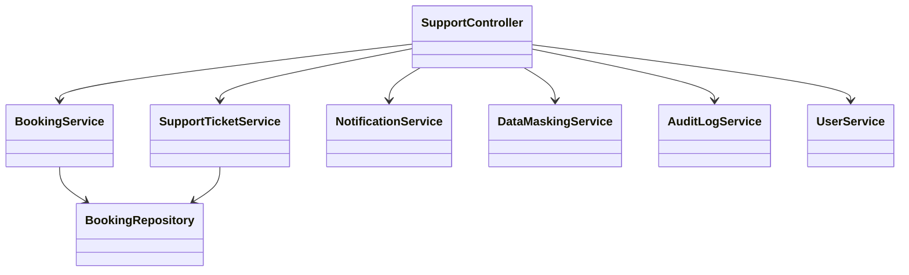
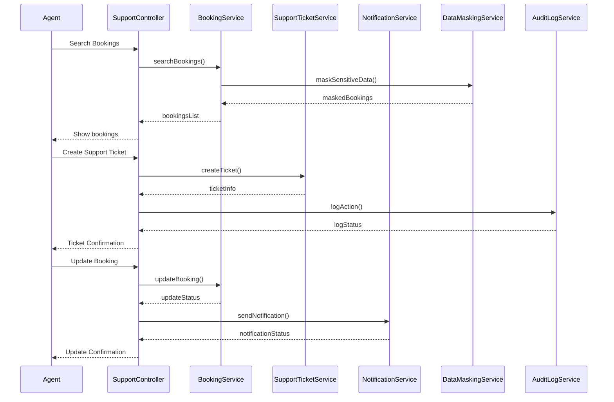
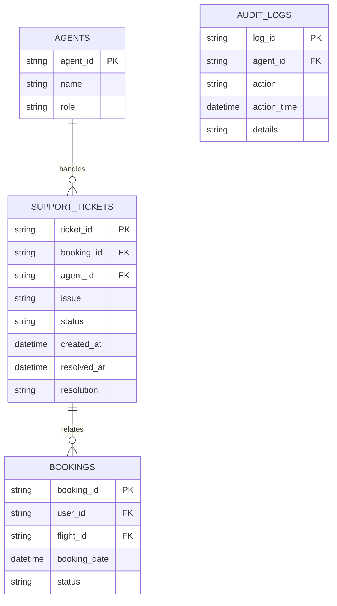

# For User Story Number [5]

1. Objective
This requirement enables customer support agents to assist travelers with booking issues and inquiries efficiently. The system must provide secure, role-based access to booking data, support ticket management, and real-time updates to travelers. The goal is to ensure timely resolution of traveler problems and maintain high customer satisfaction.

2. API Model
  2.1 Common Components/Services
  - Agent Authentication & Role-based Access Service
  - Booking Management Service
  - Support Ticketing Service
  - Notification Service
  - Data Masking Service
  - Audit Logging Service

  2.2 API Details
| Operation | REST Method | Type | URL | Request | Response |
|-----------|-------------|------|-----|---------|----------|
| Search Bookings | GET | Success/Failure | /api/support/bookings?criteria={criteria} | N/A | {"bookings": [{"bookingId": "BR123456", "userId": "U1", "flightId": "F123", "status": "CONFIRMED"}]} |
| Update Booking | PUT | Success/Failure | /api/support/bookings/{bookingId} | {"status": "MODIFIED", "notes": "Updated seat assignment"} | {"bookingId": "BR123456", "status": "MODIFIED"} |
| Create Support Ticket | POST | Success/Failure | /api/support/tickets | {"bookingId": "BR123456", "issue": "Payment failed"} | {"ticketId": "T789", "status": "OPEN"} |
| Update Support Ticket | PUT | Success/Failure | /api/support/tickets/{ticketId} | {"status": "RESOLVED", "resolution": "Payment retried"} | {"ticketId": "T789", "status": "RESOLVED"} |
| Send Notification | POST | Success/Failure | /api/notifications/support | {"userId": "U1", "message": "Your support request is resolved"} | {"status": "SENT"} |

  2.3 Exceptions
| API | Exception | Description |
|-----|-----------|-------------|
| Search/Update Bookings | UnauthorizedAccessException | Agent not authorized |
| Update Booking | BookingUpdateException | Update not allowed or failed |
| Create/Update Ticket | TicketingException | Ticket creation/update failed |
| Send Notification | NotificationFailedException | Notification could not be sent |
| All | ValidationException | Invalid or missing fields |

3 Functional Design
  3.1 Class Diagram

  3.2 UML Sequence Diagram

  3.3 Components
| Component Name | Description | Existing/New |
|----------------|-------------|--------------|
| SupportController | REST controller for support operations | New |
| BookingService | Handles booking search and updates | Existing |
| SupportTicketService | Manages support ticket lifecycle | New |
| NotificationService | Sends notifications to travelers | Existing |
| DataMaskingService | Masks sensitive data for agents | New |
| AuditLogService | Logs all support actions | New |
| BookingRepository | Data access for bookings | Existing |
| UserService | Handles agent authentication and details | Existing |

  3.4 Service Layer Logic and Validations
| FieldName | Validation | Error Message | ClassUsed |
|-----------|-----------|--------------|-----------|
| agentId | Authorized and has support role | "Unauthorized agent access" | UserService |
| bookingId | Exists and accessible | "Booking not found or access denied" | BookingService |
| ticketId | Exists and accessible | "Ticket not found or access denied" | SupportTicketService |
| sensitiveData | Masked unless required for resolution | "Access to sensitive data denied" | DataMaskingService |
| action | Logged for audit | "Audit log failure" | AuditLogService |

4 Integrations
| SystemToBeIntegrated | IntegratedFor | IntegrationType |
|----------------------|---------------|-----------------|
| Booking Management | Access and update bookings | API |
| Notification Service | Traveler updates | API |
| Support Ticketing System | Ticket management | API |
| Audit Logging Service | Compliance logging | API |
| Data Masking Service | Secure data access | API |
| Agent Authentication (OAuth2/Role-based) | Secure agent access | API |

5 DB Details
  5.1 ER Model

  5.2 DB Validations
- Only authorized agents can access traveler data.
- All support actions logged with agent ID and timestamp.
- Sensitive data masked unless required for resolution.

6 Non-Functional Requirements
  6.1 Performance
  - Support requests acknowledged within 2 minutes.
  - API response time < 2 seconds for support operations.

  6.2 Security
    6.2.1 Authentication
    - OAuth2/Role-based authentication for agent endpoints.
    6.2.2 Authorization
    - Only authorized agents can access support features.
    - Data masking for sensitive traveler information.

  6.3 Logging
    6.3.1 Application Logging
    - DEBUG: API requests/responses, ticket actions
    - INFO: Ticket creation, updates, resolutions
    - ERROR: Unauthorized access, update failures
    - WARN: Suspicious agent activity
    6.3.2 Audit Log
    - All support actions logged with agent ID and timestamp

7 Dependencies
- Booking management system
- Notification service provider
- Support ticketing system
- Audit logging system
- Data masking service
- OAuth2 IAM provider for agent roles

8 Assumptions
- Agents have correct roles and permissions assigned.
- Data masking rules are up-to-date and enforced.
- All actions are tracked for compliance and quality assurance.