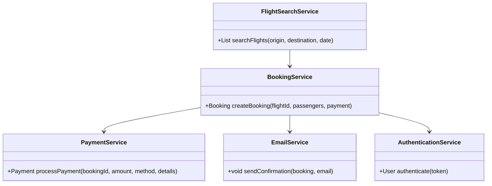
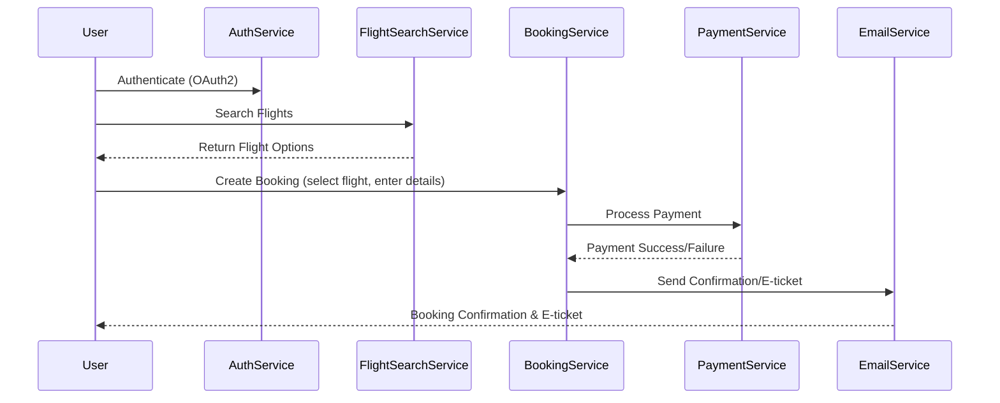
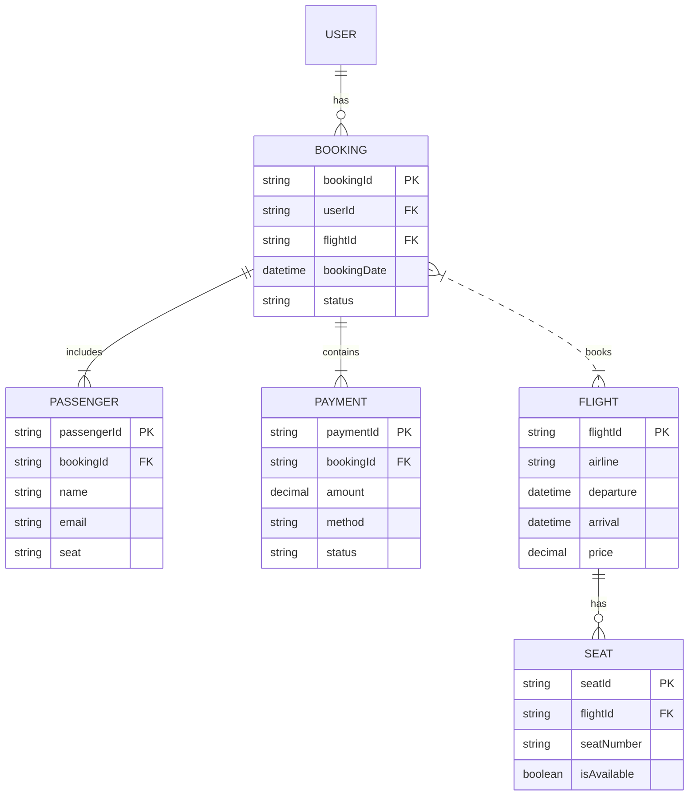

# For User Story Number [1]

1. Objective
The objective is to enable passengers to search, select, and book air transport tickets online, supporting multiple airlines, flexible dates, and various payment methods. This feature aims to provide a seamless and user-friendly experience for flight booking. The process includes searching flights, entering passenger details, seat selection, payment, and e-ticket generation.

2. API Model
  2.1 Common Components/Services
  - AuthenticationService (OAuth2)
  - PaymentService (Stripe/PayPal integration)
  - EmailService (for confirmation/e-ticket)
  - FlightSearchService (integration with airline APIs)
  - BookingService

  2.2 API Details
| Operation    | REST Method | Type    | URL                                | Request (Sample JSON)                                                                                                                                      | Response (Sample JSON)                                                                                       |
|-------------|-------------|---------|------------------------------------|-----------------------------------------------------------------------------------------------------------------------------------------------------------|-------------------------------------------------------------------------------------------------------------|
| Search      | GET         | Success | /api/flights/search                | {"origin": "JFK", "destination": "LAX", "date": "2025-10-01"}                                                                                     | [{"flightId": "F123", "airline": "Delta", "price": 350, "departure": "10:00", "arrival": "13:00"}] |
| Booking     | POST        | Success | /api/bookings                      | {"flightId": "F123", "passengers": [{"name": "John Doe", "email": "john@example.com", "seat": "12A"}], "payment": {"method": "card", "details": {...}}} | {"bookingId": "B456", "status": "CONFIRMED", "eTicket": "url-to-pdf"}                                  |
| Payment     | POST        | Success | /api/payments                      | {"bookingId": "B456", "amount": 350, "method": "card", "details": {...}}                                                                         | {"paymentId": "P789", "status": "SUCCESS"}                                                              |
| Confirmation| GET         | Success | /api/bookings/{bookingId}/confirm  | -                                                                                                                                                         | {"bookingId": "B456", "status": "CONFIRMED", "eTicket": "url-to-pdf"}                                  |

  2.3 Exceptions
| API              | Exception Type         | Error Message                                 |
|------------------|----------------------|-----------------------------------------------|
| /flights/search  | ValidationException  | Missing required fields                       |
| /bookings        | PaymentFailed        | Payment could not be processed                |
| /bookings        | FlightUnavailable    | Flight no longer available                    |
| /bookings        | InvalidEmail         | Invalid email format                          |
| /payments        | PaymentGatewayError  | Payment gateway error                         |

3 Functional Design
  3.1 Class Diagram

  3.2 UML Sequence Diagram

  3.3 Components
| Component Name         | Description                                            | Existing/New |
|-----------------------|--------------------------------------------------------|--------------|
| FlightSearchService   | Handles flight search and integration with airline APIs | New          |
| BookingService        | Manages booking lifecycle                              | New          |
| PaymentService        | Handles payment processing with gateways               | New          |
| EmailService          | Sends confirmation and e-ticket emails                 | New          |
| AuthenticationService | Manages OAuth2 authentication                          | Existing     |

  3.4 Service Layer Logic and Validations
| FieldName          | Validation                                  | Error Message                    | ClassUsed            |
|--------------------|---------------------------------------------|----------------------------------|----------------------|
| origin             | Not null, valid IATA code                   | Origin is required/invalid       | FlightSearchService  |
| destination        | Not null, valid IATA code                   | Destination is required/invalid  | FlightSearchService  |
| date               | Not null, valid date, not in past           | Date is required/invalid         | FlightSearchService  |
| passenger details  | Not null, valid format                      | Passenger details required       | BookingService       |
| seat selection     | Must be available                           | Seat not available               | BookingService       |
| payment details    | Valid card/wallet, PCI DSS compliant        | Payment details invalid          | PaymentService       |
| email              | Valid email format                          | Invalid email format             | BookingService       |

4 Integrations
| SystemToBeIntegrated | IntegratedFor         | IntegrationType |
|----------------------|----------------------|-----------------|
| Airline APIs         | Flight search, booking| API             |
| Payment Gateway      | Payment processing    | API             |
| Email Service        | Confirmation delivery | API             |

5 DB Details
  5.1 ER Model

  5.2 DB Validations
- Unique constraint on bookingId, paymentId, passengerId
- Foreign key constraints for relationships
- Email format validation at DB level (if supported)

6 Non-Functional Requirements
  6.1 Performance
  - Support 10,000 concurrent users
  - Search API response < 2 seconds
  - Caching of frequent flight search queries at API layer

  6.2 Security
    6.2.1 Authentication
    - OAuth2 authentication for all endpoints
    6.2.2 Authorization
    - Role-based access: Only authenticated users can book
    - Admin roles for managing flights/bookings

  6.3 Logging
    6.3.1 Application Logging
    - DEBUG: API request/response payloads (PII masked)
    - INFO: Successful bookings, payments, email sent
    - ERROR: Failed payments, booking errors
    - WARN: Suspicious activity, repeated failures
    6.3.2 Audit Log
    - Audit log for booking creation, payment, and confirmation events

7 Dependencies
- Airline APIs for real-time flight data
- Payment gateway (Stripe/PayPal)
- Email delivery service
- OAuth2 IAM provider

8 Assumptions
- All airlines provide real-time API access
- Payment gateways are PCI DSS compliant
- Users have valid email addresses
- System time is synchronized for bookings and payments
