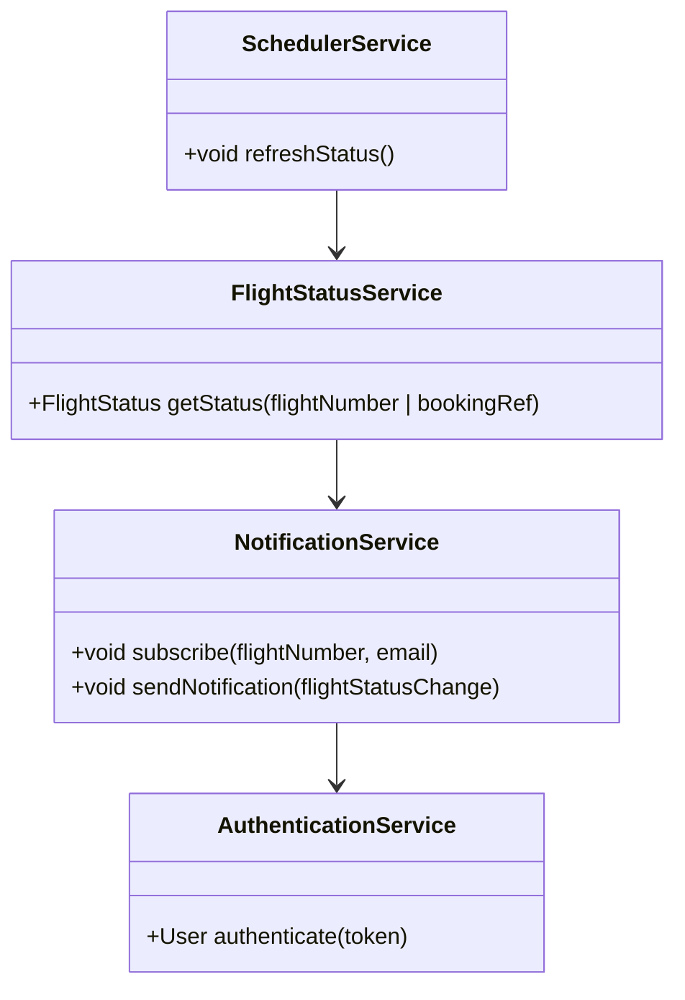
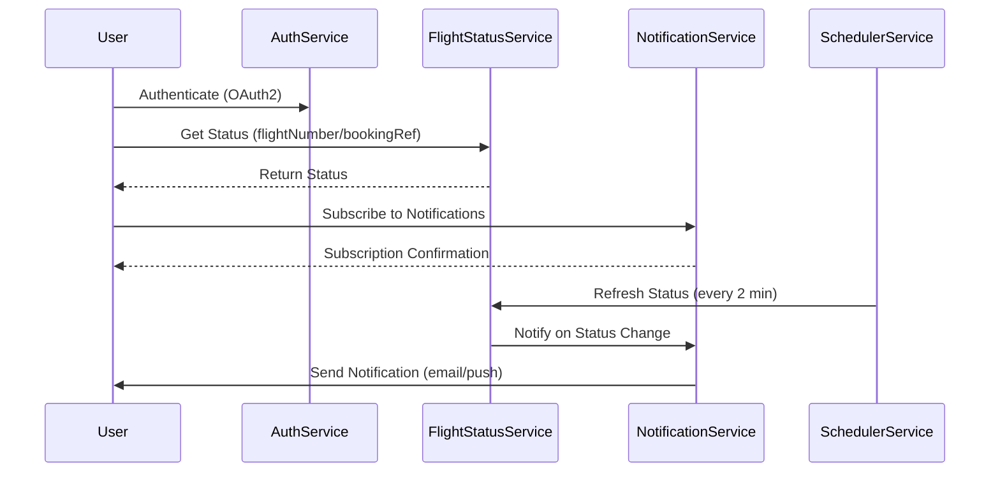
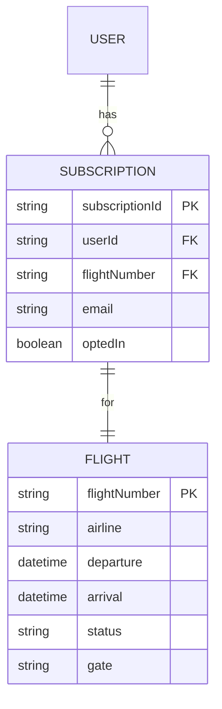

# For User Story Number [2]

1. Objective
The objective is to enable passengers to check the real-time status of their flights, including departure/arrival times, delays, gate assignments, and cancellations. The system will provide timely updates and notifications to keep passengers informed. This feature aims to enhance passenger experience and reduce uncertainty during travel.

2. API Model
  2.1 Common Components/Services
  - AuthenticationService (OAuth2)
  - FlightStatusService (integration with airline/airport APIs)
  - NotificationService (push/email notifications)
  - SchedulerService (Azure Functions for periodic updates)

  2.2 API Details
| Operation    | REST Method | Type    | URL                                      | Request (Sample JSON)                                   | Response (Sample JSON)                                                                                 |
|-------------|-------------|---------|------------------------------------------|---------------------------------------------------------|-------------------------------------------------------------------------------------------------------|
| Status      | GET         | Success | /api/flights/status                      | {"flightNumber": "DL123"}                              | {"flightNumber": "DL123", "status": "DELAYED", "gate": "A12", "departure": "10:30", "arrival": "13:45"} |
| Status      | GET         | Success | /api/flights/status                      | {"bookingRef": "BR789"}                                | {"flightNumber": "DL123", "status": "ON TIME", ...}                                             |
| Subscribe   | POST        | Success | /api/notifications/subscribe             | {"flightNumber": "DL123", "email": "user@x.com"}      | {"subscriptionId": "S456", "status": "SUBSCRIBED"}                                            |

  2.3 Exceptions
| API                  | Exception Type         | Error Message                                 |
|----------------------|----------------------|-----------------------------------------------|
| /flights/status      | ValidationException  | Invalid flight number or booking reference     |
| /notifications/subscribe | ValidationException  | Invalid email or flight number                |
| /flights/status      | DataFeedError        | Unable to fetch real-time status              |

3 Functional Design
  3.1 Class Diagram

  3.2 UML Sequence Diagram

  3.3 Components
| Component Name         | Description                                            | Existing/New |
|-----------------------|--------------------------------------------------------|--------------|
| FlightStatusService   | Handles status queries and data feed integration       | New          |
| NotificationService   | Manages subscriptions and sends notifications          | New          |
| SchedulerService      | Periodically refreshes flight status                   | New          |
| AuthenticationService | Manages OAuth2 authentication                          | Existing     |

  3.4 Service Layer Logic and Validations
| FieldName          | Validation                                  | Error Message                    | ClassUsed            |
|--------------------|---------------------------------------------|----------------------------------|----------------------|
| flightNumber       | Not null, valid airline format               | Invalid flight number            | FlightStatusService  |
| bookingRef         | Not null, valid format                      | Invalid booking reference        | FlightStatusService  |
| email              | Valid email format                          | Invalid email format             | NotificationService  |
| notification opt-in| Must be true to receive notifications       | Not opted-in                     | NotificationService  |

4 Integrations
| SystemToBeIntegrated | IntegratedFor         | IntegrationType |
|----------------------|----------------------|-----------------|
| Airline/Airport APIs | Real-time flight data | API             |
| Email Service        | Notification delivery | API             |

5 DB Details
  5.1 ER Model

  5.2 DB Validations
- Unique constraint on subscriptionId
- Foreign key constraints for relationships
- Email format validation at DB level (if supported)

6 Non-Functional Requirements
  6.1 Performance
  - Support 5,000 concurrent users
  - Status refresh every 2 minutes via scheduler

  6.2 Security
    6.2.1 Authentication
    - OAuth2 authentication for all endpoints
    6.2.2 Authorization
    - Only authenticated users can subscribe to notifications

  6.3 Logging
    6.3.1 Application Logging
    - DEBUG: API request/response payloads (PII masked)
    - INFO: Successful subscriptions, notifications sent
    - ERROR: Data feed failures, notification errors
    - WARN: Suspicious subscription attempts
    6.3.2 Audit Log
    - Audit log for subscription and notification events

7 Dependencies
- Airline/Airport APIs for real-time data
- Email delivery service
- OAuth2 IAM provider
- Azure Functions for scheduling

8 Assumptions
- Airline/airport APIs provide real-time data
- Users provide valid email addresses
- Scheduler runs reliably every 2 minutes
