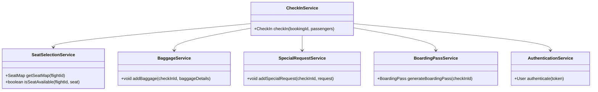
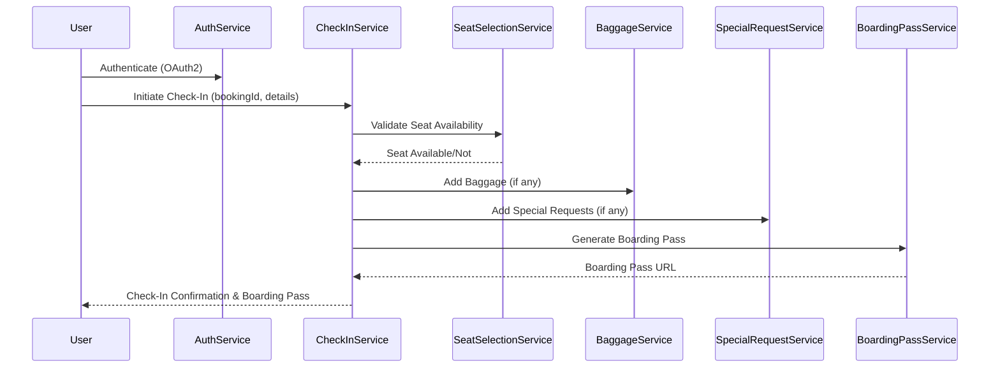
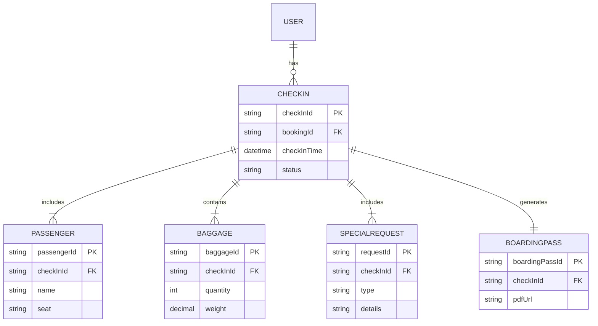

# For User Story Number [3]

1. Objective
The objective is to enable passengers to check in online before their flight, allowing them to select seats, add baggage, and generate boarding passes. The system should support check-in for multiple airlines and handle special requests. This feature aims to streamline the airport experience and reduce wait times.

2. API Model
  2.1 Common Components/Services
  - AuthenticationService (OAuth2)
  - CheckInService (integration with airline APIs)
  - SeatSelectionService
  - BoardingPassService (PDF generation)
  - BaggageService
  - SpecialRequestService

  2.2 API Details
| Operation    | REST Method | Type    | URL                                      | Request (Sample JSON)                                                                                                                   | Response (Sample JSON)                                                                                      |
|-------------|-------------|---------|------------------------------------------|----------------------------------------------------------------------------------------------------------------------------------------|--------------------------------------------------------------------------------------------------------------|
| Check-In    | POST        | Success | /api/checkin                             | {"bookingId": "B456", "passengers": [{"name": "John Doe", "seat": "12A", "baggage": 1, "specialRequests": ["Vegan Meal"]}]} | {"checkInId": "C789", "status": "CHECKED_IN", "boardingPass": "url-to-pdf"}                          |
| Seat Map    | GET         | Success | /api/flights/{flightId}/seatmap          | -                                                                                              | {"flightId": "F123", "seats": [{"seat": "12A", "available": true}, ...]}                          |
| BoardingPass| GET         | Success | /api/checkin/{checkInId}/boardingpass    | -                                                                                              | {"boardingPass": "url-to-pdf"}                                                                             |

  2.3 Exceptions
| API                  | Exception Type         | Error Message                                 |
|----------------------|----------------------|-----------------------------------------------|
| /checkin             | ValidationException  | Check-in not allowed (outside window)         |
| /checkin             | SeatUnavailable      | Selected seat is no longer available          |
| /checkin             | InvalidRequest       | Missing or invalid passenger details          |
| /boardingpass        | NotFoundException    | Boarding pass not found                       |

3 Functional Design
  3.1 Class Diagram

  3.2 UML Sequence Diagram

  3.3 Components
| Component Name         | Description                                            | Existing/New |
|-----------------------|--------------------------------------------------------|--------------|
| CheckInService        | Manages check-in process and integrations              | New          |
| SeatSelectionService  | Handles seat map and availability                      | New          |
| BoardingPassService   | Generates boarding passes in PDF                       | New          |
| BaggageService        | Manages baggage addition                               | New          |
| SpecialRequestService | Handles special requests (meals, assistance)           | New          |
| AuthenticationService | Manages OAuth2 authentication                          | Existing     |

  3.4 Service Layer Logic and Validations
| FieldName          | Validation                                  | Error Message                    | ClassUsed            |
|--------------------|---------------------------------------------|----------------------------------|----------------------|
| bookingId          | Not null, valid format                      | Invalid booking ID               | CheckInService       |
| check-in window    | Within allowed airline window               | Check-in not allowed             | CheckInService       |
| seat selection     | Must be available in real time              | Seat not available               | SeatSelectionService |
| passenger details  | Not null, valid format                      | Invalid passenger details        | CheckInService       |
| baggage            | Valid per airline rules                     | Invalid baggage details          | BaggageService       |
| special requests   | Valid options only                          | Invalid special request          | SpecialRequestService|

4 Integrations
| SystemToBeIntegrated | IntegratedFor         | IntegrationType |
|----------------------|----------------------|-----------------|
| Airline APIs         | Check-in, seat map   | API             |
| PDF Generator        | Boarding pass        | API             |

5 DB Details
  5.1 ER Model

  5.2 DB Validations
- Unique constraint on checkInId, boardingPassId
- Foreign key constraints for relationships
- Seat allocation uniqueness per flight

6 Non-Functional Requirements
  6.1 Performance
  - Support 2,000 concurrent check-ins
  - Boarding pass generated within 5 seconds

  6.2 Security
    6.2.1 Authentication
    - OAuth2 authentication for all endpoints
    6.2.2 Authorization
    - Only authenticated users can check in

  6.3 Logging
    6.3.1 Application Logging
    - DEBUG: API request/response payloads (PII masked)
    - INFO: Successful check-ins, boarding passes generated
    - ERROR: Failed check-ins, seat allocation errors
    - WARN: Suspicious or repeated failed check-ins
    6.3.2 Audit Log
    - Audit log for check-in and boarding pass events

7 Dependencies
- Airline APIs for check-in and seat map
- PDF generator for boarding passes
- OAuth2 IAM provider

8 Assumptions
- Airline APIs provide real-time seat map and check-in window
- PDF generator is available and reliable
- Users have valid bookings
