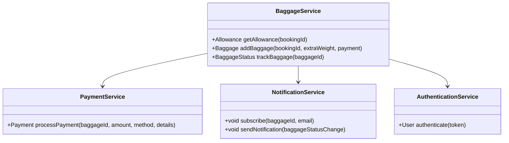
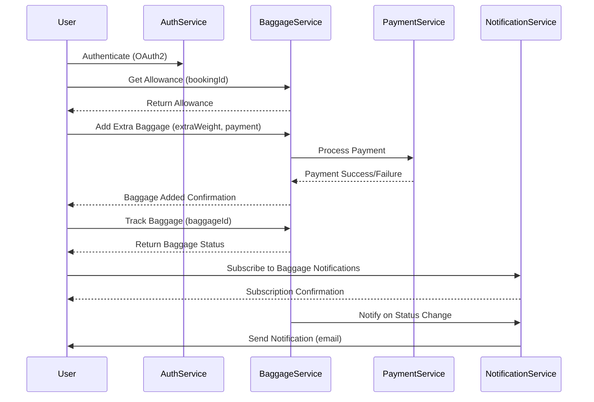
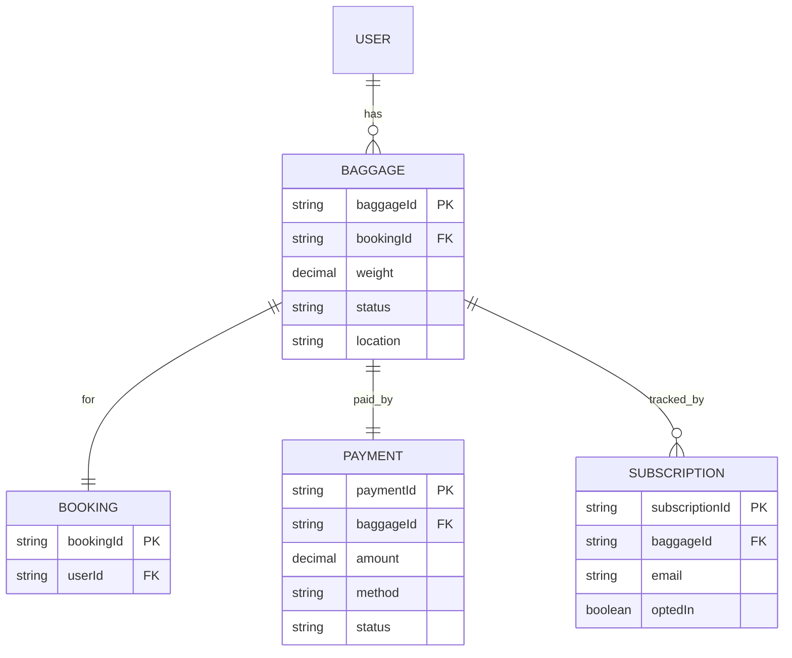

# For User Story Number [4]

1. Objective
The objective is to enable passengers to manage their baggage online, including viewing baggage allowance, prepaying for extra luggage, and tracking baggage status in real time. The system should integrate with airline and airport baggage systems and provide notifications for baggage delays or reroutes. This feature aims to improve passenger convenience and transparency regarding baggage handling.

2. API Model
  2.1 Common Components/Services
  - AuthenticationService (OAuth2)
  - BaggageService (integration with airline/airport APIs)
  - PaymentService (for extra baggage fees)
  - NotificationService (for baggage status updates)

  2.2 API Details
| Operation    | REST Method | Type    | URL                                      | Request (Sample JSON)                                                                                   | Response (Sample JSON)                                                                                      |
|-------------|-------------|---------|------------------------------------------|----------------------------------------------------------------------------------------------------------|--------------------------------------------------------------------------------------------------------------|
| Allowance   | GET         | Success | /api/baggage/allowance                   | {"bookingId": "B456"}                                                                                  | {"bookingId": "B456", "allowance": {"weight": 23, "pieces": 1}}                                      |
| Add Baggage | POST        | Success | /api/baggage/add                         | {"bookingId": "B456", "extraWeight": 10, "payment": {"method": "card", "details": {...}}}         | {"baggageId": "BG789", "status": "PAID", "fee": 50}                                                 |
| Track       | GET         | Success | /api/baggage/track                       | {"baggageId": "BG789"}                                                                                  | {"baggageId": "BG789", "status": "IN TRANSIT", "location": "JFK"}                                  |
| Subscribe   | POST        | Success | /api/baggage/notifications/subscribe     | {"baggageId": "BG789", "email": "user@x.com"}                                                        | {"subscriptionId": "S123", "status": "SUBSCRIBED"}                                                    |

  2.3 Exceptions
| API                  | Exception Type         | Error Message                                 |
|----------------------|----------------------|-----------------------------------------------|
| /baggage/allowance   | ValidationException  | Invalid booking ID                            |
| /baggage/add         | ValidationException  | Exceeds allowed baggage limit                 |
| /baggage/add         | PaymentFailed        | Payment could not be processed                |
| /baggage/track       | NotFoundException    | Baggage not found                             |
| /baggage/notifications/subscribe | ValidationException  | Invalid email or baggage ID                  |

3 Functional Design
  3.1 Class Diagram

  3.2 UML Sequence Diagram

  3.3 Components
| Component Name         | Description                                            | Existing/New |
|-----------------------|--------------------------------------------------------|--------------|
| BaggageService        | Manages baggage allowance, addition, and tracking      | New          |
| PaymentService        | Handles payment processing for extra baggage           | New          |
| NotificationService   | Manages subscriptions and sends notifications          | New          |
| AuthenticationService | Manages OAuth2 authentication                          | Existing     |

  3.4 Service Layer Logic and Validations
| FieldName          | Validation                                  | Error Message                    | ClassUsed            |
|--------------------|---------------------------------------------|----------------------------------|----------------------|
| bookingId          | Not null, valid format                      | Invalid booking ID               | BaggageService       |
| extraWeight        | Within airline rules                        | Exceeds allowed baggage limit    | BaggageService       |
| payment details    | Valid card/wallet, PCI DSS compliant        | Payment details invalid          | PaymentService       |
| baggageId          | Not null, valid format                      | Invalid baggage ID               | BaggageService       |
| email              | Valid email format                          | Invalid email format             | NotificationService  |

4 Integrations
| SystemToBeIntegrated | IntegratedFor         | IntegrationType |
|----------------------|----------------------|-----------------|
| Airline/Airport APIs | Baggage allowance, tracking | API        |
| Payment Gateway      | Payment processing    | API             |
| Email Service        | Notification delivery | API             |

5 DB Details
  5.1 ER Model

  5.2 DB Validations
- Unique constraint on baggageId, paymentId, subscriptionId
- Foreign key constraints for relationships
- Weight and allowance validations

6 Non-Functional Requirements
  6.1 Performance
  - Support 1,000 concurrent baggage transactions
  - Real-time status updates within 1 minute

  6.2 Security
    6.2.1 Authentication
    - OAuth2 authentication for all endpoints
    6.2.2 Authorization
    - Only authenticated users can manage baggage

  6.3 Logging
    6.3.1 Application Logging
    - DEBUG: API request/response payloads (PII masked)
    - INFO: Successful baggage additions, payments, notifications
    - ERROR: Failed payments, baggage tracking errors
    - WARN: Suspicious baggage activities
    6.3.2 Audit Log
    - Audit log for baggage addition, payment, and tracking events

7 Dependencies
- Airline/Airport APIs for baggage data
- Payment gateway for extra baggage fees
- Email delivery service
- OAuth2 IAM provider

8 Assumptions
- Airline/airport APIs provide real-time baggage status
- Payment gateway is PCI DSS compliant
- Users have valid bookings and emails
