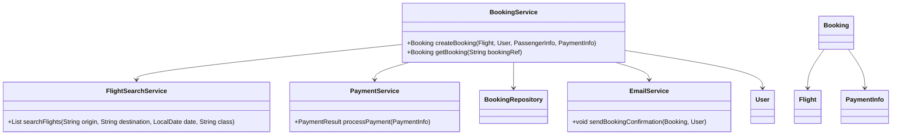
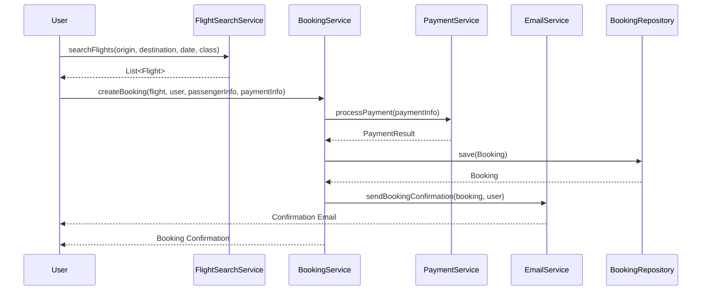
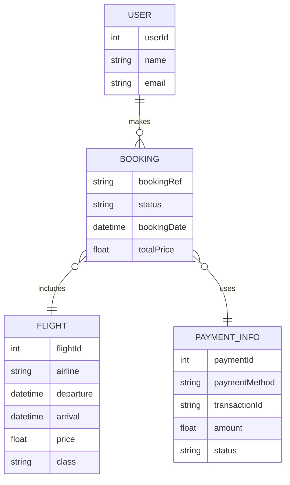

# For User Story Number [1]
1. Objective
This requirement enables travelers to search, view, and book air transport tickets online. It supports searching by origin, destination, travel date, and class of service, and allows secure payment processing. The goal is to provide a seamless, secure, and user-friendly booking experience.

2. API Model
  2.1 Common Components/Services
  - FlightSearchService (existing/new): Handles integration with airline APIs for flight search.
  - PaymentService (existing/new): Handles secure payment processing.
  - BookingService (new): Manages booking logic and persistence.
  - EmailService (existing): Sends booking confirmations.

  2.2 API Details
| Operation      | REST Method | Type     | URL                        | Request (Sample JSON)                                                                 | Response (Sample JSON)                                                               |
|---------------|-------------|----------|----------------------------|--------------------------------------------------------------------------------------|--------------------------------------------------------------------------------------|
| Search Flights| GET         | Success  | /api/flights/search        | {"origin":"JFK","destination":"LAX","date":"2025-10-01","class":"Economy"}           | [{"flightId":123,"airline":"Delta","departure":"10:00","arrival":"13:00","price":350,"class":"Economy"}] |
| Book Flight   | POST        | Success  | /api/bookings              | {"flightId":123,"userId":456,"passengerInfo":{...},"paymentInfo":{...}}                | {"bookingRef":"ABC123","status":"CONFIRMED"}                                   |
| Make Payment  | POST        | Success  | /api/payments/process      | {"amount":350,"paymentMethod":"VISA","cardDetails":{...}}                              | {"paymentStatus":"SUCCESS","transactionId":"TXN789"}                           |
| Get Booking   | GET         | Success  | /api/bookings/{bookingRef} | N/A                                                                                  | {"bookingRef":"ABC123","status":"CONFIRMED","details":{...}}                  |

  2.3 Exceptions
| API                | Exception Type           | Description                                  |
|--------------------|-------------------------|----------------------------------------------|
| /api/flights/search| InvalidInputException   | Origin/Destination/Date invalid              |
| /api/bookings      | FlightNotAvailableException | Selected flight no longer available      |
| /api/payments/process| PaymentFailedException | Payment declined or failed                   |
| /api/bookings/{ref}| BookingNotFoundException| Booking reference not found                  |

3 Functional Design
  3.1 Class Diagram

  3.2 UML Sequence Diagram

  3.3 Components
| Component Name       | Description                                         | Existing/New |
|---------------------|-----------------------------------------------------|--------------|
| FlightSearchService | Integrates with airline APIs for flight search      | New          |
| BookingService      | Handles booking logic and orchestration             | New          |
| PaymentService      | Processes payments securely                         | New          |
| EmailService        | Sends booking confirmation emails                   | Existing     |
| BookingRepository   | Persists booking data                               | New          |
| User                | Represents the user/traveler                        | Existing     |
| Flight              | Represents flight details                           | New          |
| PaymentInfo         | Represents payment information                      | New          |
| Booking             | Represents a booking record                         | New          |

  3.4 Service Layer Logic and Validations
| FieldName           | Validation                                      | Error Message                           | ClassUsed             |
|---------------------|------------------------------------------------|-----------------------------------------|-----------------------|
| origin/destination  | Must be valid airport code or name              | Invalid origin or destination           | FlightSearchService   |
| date                | Must be in the future                           | Travel date must be in the future       | FlightSearchService   |
| paymentInfo         | Valid and secure payment details                 | Invalid payment details                 | PaymentService        |

4 Integrations
| SystemToBeIntegrated | IntegratedFor         | IntegrationType |
|----------------------|----------------------|-----------------|
| Airline APIs         | Flight search/bookings| API             |
| Payment Gateway      | Payment processing    | API             |
| Email Service        | Booking confirmation  | API             |

5 DB Details
  5.1 ER Model

  5.2 DB Validations
- bookingRef must be unique in BOOKING table
- paymentId must be unique in PAYMENT_INFO table
- Foreign key constraints between BOOKING and USER, FLIGHT, PAYMENT_INFO

6 Non-Functional Requirements
  6.1 Performance
  - Flight search API response time <2 seconds
  - Caching for frequent search queries at API layer

  6.2 Security
    6.2.1 Authentication
    - OAuth2/JWT-based authentication for all APIs
    - HTTPS enforced for all endpoints
    6.2.2 Authorization
    - Role-based access for booking endpoints (user/admin)

  6.3 Logging
    6.3.1 Application Logging
    - INFO: All booking and payment transactions
    - ERROR: Failed payments, booking errors
    - DEBUG: Flight search queries (optional, for troubleshooting)
    6.3.2 Audit Log
    - Log all booking and payment events with user ID, timestamp, and status

7 Dependencies
- Airline APIs for flight data
- Payment gateway (PCI DSS compliant)
- Email service provider (e.g., SendGrid)

8 Assumptions
- All airline APIs provide real-time availability and pricing
- Payment gateway is PCI DSS compliant
- Email delivery is reliable and near real-time
