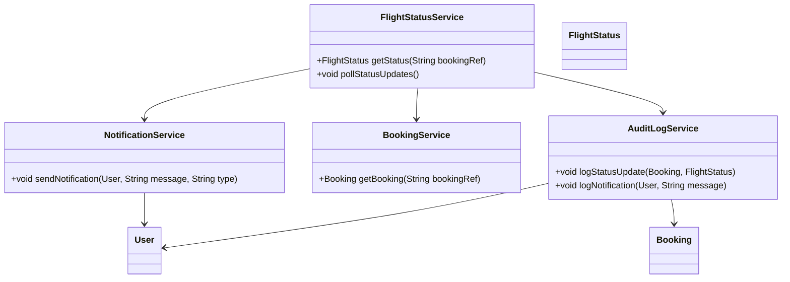
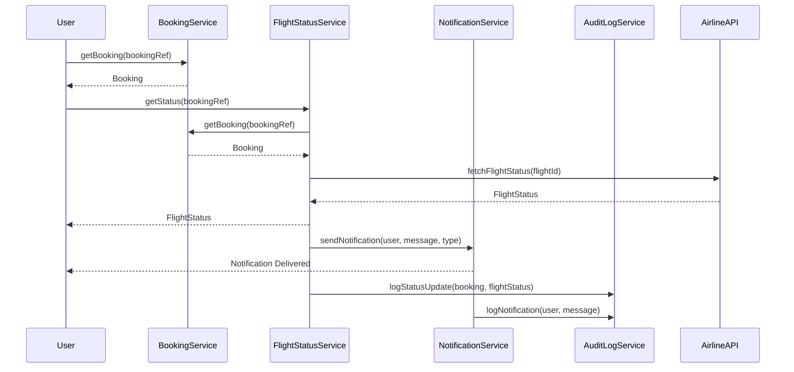
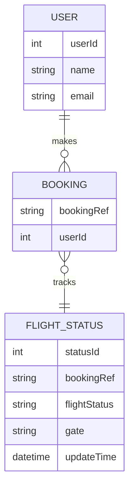

# For User Story Number [2]
1. Objective
This requirement enables travelers to track the real-time status of their booked flights, including delays, gate changes, and cancellations. It provides timely push/email notifications and easy access to flight status from the user's dashboard. The goal is to keep travelers informed and reduce uncertainty during their journey.

2. API Model
  2.1 Common Components/Services
  - FlightStatusService (new): Integrates with airline status APIs and manages status polling.
  - NotificationService (existing/new): Sends push/email notifications to users.
  - BookingService (existing): Retrieves user bookings.
  - AuditLogService (existing): Logs all status updates and notifications.

  2.2 API Details
| Operation         | REST Method | Type     | URL                              | Request (Sample JSON)                                          | Response (Sample JSON)                                          |
|------------------|-------------|----------|----------------------------------|---------------------------------------------------------------|-----------------------------------------------------------------|
| Get Flight Status| GET         | Success  | /api/flights/status/{bookingRef} | N/A                                                           | {"bookingRef":"ABC123","flightStatus":"DELAYED","gate":"A12","updateTime":"2025-10-01T09:00"} |
| Subscribe Status | POST        | Success  | /api/flights/subscribe           | {"bookingRef":"ABC123","notificationType":"PUSH"}           | {"subscriptionStatus":"ACTIVE"}                               |
| Notification     | POST        | Success  | /api/notifications/send          | {"userId":456,"message":"Flight delayed","type":"PUSH"}    | {"deliveryStatus":"SENT"}                                     |

  2.3 Exceptions
| API                        | Exception Type             | Description                                         |
|----------------------------|---------------------------|-----------------------------------------------------|
| /api/flights/status/{ref}  | BookingNotFoundException  | Booking reference not found                         |
| /api/flights/status/{ref}  | UnauthorizedAccessException| User not authorized for this booking                |
| /api/flights/subscribe     | InvalidInputException      | Invalid booking reference or notification type       |
| /api/notifications/send    | NotificationFailedException| Notification could not be delivered                 |

3 Functional Design
  3.1 Class Diagram

  3.2 UML Sequence Diagram

  3.3 Components
| Component Name       | Description                                             | Existing/New |
|---------------------|---------------------------------------------------------|--------------|
| FlightStatusService | Polls airline APIs and manages status updates           | New          |
| NotificationService | Sends push/email notifications to users                 | New          |
| BookingService      | Retrieves booking details for users                     | Existing     |
| AuditLogService     | Logs status updates and notification events             | Existing     |
| User                | Represents the user/traveler                            | Existing     |
| Booking             | Represents a booking record                             | Existing     |
| FlightStatus        | Represents the real-time status of a flight             | New          |

  3.4 Service Layer Logic and Validations
| FieldName           | Validation                                      | Error Message                           | ClassUsed             |
|---------------------|------------------------------------------------|-----------------------------------------|-----------------------|
| bookingRef          | Must be valid and belong to user                | Booking reference not found/unauthorized| BookingService        |
| flightStatus        | Must be updated at least every 5 minutes        | Flight status data is outdated          | FlightStatusService   |
| notification        | Must be sent within 1 minute of status change   | Notification delivery delayed           | NotificationService   |

4 Integrations
| SystemToBeIntegrated | IntegratedFor          | IntegrationType |
|----------------------|-----------------------|-----------------|
| Airline Status APIs  | Real-time flight status| API             |
| Notification Service | Push/email notifications| API             |

5 DB Details
  5.1 ER Model

  5.2 DB Validations
- bookingRef must be valid and exist in BOOKING table
- statusId must be unique in FLIGHT_STATUS table
- Foreign key constraints between FLIGHT_STATUS and BOOKING

6 Non-Functional Requirements
  6.1 Performance
  - Status updates reflected within 1 minute
  - Support for 5,000 concurrent notification events

  6.2 Security
    6.2.1 Authentication
    - OAuth2/JWT-based authentication for all APIs
    - HTTPS enforced for all endpoints
    6.2.2 Authorization
    - Only users with valid bookings can access status

  6.3 Logging
    6.3.1 Application Logging
    - INFO: All status updates and notification events
    - ERROR: Notification delivery failures
    - DEBUG: Polling and API integration logs
    6.3.2 Audit Log
    - Log all status changes and notifications with user ID, timestamp, and status

7 Dependencies
- Airline status APIs for real-time updates
- Notification service (e.g., Firebase, SendGrid)

8 Assumptions
- Airline APIs provide real-time and reliable status data
- Notification service delivers within 1 minute
- User dashboard is updated via websockets or polling
