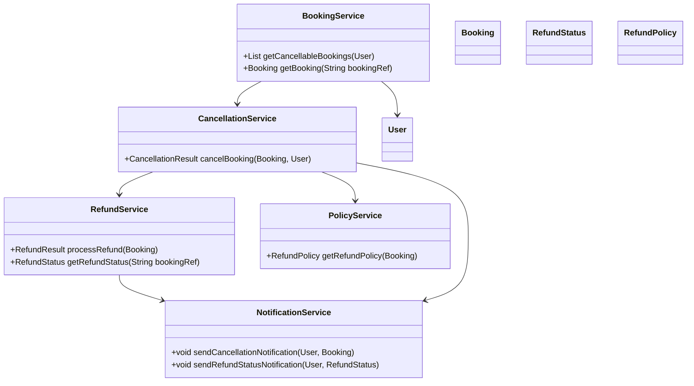
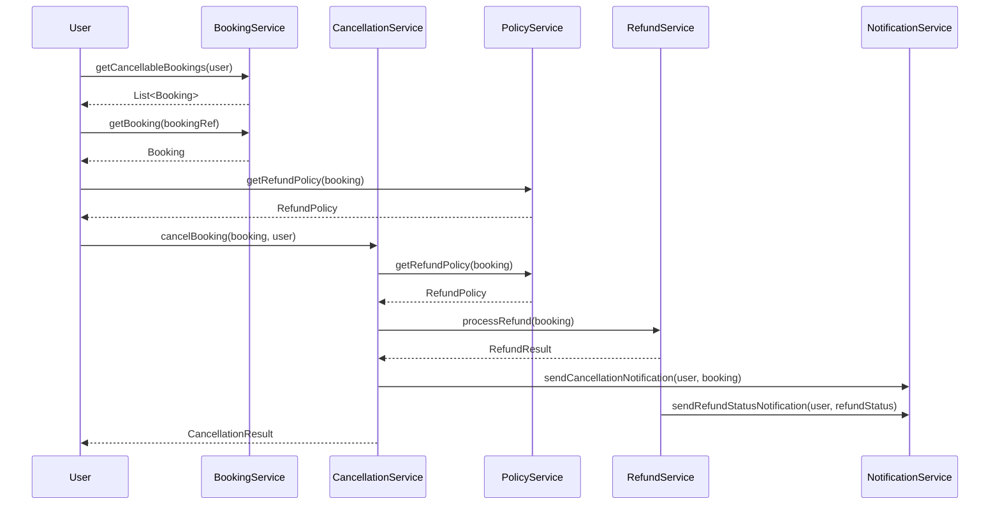
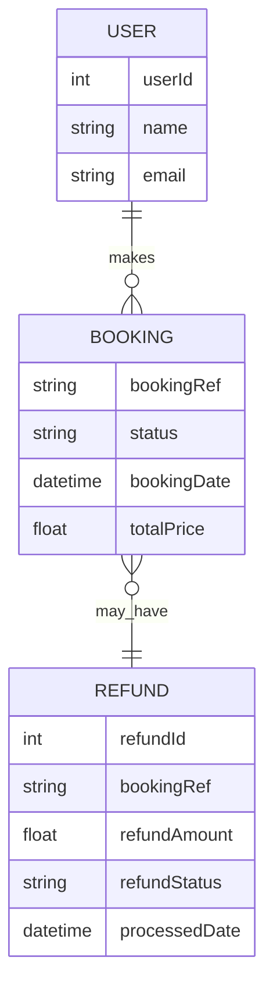

# For User Story Number [3]
1. Objective
This requirement enables travelers to cancel their air transport bookings online and request refunds according to airline policies. It ensures users can view refund eligibility, process cancellations, and receive status updates. The goal is to provide a transparent, compliant, and user-friendly cancellation and refund experience.

2. API Model
  2.1 Common Components/Services
  - BookingService (existing): Retrieves and manages bookings.
  - CancellationService (new): Handles cancellation logic and integration with airline APIs.
  - RefundService (new): Calculates and processes refunds via payment gateway.
  - NotificationService (existing/new): Sends cancellation and refund status updates.
  - PolicyService (new): Retrieves airline cancellation policies.

  2.2 API Details
| Operation           | REST Method | Type     | URL                                | Request (Sample JSON)                                                      | Response (Sample JSON)                                                      |
|---------------------|-------------|----------|------------------------------------|----------------------------------------------------------------------------|------------------------------------------------------------------------------|
| Get Cancel Eligible | GET         | Success  | /api/bookings/cancellable/{userId} | N/A                                                                        | [{"bookingRef":"ABC123","eligible":true,"refundPolicy":"Full Refund"}]         |
| Get Refund Policy   | GET         | Success  | /api/bookings/refund-policy/{bookingRef} | N/A                                                                | {"bookingRef":"ABC123","refundAmount":200,"policy":"Partial Refund"}           |
| Cancel Booking      | POST        | Success  | /api/bookings/cancel               | {"bookingRef":"ABC123","userId":456,"confirm":true}                        | {"bookingRef":"ABC123","status":"CANCELLED","refundStatus":"PENDING"}        |
| Refund Status       | GET         | Success  | /api/bookings/refund-status/{bookingRef} | N/A                                                                | {"bookingRef":"ABC123","refundStatus":"COMPLETED","amount":200}                |

  2.3 Exceptions
| API                              | Exception Type               | Description                                         |
|----------------------------------|------------------------------|-----------------------------------------------------|
| /api/bookings/cancellable/{userId}| UnauthorizedAccessException  | User not authorized                                 |
| /api/bookings/refund-policy/{ref}| BookingNotFoundException     | Booking reference not found                         |
| /api/bookings/cancel             | NotEligibleForCancellationException | Booking not eligible for cancellation      |
| /api/bookings/cancel             | RefundCalculationException   | Refund calculation failed                           |
| /api/bookings/refund-status/{ref}| RefundNotFoundException      | Refund record not found                             |

3 Functional Design
  3.1 Class Diagram

  3.2 UML Sequence Diagram

  3.3 Components
| Component Name       | Description                                             | Existing/New |
|---------------------|---------------------------------------------------------|--------------|
| BookingService      | Retrieves and manages bookings                          | Existing     |
| CancellationService | Handles cancellation logic and airline API integration  | New          |
| RefundService       | Calculates and processes refunds                        | New          |
| NotificationService | Sends cancellation and refund status notifications      | Existing/New |
| PolicyService       | Retrieves airline cancellation/refund policies          | New          |
| Booking             | Represents a booking record                             | Existing     |
| User                | Represents the user/traveler                            | Existing     |
| RefundStatus        | Represents the status of a refund                       | New          |
| RefundPolicy        | Represents airline refund policy details                | New          |

  3.4 Service Layer Logic and Validations
| FieldName           | Validation                                      | Error Message                           | ClassUsed             |
|---------------------|------------------------------------------------|-----------------------------------------|-----------------------|
| bookingRef          | Must be valid and eligible for cancellation     | Booking not eligible for cancellation   | BookingService        |
| refundAmount        | Must match airline policy calculation           | Refund calculation error                | RefundService         |
| confirm             | User must confirm cancellation                  | Cancellation not confirmed              | CancellationService   |

4 Integrations
| SystemToBeIntegrated | IntegratedFor           | IntegrationType |
|----------------------|------------------------|-----------------|
| Airline Booking APIs | Booking cancellation   | API             |
| Payment Gateway      | Refund processing      | API             |
| Notification Service | Cancellation/refund updates| API         |

5 DB Details
  5.1 ER Model

  5.2 DB Validations
- bookingRef must be unique in BOOKING table
- refundId must be unique in REFUND table
- Foreign key constraints between REFUND and BOOKING

6 Non-Functional Requirements
  6.1 Performance
  - Refund status updated within 24 hours
  - Support for 1,000 concurrent cancellations

  6.2 Security
    6.2.1 Authentication
    - OAuth2/JWT-based authentication for all APIs
    - HTTPS enforced for all endpoints
    6.2.2 Authorization
    - Only users with valid bookings can cancel

  6.3 Logging
    6.3.1 Application Logging
    - INFO: All cancellations and refund transactions
    - ERROR: Refund calculation or payment failures
    - DEBUG: Airline API and payment gateway integration logs
    6.3.2 Audit Log
    - Log all cancellation and refund events with user ID, timestamp, and status

7 Dependencies
- Airline booking APIs for cancellation
- Payment gateway for refunds
- Notification service for updates

8 Assumptions
- Airline APIs provide up-to-date eligibility and policy data
- Payment gateway supports refund processing
- Notifications are delivered reliably and promptly
