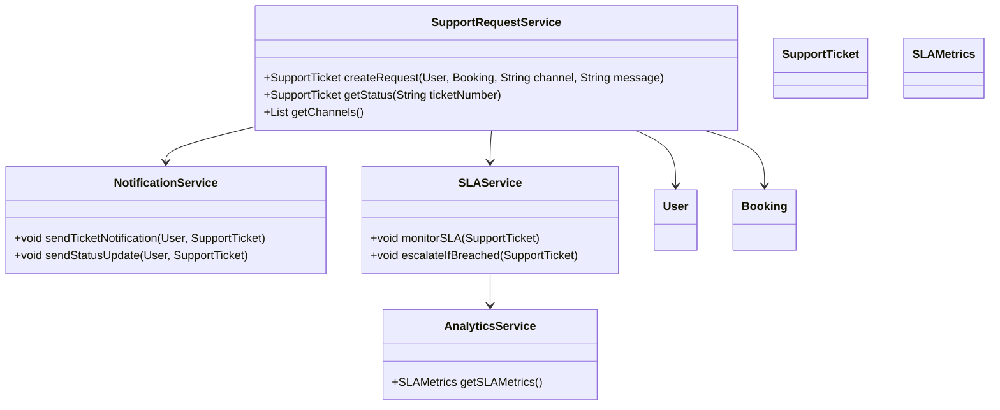
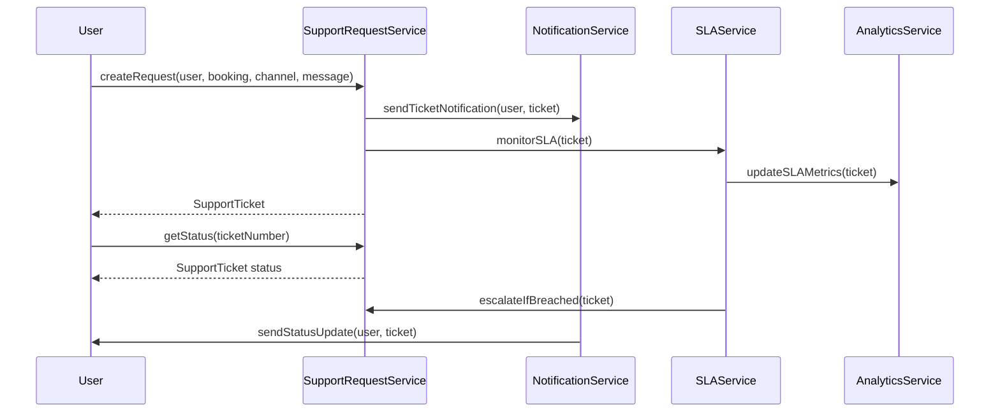
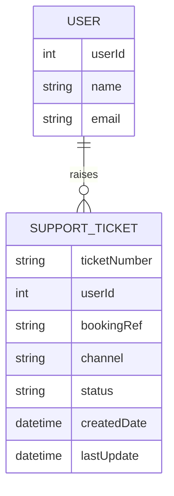

# For User Story Number [4]
1. Objective
This requirement enables travelers to contact customer support for air transport bookings via chat, email, or phone. It allows users to initiate and track support requests, ensuring timely responses and resolution. The goal is to provide a seamless, multi-channel support experience with robust tracking and SLA monitoring.

2. API Model
  2.1 Common Components/Services
  - SupportRequestService (new): Manages support request creation, tracking, and routing.
  - NotificationService (existing/new): Sends support ticket and status notifications.
  - SLAService (new): Monitors and escalates SLA breaches.
  - AnalyticsService (existing): Provides support metrics and dashboard.

  2.2 API Details
| Operation             | REST Method | Type     | URL                                   | Request (Sample JSON)                                                   | Response (Sample JSON)                                                    |
|-----------------------|-------------|----------|---------------------------------------|-------------------------------------------------------------------------|----------------------------------------------------------------------------|
| Create Support Request| POST        | Success  | /api/support/requests                 | {"userId":456,"bookingRef":"ABC123","channel":"CHAT","message":"Need help"} | {"ticketNumber":"SUP-789","status":"OPEN"}                               |
| Get Support Status    | GET         | Success  | /api/support/status/{ticketNumber}    | N/A                                                                    | {"ticketNumber":"SUP-789","status":"IN_PROGRESS","lastUpdate":"2025-10-01T10:00"} |
| List Support Channels | GET         | Success  | /api/support/channels                 | N/A                                                                    | ["CHAT","EMAIL","PHONE"]                                                  |
| SLA Metrics           | GET         | Success  | /api/support/sla-metrics              | N/A                                                                    | {"openTickets":5,"slaBreaches":1,"avgResponseTime":3}                     |

  2.3 Exceptions
| API                           | Exception Type             | Description                                         |
|-------------------------------|---------------------------|-----------------------------------------------------|
| /api/support/requests         | UnauthorizedAccessException| User not authenticated                              |
| /api/support/requests         | InvalidInputException      | Invalid booking reference or channel                 |
| /api/support/status/{ticket}  | TicketNotFoundException    | Ticket number not found                             |
| /api/support/sla-metrics      | AccessDeniedException      | Only admin can access SLA metrics                   |

3 Functional Design
  3.1 Class Diagram

  3.2 UML Sequence Diagram

  3.3 Components
| Component Name       | Description                                             | Existing/New |
|---------------------|---------------------------------------------------------|--------------|
| SupportRequestService | Manages support request creation, tracking, routing   | New          |
| NotificationService | Sends ticket and status notifications                   | Existing/New |
| SLAService          | Monitors and escalates SLA breaches                     | New          |
| AnalyticsService    | Provides support metrics and dashboard                  | Existing     |
| User                | Represents the user/traveler                            | Existing     |
| Booking             | Represents a booking record                             | Existing     |
| SupportTicket       | Represents a support request/ticket                     | New          |
| SLAMetrics          | Represents SLA and analytics data                       | New          |

  3.4 Service Layer Logic and Validations
| FieldName           | Validation                                      | Error Message                           | ClassUsed             |
|---------------------|------------------------------------------------|-----------------------------------------|-----------------------|
| userId              | Must be authenticated                           | User not authenticated                  | SupportRequestService |
| bookingRef          | Must be valid and belong to user                | Invalid booking reference               | SupportRequestService |
| channel             | Must be one of CHAT, EMAIL, PHONE               | Invalid support channel                 | SupportRequestService |
| ticketNumber        | Must exist in system                            | Ticket number not found                 | SupportRequestService |
| SLA                 | Response within defined SLA                     | SLA breach detected                     | SLAService            |

4 Integrations
| SystemToBeIntegrated | IntegratedFor           | IntegrationType |
|----------------------|------------------------|-----------------|
| Customer Support Platform | Ticket management, chat, email | API         |
| Email Service        | Ticket/status notifications      | API             |
| Analytics Dashboard  | SLA and support metrics         | API             |

5 DB Details
  5.1 ER Model

  5.2 DB Validations
- ticketNumber must be unique in SUPPORT_TICKET table
- Foreign key constraints between SUPPORT_TICKET and USER
- bookingRef must be valid and belong to user

6 Non-Functional Requirements
  6.1 Performance
  - Initial response time <5 minutes for chat, <1 hour for email
  - Support for 500 concurrent support sessions

  6.2 Security
    6.2.1 Authentication
    - OAuth2/JWT-based authentication for all APIs
    - HTTPS enforced for all endpoints
    6.2.2 Authorization
    - Only authenticated users can raise support requests
    - Only admin can access SLA metrics

  6.3 Logging
    6.3.1 Application Logging
    - INFO: All support request creations and updates
    - ERROR: SLA breaches and escalation events
    - DEBUG: Integration logs with support platform
    6.3.2 Audit Log
    - Log all support events with user ID, ticket number, timestamps, and status

7 Dependencies
- Customer support platform (e.g., Zendesk, Freshdesk)
- Email service provider
- Analytics dashboard for SLA monitoring

8 Assumptions
- Support platform provides real-time ticket updates
- Email and chat notifications are delivered reliably
- SLA rules are configurable and monitored automatically
